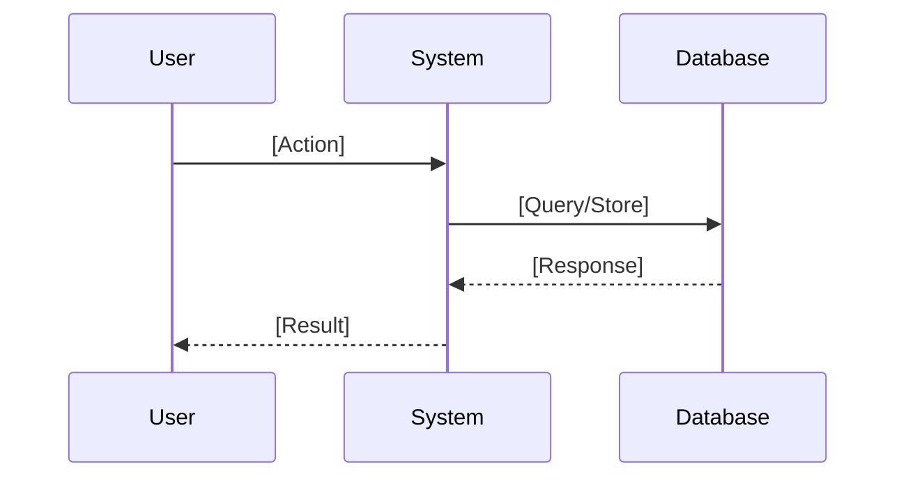
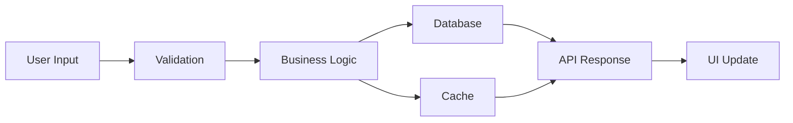
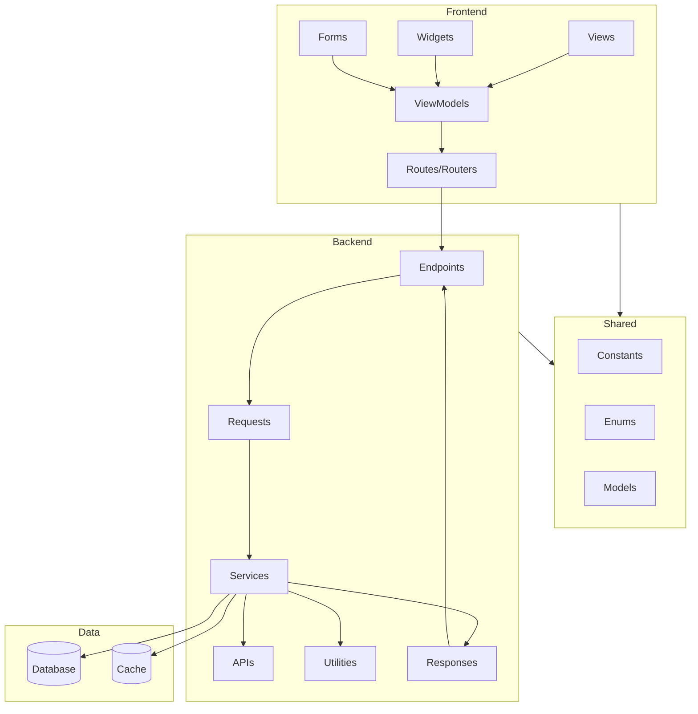

# 📐 Issue: [Feature/Capability Name]
> 💡 *Systematic decomposition of requirements into atomic, scoped work items that a single developer can complete in half a day or less (max 3 story points).*

[Brief description of the feature or capability being decomposed]

---

## 📝 Initial Requirements
> 💡 *Actor-based capability statements that define what users or systems should be able to do or be.*

### Actors Identified
[List all actors involved in this requirement]
- **[Actor Name]**: [Role/description]
- **[Actor Name]**: [Role/description]

### Capability Statements
[Simple English sentences defining capabilities]

1. **[Actor]** should be able to [action/capability]
   - Scope estimate: [1-3 points]
   - Pre-decomposition needed: [Yes/No]
   
2. **[Actor]** should be [state/condition]
   - Scope estimate: [1-3 points]
   - Pre-decomposition needed: [Yes/No]

### Pre-emptive Decomposition
[If any requirements obviously exceed scope, break them down here]

#### Original: [Large requirement]
Decomposed to:
- [ ] [Sub-requirement 1]
- [ ] [Sub-requirement 2]
- [ ] [Sub-requirement 3]

---

## 🌊 Event Flows
> 💡 *Sequential list of actor-verb-subject interactions that fulfill each requirement.*

### Requirement: [Capability statement from Phase 1]

#### Event Sequence
```
1. [Actor] → [verb] → [subject]
2. [Actor] → [verb] → [subject]
3. [Actor] → [verb] → [subject]
4. [Actor] → [verb] → [subject]
5. [Actor] → [verb] → [subject]
```

#### Error Paths
```
E1. If [condition], then [Actor] → [verb] → [subject]
E2. If [error], then [System] → [verb] → [subject]
```

#### Visual Flow Diagram


---

## 🎯 Scope Assessment
> 💡 *Critical checkpoint to ensure requirement fits within scope constraints (≤3 story points).*

### Complexity Metrics

| Metric | Count | Points Impact |
|:-------|:------|:-------------|
| Event Count | [number] | [0-1 points] |
| Actors Involved | [number] | [0-1 points] |
| Data Entities | [number] | [0-1 points] |
| External Integrations | [number] | [0-1 points] |
| **Total Story Points** | | **[sum]** |

### Scope Decision
- [ ] **PROCEED** - Requirement is ≤3 points
- [ ] **DECOMPOSE** - Requirement exceeds 3 points

### Decomposition Plan
[If decomposition needed, define split points]

#### Split Point Analysis
- **Authentication vs Core**: [Separate login from main feature]
- **CRUD Operations**: [Create, Read, Update, Delete as separate items]
- **User Paths**: [Different flows for different user types]

#### Resulting Sub-requirements
1. **[Sub-requirement 1]**: [1-3 points]
2. **[Sub-requirement 2]**: [1-3 points]
3. **[Sub-requirement 3]**: [1-3 points]

---

## 💾 Data Flow
> 💡 *Map of how data moves and transforms through the system.*

### Data Sources
[Identify where data originates]
- **User Input**: [Form fields, selections]
- **Database**: [Tables/collections accessed]
- **External API**: [Services called]
- **System Generated**: [IDs, timestamps]

### Data Transformations
[Track how data changes]
```
Input: [Raw data format]
  ↓ [Validation]
Validated: [Clean data]
  ↓ [Calculation/Processing]
Processed: [Business logic applied]
  ↓ [Formatting]
Output: [Final format]
```

### Data Destinations
[Where data ends up]
- **Database Write**: [Table/collection and fields]
- **API Response**: [Response structure]
- **UI Update**: [Component state changes]
- **Cache/Session**: [Temporary storage]

### Data Flow Diagram


### Convention Compliance
- [ ] Naming conventions followed
- [ ] Validation patterns applied
- [ ] Error handling implemented
- [ ] Security requirements met

### Scope Revalidation
[Check if data complexity changes scope]
- Data complexity: [Simple/Medium/Complex]
- Scope impact: [None/Minor/Major]
- Action: [Proceed/Decompose]

---

## 🧩 Components
> 💡 *All technical components needed for implementation, organized by architectural layer.*

### Data Structures
[Core data definitions and shared structures]
- **Constants**: [Fixed values, configuration constants]
- **Enums**: [Type definitions, status codes, categories]
- **Models**: [Data models, entities, DTOs]

### Frontend Architecture
[Client-side components and logic]
- **Views**: [Screens, pages, layouts]
- **Widgets**: [Reusable UI components]
- **Forms**: [Input forms, validation forms]
- **ViewModels**: [State management, business logic]
- **Routes**: [Navigation paths, route definitions]
- **Routers**: [Navigation handlers, route guards]

### Backend Architecture
[Server-side components and services]
- **Endpoints**: [REST/GraphQL endpoints]
  - `[METHOD] /path`: [Purpose]
- **APIs**: [External API integrations]
- **Services**: [Business logic services]
- **Utilities**: [Helper functions, shared logic]
- **Requests**: [Request handlers, validators]
- **Responses**: [Response formatters, transformers]

### Integration Points
[How components connect and communicate]
- **API Contracts**: [Request/Response schemas]
- **Events**: [Event emitters, listeners]
- **Database Operations**: [CRUD operations]
- **External Services**: [Third-party integrations]
- **Authentication/Authorization**: [Security boundaries]

### Component Diagram


---

![[component-breakdown-block]]

---

![[suggested-approach-block]]
