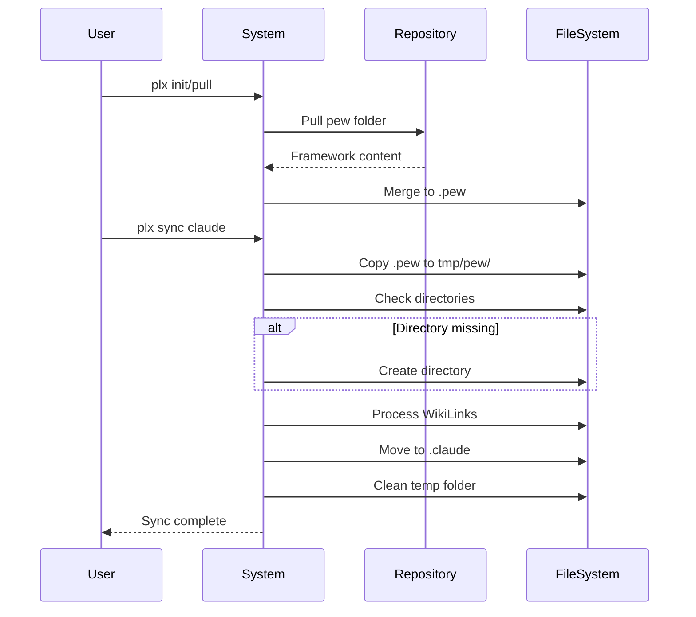
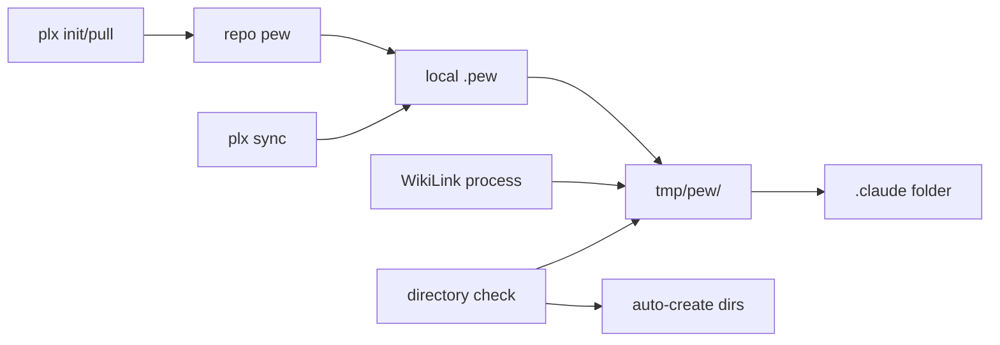

# 🔧 Issue: Framework Folder Structure Migration

Migrate framework from hidden `.pew` folder to public `pew` folder while maintaining sync compatibility with hidden `.claude` directory and auto-creating missing directories during sync operations.

---

## 📝 Initial Requirement
*What should the system/user be able to do or be?*

### Requirements

1. **Repository** should use public `pew` folder for framework source components
2. **System** should pull `pew` folder content into local `.pew` folder during `plx init` or `plx pull {branch}`
3. **System** should merge framework `pew` content with existing local `.pew` content (overwriting framework files)
4. **System** should create `tmp/pew/` folder for safe WikiLink processing
5. **System** should process all WikiLinks in `tmp/pew/` folder before Claude sync
6. **System** should move processed content from `tmp/pew/` to `.claude` folders after sync completion
7. **System** should continue syncing to hidden `.claude` directory for Claude Code compatibility
8. **System** should automatically create missing directories during sync operations
9. **User** should be able to run `plx init` with new workflow
10. **User** should be able to run `plx sync claude` without errors for missing directories
11. **System** should handle both existing `.pew` installations and new `pew` installations
12. **System** should provide clear migration path for existing users
13. **System** should update all scripts to reference appropriate paths

---

## 🌊 Actor Flow
*How does this look in terms of sequential events?*

### Event Sequence

1. **User** → executes → plx init or plx pull
   - Data: project path, framework version, branch name
2. **System** → pulls → pew folder from repository
   - Data: framework pew content, file structure
3. **System** → merges → pew content into local .pew folder
   - Data: existing .pew content, merged file tree
4. **User** → executes → plx sync claude
   - Data: sync command, optional flags
5. **System** → copies → .pew content to tmp/pew/
   - Data: all .pew files, temporary working directory
6. **System** → checks → source directories existence
   - Data: directory paths, existence status
7. **System** → creates → missing directories if needed
   - Data: directory paths, creation status
8. **System** → processes → WikiLinks in tmp/pew/
   - Data: markdown files, resolved link paths
9. **System** → moves → processed content to .claude directory
   - Data: processed files, target paths
10. **System** → cleans → tmp/pew/ folder
    - Data: temporary files removal
11. **System** → reports → sync completion status
    - Data: success/error messages, synced component counts

### Flow Diagram

---

## 📦 Deliverables
*Tangible components to create/update/delete per event*

### Event 1: Framework pull and merge
- **Create**: pew folder in repository (public)
- **Update**: Pull scripts to fetch pew content
- **Merge**: pew content into local .pew folder

### Event 2: Temporary sync folder creation
- **Create**: tmp/pew/ directory
- **Copy**: Full .pew content to temp folder
- **Update**: Working directory references

### Event 3: Directory checking
- **Create**: Missing subdirectories (personas, agents, prompts, etc.)
- **Update**: Directory existence status tracking
- **Delete**: None

### Event 4: WikiLink processing
- **Update**: All markdown files in tmp/pew/
- **Resolve**: WikiLink paths to absolute references
- **Validate**: Link target existence

### Event 5: Path migration
- **Update**: All bash scripts in scripts/
- **Update**: bin/plx.js path references
- **Update**: lib/init.js path references
- **Update**: Makefile target paths

### Event 6: Final sync operations
- **Move**: Processed content from tmp/pew/ to .claude
- **Create**: .claude directory structure (hidden)
- **Delete**: tmp/pew/ folder after successful move

### Component Connection Diagram

---

## ✅ Acceptance Criteria

### What should always go right?
- [ ] Repository maintains public pew folder with framework components
- [ ] plx init/pull successfully fetches pew content from repository
- [ ] Framework pew content merges correctly into local .pew folder
- [ ] tmp/pew/ folder creation succeeds before sync
- [ ] WikiLinks process correctly in temp folder without affecting originals
- [ ] plx sync claude successfully moves from tmp/pew/ to .claude
- [ ] Missing directories are automatically created during sync
- [ ] All existing plx commands work with new workflow
- [ ] Temp folder cleanup happens after successful sync
- [ ] Sync completes without errors when directories are missing

### What should never go wrong?
- [ ] Sync never fails due to missing source directories
- [ ] Existing .pew installations never break
- [ ] WikiLink processing never corrupts original files
- [ ] Temp folder operations never interfere with active sync
- [ ] Path references never point to wrong location
- [ ] Auto-creation never fails due to permissions
- [ ] Sync never creates directories in wrong location
- [ ] Merge operations never lose user customizations

### What should always be?
- [ ] Framework source in repository's public pew folder
- [ ] User working files in local hidden .pew folder
- [ ] Claude Code components in hidden .claude folder
- [ ] Temp sync operations in tmp/pew/ folder
- [ ] Clear separation between source (repo pew), working (.pew), temp (tmp/pew/), and target (.claude)
- [ ] Backward compatibility during transition period
- [ ] Consistent path handling across all scripts
- [ ] WikiLink processing isolated to temp folder

### What should never be?
- [ ] Hidden .pew folder in repository
- [ ] Public pew folder in user's local project
- [ ] Direct WikiLink processing in .pew folder
- [ ] Sync failures for missing personas/agents/prompts directories
- [ ] Mixed usage of pew and .pew in same installation for same purpose
- [ ] Hardcoded paths that can't adapt to workflow
- [ ] User confusion about which folder to edit (always edit .pew locally)
- [ ] Leftover tmp/pew/ folders after sync completion
