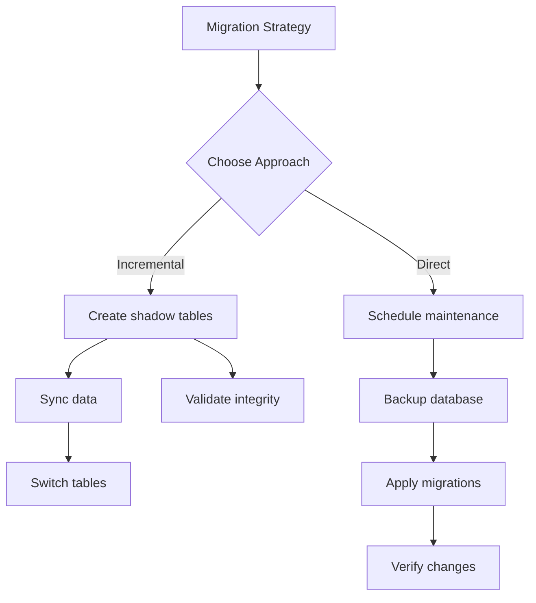

# 📝 Feedback: Question and Confirmation Mode Enhancements
> 💡 *Constructive feedback for improving question mode and confirmation mode prompts to include more context, reasoning, and visual representations.*

## 🎯 Component Details
> 💡 *Identify the specific component and its location within the PLX framework.*

**Component Type:** Prompt
**Component Name:** Question Mode and Confirmation Mode prompts
**File Path:** `prompts/activate-question-mode.md`, `prompts/activate-confirmation-mode.md` and related prompts
**Version/Last Modified:** Current as of 2025-08-05

## 📊 Context & Usage
> 💡 *Describe how you were using this component when you identified areas for improvement.*

**Use Case:** Using question mode to gather requirements and confirmation mode to verify understanding before executing tasks
**Interaction Type:** Direct usage through slash commands and prompt invocation
**Related Components:** All prompts that involve user interaction, confirmation workflows, and decision points

## 🔍 Observations
> 💡 *Document specific behaviours, outputs, or characteristics that prompted this feedback.*

### What Worked Well
- Question mode effectively gathers information from users
- Confirmation mode prevents unintended actions
- Clear structure for yes/no decisions

### Areas for Improvement
- **Issue:** Lack of context about why certain questions are being asked
  - **Example:** When asking "Should I proceed with implementation?", there's no explanation of what the implementation entails
  - **Impact:** Users may answer incorrectly without understanding the full implications
  
- **Issue:** Missing reasoning behind the questions or confirmations
  - **Example:** No explanation of why certain information is needed or what will be done with it
  - **Impact:** Reduces user confidence and can lead to incomplete or incorrect responses
  
- **Issue:** No visual representation of complex decision flows
  - **Example:** Multi-step confirmations lack a clear visual flow of what happens next
  - **Impact:** Users struggle to understand the overall process and consequences of their choices

## 💡 Suggestions
> 💡 *Provide specific, actionable suggestions for improving this component.*

1. **Add Context Sections to Question Prompts**
   - **Current State:** Questions are asked without background information
   - **Proposed Change:** Include a context section that explains:
     - Why this information is needed
     - How it will be used
     - What the implications are
   - **Rationale:** Users make better decisions when they understand the full picture
   - **Implementation Notes:** Add `<context>` XML tags to question prompts

2. **Include Reasoning in Confirmation Prompts**
   - **Current State:** Confirmations show what will happen but not why
   - **Proposed Change:** Add reasoning sections that explain:
     - Why this action is recommended (or not)
     - What alternatives were considered
     - Potential risks and benefits
   - **Rationale:** Helps users make informed decisions rather than blind confirmations
   - **Implementation Notes:** Add `<reasoning>` sections with structured explanations

3. **Generate Mermaid Diagrams for Complex Flows**
   - **Current State:** Multi-step processes are described in text only
   - **Proposed Change:** When applicable, include Mermaid diagrams showing:
     - Decision trees for multi-choice questions
     - Process flows for sequential confirmations
     - State diagrams for system changes
   - **Rationale:** Visual representations significantly improve understanding of complex processes
   - **Implementation Notes:** Add conditional Mermaid generation based on complexity threshold

## 🎨 Examples & Comparisons
> 💡 *If helpful, provide examples of desired behavior or reference similar components that handle things well.*

### Desired Behaviour Example
```markdown
## 🤔 Question: Database Migration Strategy

### 📋 Context
We need to migrate your database to accommodate the new feature requirements. This involves:
- Adding 3 new tables for user preferences
- Modifying 2 existing tables with new columns
- Creating indexes for performance optimization

### 💭 Reasoning
Based on your current database structure:
- **Option A (Recommended):** Incremental migration with backward compatibility
  - Pros: Zero downtime, reversible changes
  - Cons: More complex implementation
- **Option B:** Direct migration with maintenance window
  - Pros: Simpler implementation
  - Cons: Requires 30-minute downtime

### 📊 Decision Flow


**Your Choice:** Which migration strategy should we proceed with? (A/B)
```

### Reference Implementation
- Component: Modern CI/CD platforms like GitHub Actions
- Relevant Pattern: Provides detailed context, reasoning, and visual workflows before requiring user decisions

## 🚀 Priority & Impact Assessment
> 💡 *Help prioritize this feedback by assessing its importance and impact.*

**Priority Level:** High
**Scope of Impact:** Framework-wide
**User Impact:** Significantly improves user confidence and decision quality across all interactive prompts
**Implementation Effort:** Moderate update

## 🔗 Related Feedback
> 💡 *Link to any related feedback documents or issues.*

- Related to overall prompt clarity improvements
- Connected to user experience enhancement initiatives
- Links to visual documentation efforts

## 📋 Meta Agent Assignment
> 💡 *Indicate which meta agent should process this feedback.*

**Recommended Meta Agent:** [[meta-prompt-engineer]]
**Reasoning:** This feedback directly relates to prompt structure and content optimization, which is the core expertise of the prompt engineering specialist

## 📝 Additional Notes
> 💡 *Any other context, considerations, or information that might be helpful.*

Implementation considerations:
1. **Conditional Rendering:** Not all questions need diagrams - implement smart detection for when visual aids add value
2. **Context Templates:** Create reusable context templates for common question types
3. **Mermaid Integration:** Ensure Mermaid rendering is supported across all environments where prompts are used
4. **Progressive Disclosure:** For simple questions, keep basic format but allow expansion for details
5. **Accessibility:** Ensure visual diagrams have text alternatives for accessibility

The enhanced format would be particularly valuable for:
- Architecture decisions requiring understanding of system impact
- Multi-step workflows where seeing the full process helps decision-making
- Risk assessments where understanding consequences is crucial
- Configuration choices that affect multiple system components

Consider creating different levels of detail:
- **Quick Mode:** Current simple format for trivial decisions
- **Standard Mode:** Includes context and reasoning
- **Detailed Mode:** Full context, reasoning, and visual diagrams

This enhancement aligns with the PLX framework's goal of making complex processes understandable and manageable.