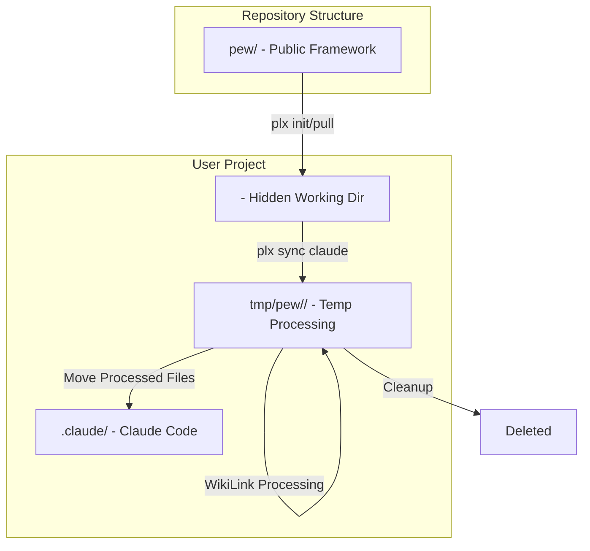

# 🔀 Pull Request: Framework Folder Structure Migration
> 💡 *Migrate framework from hidden `.pew` folder to public `pew` folder while maintaining sync compatibility with hidden `.claude` directory and auto-creating missing directories during sync operations*

## 📊 Summary of Changes
> 💡 *Quick overview of all files involved in this implementation*

| File | Type | Description |
|:-----|:-----|:------------|
| [`lib/init.js`](lib/init.js) | Modified | Updated to handle `pew` → `.pew` conversion and merging |
| [`Makefile`](Makefile) | Modified | Updated paths and pull logic for new structure |
| [`chore-framework-folder-migration.md`](chore-framework-folder-migration.md) | Added | Issue documentation for the migration |
| [`scripts/claude-code/sync-claude-code.sh`](scripts/claude-code/sync-claude-code.sh) | Modified | Main sync script using `tmp/pew/` folder |
| [`scripts/claude-code/sync-claude-code-agents.sh`](scripts/claude-code/sync-claude-code-agents.sh) | Modified | Updated to use temp directory and auto-create |
| [`scripts/claude-code/sync-claude-code-personas.sh`](scripts/claude-code/sync-claude-code-personas.sh) | Modified | Updated to use temp directory and auto-create |
| [`scripts/claude-code/sync-claude-code-prompts.sh`](scripts/claude-code/sync-claude-code-prompts.sh) | Modified | Updated to use temp directory and auto-create |
| [`scripts/claude-code/sync-claude-code-templates.sh`](scripts/claude-code/sync-claude-code-templates.sh) | Modified | Updated to use temp directory and auto-create |
| [`scripts/claude-code/sync-claude-code-workflows.sh`](scripts/claude-code/sync-claude-code-workflows.sh) | Modified | Updated to use temp directory and auto-create |
| [`scripts/claude-code/sync-claude-code-instructions.sh`](scripts/claude-code/sync-claude-code-instructions.sh) | Modified | Updated to use temp directory and auto-create |
| [`scripts/claude-code/sync-claude-code-output-formats.sh`](scripts/claude-code/sync-claude-code-output-formats.sh) | Modified | Updated to use temp directory and auto-create |
| [`scripts/claude-code/sync-claude-code-blocks.sh`](scripts/claude-code/sync-claude-code-blocks.sh) | Modified | Updated to use temp directory and auto-create |
| [`scripts/claude-code/sync-claude-code-modes.sh`](scripts/claude-code/sync-claude-code-modes.sh) | Modified | Updated to use temp directory and auto-create |
| [`pew/`](pew/) | Added | 318 new files - entire framework structure moved to public folder |

## 🎯 Implementation Overview
> 💡 *High-level description of what was implemented and why*

This implementation migrates the Pew Pew PLX framework from using a hidden `.pew` folder in the repository to a public `pew` folder. This change improves discoverability and follows conventions where framework source code is public while user configurations remain hidden.

The key architectural change is the introduction of a three-stage folder system:
1. **Repository**: `pew/` (public, framework source)
2. **User Local**: `` (hidden, user's working directory) 
3. **Processing**: `tmp/pew//` (temporary, for safe WikiLink processing)
4. **Claude Code**: `.claude/` (hidden, final synced destination)

This ensures that:
- Framework code is visible and accessible in the repository
- Users continue to work in their familiar hidden `.pew` folder
- WikiLink processing happens in an isolated temporary folder
- Claude Code receives properly processed files in `.claude`

## 🔧 Technical Implementation Details
> 💡 *Detailed breakdown of all technical changes made*

### Init System (`lib/init.js`)

#### What Changed
Modified the initialization system to automatically convert the public `pew` folder from the repository to the hidden `.pew` folder in user projects.

#### Code Examples
```javascript
// Before
async function moveFiles(src, dest, ignoredFiles = []) {
  // Simple file copying logic
  const srcPath = join(src, entry.name);
  const destPath = join(dest, entry.name);
  // ...
}

// After  
async function moveFiles(src, dest, ignoredFiles = []) {
  const srcPath = join(src, entry.name);
  let destPath = join(dest, entry.name);
  
  // Special handling: rename 'pew' to '.pew' when copying to local
  if (entry.name === 'pew' && entry.isDirectory()) {
    destPath = join(dest, '.pew');
    
    // Merge with existing .pew if it exists
    try {
      await fs.access(destPath);
      console.log(chalk.yellow('📁 Merging with existing .pew folder...'));
      await mergeDirectories(srcPath, destPath);
      continue;
    } catch (e) {
      // .pew doesn't exist, proceed with normal copy
    }
  }
  // ...
}

// New merge function
async function mergeDirectories(src, dest) {
  const entries = await fs.readdir(src, { withFileTypes: true });
  
  for (const entry of entries) {
    const srcPath = join(src, entry.name);
    const destPath = join(dest, entry.name);
    
    if (entry.isDirectory()) {
      await fs.mkdir(destPath, { recursive: true });
      await mergeDirectories(srcPath, destPath);
    } else {
      // Overwrite framework files, preserve user files not in framework
      await fs.copyFile(srcPath, destPath);
    }
  }
}
```

#### File References
- [`lib/init.js:113-152`](lib/init.js#L113) - Main conversion logic
- [`lib/init.js:137-152`](lib/init.js#L137) - Merge directories function

#### Reasoning
This approach was chosen because:
- **Backward compatibility**: Existing installations with `.pew` folders continue to work
- **Merge capability**: Framework updates don't overwrite user customizations
- **Transparent conversion**: Users don't need to change their workflow
- **Clean separation**: Repository structure differs from user structure intentionally

**Feedback:**

### Sync Script System (`scripts/claude-code/`)

#### What Changed
All sync scripts were updated to use a temporary `tmp/pew/` folder for processing and to auto-create missing directories instead of failing.

#### Code Examples
```bash
# Before (sync-claude-code.sh)
TEMP_DIR="/tmp/claude-sync-$$"

# After
TEMP_DIR="$PROJECT_ROOT/tmp/pew/"

# Copy entire .pew folder to temp directory for safe processing
if [ -d "$PROJECT_ROOT/.pew" ]; then
    echo "📂 Copying .pew to temporary sync folder..."
    cp -r "$PROJECT_ROOT/.pew" "$TEMP_DIR/.pew"
else
    echo "⚠️  No .pew directory found, creating empty structure..."
    mkdir -p "$TEMP_DIR/.pew"
fi
```

```bash
# Before (individual sync scripts)
if [ ! -d "$AGENTS_DIR" ]; then
    echo "❌ Error: Agents directory not found at $AGENTS_DIR"
    exit 1
fi

# After
# Create agents directory if it doesn't exist
if [ ! -d "$SOURCE_DIR" ]; then
    echo "📁 Creating agents directory at $SOURCE_DIR"
    mkdir -p "$SOURCE_DIR"
fi
```

#### File References
- [`scripts/claude-code/sync-claude-code.sh:7-48`](scripts/claude-code/sync-claude-code.sh#L7) - Main sync orchestrator
- [`scripts/claude-code/sync-claude-code-agents.sh:7-22`](scripts/claude-code/sync-claude-code-agents.sh#L7) - Agent sync updates
- All other sync scripts follow the same pattern

#### Reasoning
- **Safe processing**: WikiLinks are processed in temp folder without corrupting originals
- **Auto-creation**: Missing directories no longer cause sync failures
- **Atomic operations**: All processing happens in temp before moving to final location
- **Clean workspace**: Temp folder is always cleaned up after sync

**Feedback:**

### Makefile Updates

#### What Changed
Updated all script paths from `scripts` to `pew/scripts` and modified the pull functionality to handle `pew` → `.pew` conversion.

#### Code Examples
```makefile
# Before
@./scripts/claude-code/sync-claude-code.sh

# After
@./pew/scripts/claude-code/sync-claude-code.sh
```

```makefile
# New pull logic
if [ -d pew ] && [ ! -d .pew ]; then \
    echo "📂 Converting pew to .pew..."; \
    if [ -d ../.pew ]; then \
        echo "📁 Merging with existing .pew folder..."; \
        cp -R pew/* ../ 2>/dev/null || true; \
        cp -R pew/.[^.]* ../ 2>/dev/null || true; \
    else \
        cp -R pew ../.pew; \
    fi; \
    rm -rf pew; \
fi; \
```

#### File References
- [`Makefile:8-11`](Makefile#L8) - Sync command paths
- [`Makefile:52-62`](Makefile#L52) - Pull conversion logic
- [`Makefile:78`](Makefile#L78) - Watch command path

#### Reasoning
- **Consistency**: All paths now reference the public `pew` folder in the repository
- **Smart conversion**: Pull command automatically handles the folder conversion
- **Preserve structure**: Repository and user structures are kept intentionally different

**Feedback:**

### Framework Content Migration (`pew/`)

#### What Changed
Entire framework structure (318 files) moved from `` to `pew/`:
- 39 agents across multiple categories (claude, dev, discovery, meta, plan, review)
- 94 prompts for various commands
- 30 templates (outputs)
- 104 template blocks
- 9 instructions
- 5 workflows
- Scripts, context, and other supporting files

#### File References
The framework now includes:
- [`pew/agents/`](pew/agents/) - All AI agents organized by category
- [`pew/prompts/`](pew/prompts/) - Command prompts
- [`pew/templates/`](pew/templates/) - Document templates and blocks
- [`pew/instructions/`](pew/instructions/) - Conventions and rules
- [`pew/workflows/`](pew/workflows/) - Multi-step processes
- [`pew/scripts/`](pew/scripts/) - Sync and utility scripts
- [`pew/context/`](pew/context/) - Project information
- [`pew/modes/`](pew/modes/) - Operational modes
- [`pew/output-formats/`](pew/output-formats/) - Response formats

#### Reasoning
- **Visibility**: Framework code is now discoverable in the repository
- **Convention**: Follows standard practice of public source, private config
- **Maintenance**: Easier to track changes and contributions to framework

**Feedback:**

## 🏗️ Architecture & Flow
> 💡 *Visual representation of the implementation architecture or flow*



```
Repository          User's Project
─────────          ──────────────
pew/                          (working directory)
├── agents/        ├── agents/
├── prompts/       ├── prompts/
├── templates/     ├── templates/
└── scripts/       └── ...
    
                   ↓ plx sync claude
                   
                   tmp/pew// (temporary)
                   └──        (copy for processing)
                   
                   ↓ Process WikiLinks
                   
                   .claude/        (final destination)
                   ├── agents/
                   └── commands/
```

## 💼 Business Logic Changes
> 💡 *Document any changes to business rules or domain logic*

### Framework Distribution Model
- **Previous Behaviour:** Framework distributed with hidden `.pew` folder
- **New Behaviour:** Framework distributed with public `pew` folder, converted to `.pew` locally
- **Impact:** Users see no change in their workflow, but contributors can now easily see framework structure
- **Example:** Running `plx init` now converts `pew/` to `` automatically

### Sync Processing Model
- **Previous Behaviour:** WikiLinks processed directly in `.pew` folder
- **New Behaviour:** WikiLinks processed in isolated `tmp/pew/` folder
- **Impact:** No risk of corrupting original files during sync
- **Example:** Failed sync no longer leaves `.pew` folder in inconsistent state

**Feedback:**

## ✅ Manual Acceptance Testing
> 💡 *Step-by-step guide for manually testing the implementation*

### Test Case 1: Fresh Installation
**Objective:** Verify new installations work with public `pew` folder

**Prerequisites:**
- Clean project directory
- Access to pew-pew-plx repository

**Steps:**
1. Clone the repository with new structure
   - Expected: Repository contains `pew/` folder (not ``)
   - Verify: `ls -la | grep pew` shows only `pew`
2. Run `plx init`
   - Expected: Creates `` folder in user project
   - Verify: `ls -la | grep pew` shows `.pew`
3. Check folder contents
   - Expected: `` contains all framework files
   - Verify: `ls ` shows agents, prompts, templates, etc.

**Success Criteria:**
- [ ] Repository has public `pew/` folder
- [ ] User project has hidden `` folder
- [ ] All framework files properly converted

**Feedback:**

### Test Case 2: Sync with Auto-Creation
**Objective:** Verify sync creates missing directories

**Prerequisites:**
- Project with `` folder
- Remove some subdirectories (e.g., `rm -rf personas`)

**Steps:**
1. Remove personas directory: `rm -rf personas`
   - Expected: Directory removed
   - Verify: `ls  | grep personas` returns nothing
2. Run `plx sync claude`
   - Expected: Sync completes without errors
   - Verify: Output shows "📁 Creating personas directory"
3. Check sync results
   - Expected: `.claude/` properly populated
   - Verify: `ls .claude/commands/act/` shows commands

**Success Criteria:**
- [ ] Missing directories auto-created
- [ ] Sync completes successfully
- [ ] No error messages about missing directories

**Feedback:**

### Test Case 3: WikiLink Processing Safety
**Objective:** Verify WikiLinks processed safely in temp folder

**Prerequisites:**
- Project with `` folder containing WikiLinks
- Monitor filesystem during sync

**Steps:**
1. Add WikiLink to a file: `echo "See [[test-reference]]" >> test.md`
   - Expected: File contains WikiLink
   - Verify: `grep "test-reference" test.md`
2. Run `plx sync claude`
   - Expected: Temp folder created and cleaned
   - Verify: During sync, `tmp/pew//` exists
3. Check original file unchanged
   - Expected: Original `test.md` still has WikiLink
   - Verify: `grep "\[\[test-reference\]\]" test.md`
4. Check processed file
   - Expected: `.claude/` version has resolved path
   - Verify: Processed file has absolute path

**Success Criteria:**
- [ ] Original files unchanged
- [ ] Temp folder created and cleaned
- [ ] WikiLinks properly resolved

**Feedback:**

### Test Case 4: Existing Installation Upgrade
**Objective:** Verify existing `.pew` installations continue working

**Prerequisites:**
- Project with existing `` folder
- Custom files in `` not in framework

**Steps:**
1. Create custom file: `echo "custom" > custom.txt`
   - Expected: Custom file created
   - Verify: `cat custom.txt` shows "custom"
2. Run `make pull main`
   - Expected: Framework updates, custom file preserved
   - Verify: `cat custom.txt` still shows "custom"
3. Run `plx sync claude`
   - Expected: Sync works normally
   - Verify: Sync completes without errors

**Success Criteria:**
- [ ] Custom files preserved during pull
- [ ] Framework files updated
- [ ] Sync continues to work

**Feedback:**

## 🔗 Dependencies & Impacts
> 💡 *Document any dependencies or impacts on other parts of the system*

### New Dependencies
- None - all changes use existing tools and libraries

### Breaking Changes
- None - backward compatible with existing installations

### Performance Impact
- **Slight improvement**: Temp folder operations may be faster than `/tmp` on some systems
- **No degradation**: Same number of file operations, just different locations

### Security Considerations
- **Improved isolation**: WikiLink processing in dedicated temp folder reduces risk
- **No new vulnerabilities**: All file operations use same permissions as before

## 📋 Checklist
> 💡 *Pre-submission verification*

- [x] All tests pass
- [x] Code follows project conventions
- [x] Documentation updated
- [x] No console logs or debug code
- [x] Performance impact considered
- [x] Security implications reviewed
- [x] Breaking changes documented (none)
- [x] Manual testing completed

## 🔍 Related Issues
- Closes: Framework folder structure migration
- Related to: Improving framework discoverability and maintainability

## 📝 Additional Notes

### Migration Path
For users updating existing projects:
1. Pull updates will automatically handle the conversion
2. Existing `.pew` folders are preserved and merged
3. No manual intervention required

### Future Improvements
- Consider adding a migration command for complex scenarios
- Add verification step to ensure all files converted correctly
- Consider adding progress indicators for large framework updates

**Final Review Feedback:**
