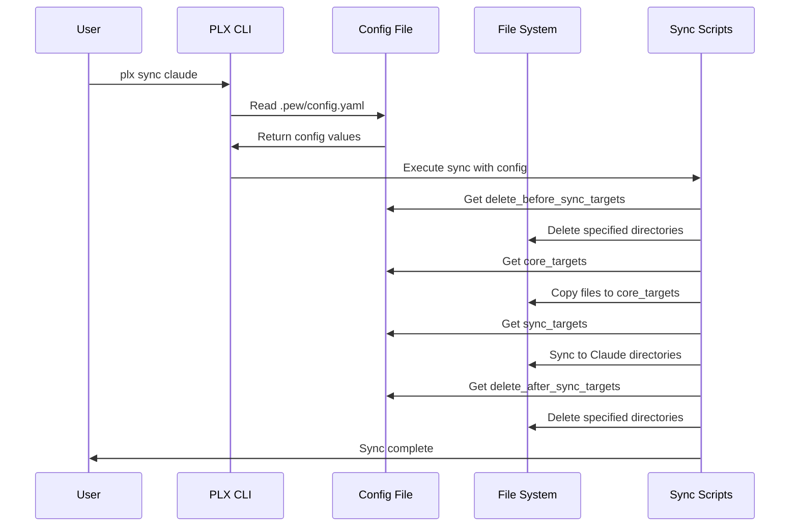
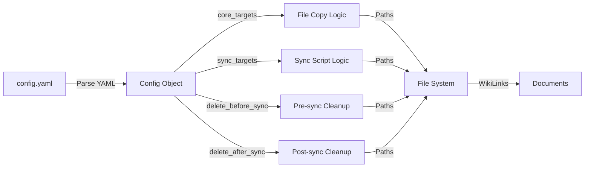
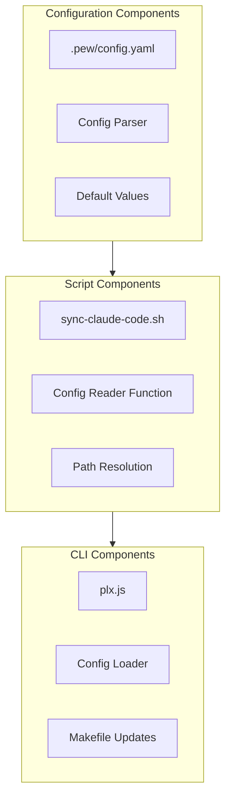

# 🎯 Issue: Configuration System Implementation
> 💡 *Complete issue documentation following the 5-step process*

Implement a centralized configuration system using `.pew/config.yaml` to manage framework component locations, sync targets, and cleanup operations.

## 📋 Initial Requirement
> 💡 *What the system or user should be able to do or be*

- System should read configuration from `.pew/config.yaml`
- System should use config to determine where to save pulled framework components
- System should use config to determine sync target directories
- System should use config to specify directories to delete before/after sync operations
- Documents should reference paths specified in config via WikiLinks
- Config should provide default values for all standard framework directories

## 🔄 Event Flow Diagram
> 💡 *Sequential visualization of what happens and what happens after that*



## ✅ Scope Check
> 💡 *Verification that requirement fits within single developer capacity*

**Estimated effort:** 3 story points / 4 hours
**Single developer:** Yes
**Fits in half day:** Yes

**Breakdown needed:** No

## 📊 Data Flow Diagram
> 💡 *Visualization of data movement and transformations*



## 🧩 Component Diagram
> 💡 *Identification of UI, frontend, and backend components needed*



## 📝 Implementation Details

### Config File Structure
```yaml
# .pew/config.yaml
core_targets:
  agents: .pew/agents
  context: .pew/context
  drafts: .pew/drafts
  instructions: .pew/instructions
  output-formats: .pew/output-formats
  personas: .pew/personas
  prompts: .pew/prompts
  scripts: .pew/scripts
  templates: .pew/templates
  workflows: .pew/workflows
  issues: issues

delete_before_sync_targets:
  - .claude/agents
  - .claude/commands

delete_after_sync_targets: []

sync_targets:
  agents:
    - .claude/agents/
    - .claude/commands/act/
  personas:
    - .claude/commands/act/
  prompts:
    - .claude/commands/plx/
  templates:
    - .claude/commands/use/
  blocks:
    - .claude/commands/use/
  output-formats:
    - .claude/commands/use/
  instructions:
    - .claude/commands/follow/
  workflows:
    - .claude/commands/start/
```

### Implementation Tasks
- [ ] Create `.pew/config.yaml` with default values
- [ ] Update sync scripts to read config
- [ ] Implement config parser in shell scripts
- [ ] Update Makefile to remove 'clean' flag
- [ ] Update WikiLink resolution to use config paths
- [ ] Add config validation
- [ ] Update documentation

### Dependencies
- YAML parsing capability in shell scripts (or use `yq` tool)
- Updates to all sync scripts
- Backward compatibility considerations