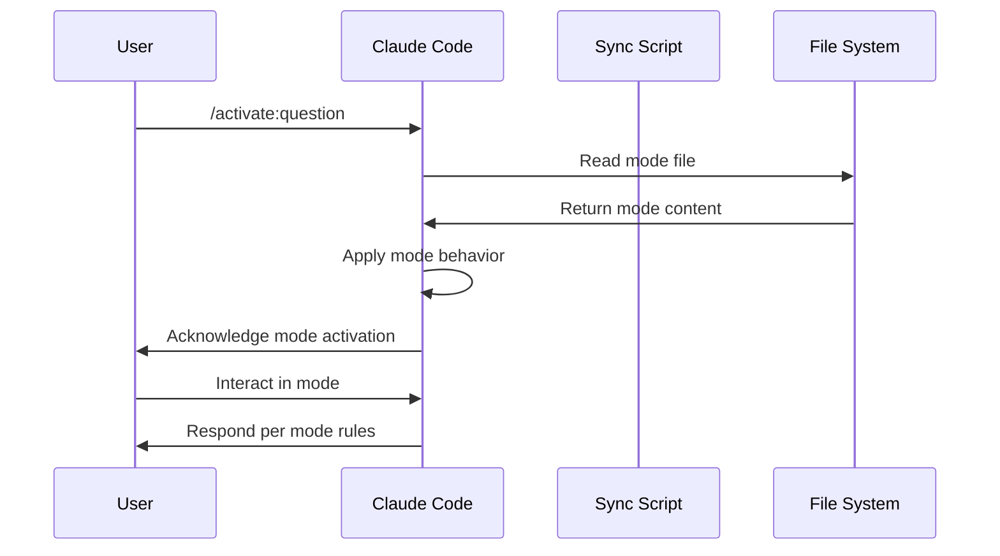
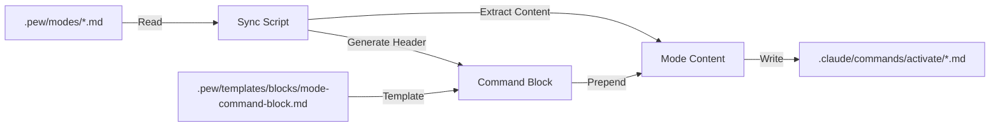
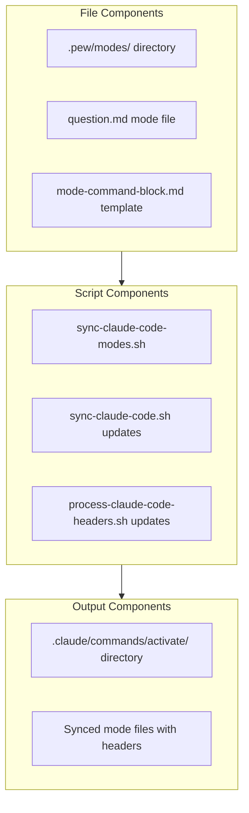

# 🎯 Issue: Introduce Modes Concept to PLX Framework
> 💡 *Refactor question-mode into a new "modes" system with dedicated folder structure and sync integration*

Split the current `question-mode.md` prompt into a new architectural concept called "modes" that provide Claude with different operational behaviors, similar to agents but for switching interaction patterns rather than delegating tasks.

## 📋 Initial Requirement
> 💡 *What the system or user should be able to do or be*

- User should be able to activate different interaction modes via `/activate:{mode-name}` command
- System should sync mode files from `.pew/modes/` to `.claude/commands/activate/`
- Mode files should contain mode descriptions without command block headers
- System should automatically inject mode-command-block headers during sync
- User should be able to switch between different operational modes seamlessly

## 🔄 Event Flow Diagram
> 💡 *Sequential visualization of what happens and what happens after that*

## ✅ Scope Check
> 💡 *Verification that requirement fits within single developer capacity*

**Estimated effort:** 2 story points / 2 hours
**Single developer:** Yes
**Fits in half day:** Yes

**Breakdown needed:** No

## 📊 Data Flow Diagram
> 💡 *Visualization of data movement and transformations*

## 🧩 Component Diagram
> 💡 *Identification of UI, frontend, and backend components needed*

## 🔨 Component Breakdown
> 💡 *Properties and behaviors for each component*

### Mode Files (.pew/modes/*.md)
**Properties:**
- Mode name (derived from filename)
- Mode description and behavior rules
- No command block header (added during sync)

**Behaviors:**
- Define interaction patterns
- Specify response formats
- Set operational constraints

### Sync Script (sync-claude-code-modes.sh)
**Properties:**
- Source directory: .pew/modes/
- Target directory: .claude/commands/activate/
- Template reference: mode-command-block.md

**Behaviors:**
- Read mode files from source
- Inject mode-command-block header
- Process WikiLinks if present
- Write to target directory

### Mode Command Block Template
**Properties:**
- Standard header format
- Activation acknowledgment text

**Behaviors:**
- Instruct Claude to switch operational mode
- Provide activation confirmation

## 💡 Suggested Approach
> 💡 *High-level implementation strategy*

1. **Create modes directory structure:**
   - Create `.pew/modes/` directory
   - Move question mode content to `.pew/modes/question.md`
   - Remove initial activation sentence from content

2. **Create mode command block template:**
   - Create `.pew/templates/blocks/mode-command-block.md`
   - Include activation acknowledgment pattern

3. **Implement sync script:**
   - Create `sync-claude-code-modes.sh` based on existing sync patterns
   - Add header injection logic
   - Include WikiLink processing

4. **Update master sync:**
   - Add modes sync to `sync-claude-code.sh`
   - Ensure proper execution order

5. **Test and validate:**
   - Run sync to verify output structure
   - Test `/activate:question` command
   - Verify mode switching behavior

## ✅ Implementation Checklist
- [ ] Create `.pew/modes/` directory
- [ ] Extract question mode to `.pew/modes/question.md`
- [ ] Create `mode-command-block.md` template
- [ ] Implement `sync-claude-code-modes.sh`
- [ ] Update master sync script
- [ ] Test mode activation commands
- [ ] Verify WikiLink resolution
- [ ] Document in CLAUDE.md
