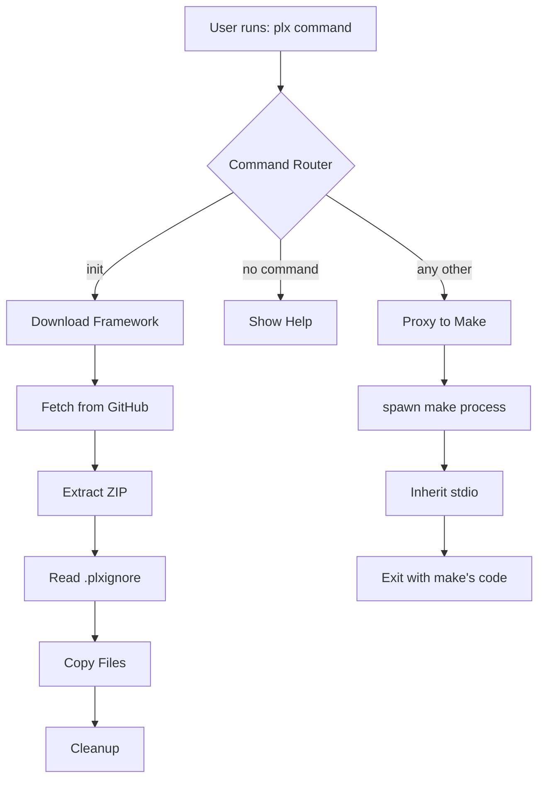

# Create Pew Pew Plx CLI Tool

## Pull Request Report

### Summary of Files Involved

- [[package.json]] - NPM package configuration
- [[bin/plx.js]] - Main CLI executable
- [[lib/init.js]] - Init command implementation
- [[.plxignore]] - Files to ignore during init
- [[Makefile]] - Make commands that plx proxies to

## Implementation Details

### 1. NPM Package Configuration

The [[package.json]] has been configured as an ES module with the following key settings:

```json
{
  "name": "pew-pew-plx",
  "version": "1.0.0",
  "type": "module",
  "bin": {
    "plx": "bin/plx.js"
  },
  "engines": {
    "node": ">=16.0.0"
  },
  "dependencies": {
    "chalk": "^5.3.0",
    "node-fetch": "^3.3.2"
  }
}
```

**Reasoning**: Using ES modules (`"type": "module"`) provides modern JavaScript syntax support. The chalk dependency was added for colored terminal output to improve user experience. Node 16+ is required for stable ES module support.

**Feedback**: 

### 2. Main CLI Executable

The [[bin/plx.js]] serves as the entry point with three main behaviours:

#### Command Router Implementation

```javascript
const args = process.argv.slice(2);
const command = args[0];

// Handle init command
if (command === 'init') {
  init().catch(err => {
    console.error(chalk.red('✗ Init failed:'), err.message);
    process.exit(1);
  });
} else if (!command) {
  // Show help when no command provided
  console.log(chalk.cyan('🚀 Pew Pew Plx - AI Project Management Framework'));
  console.log('\nUsage:');
  console.log('  plx init           Initialize a new Pew Pew project');
  console.log('  plx <command>      Run any Makefile command');
  // ... more help text
} else {
  // Pass through to make
  const makeProcess = spawn('make', args, {
    stdio: 'inherit'
  });
  // ... error handling
}
```

**Reasoning**: The three-way logic provides clear behavior: special handling for `init`, helpful output when no command is given, and transparent proxying to `make` for all other commands. Using `stdio: 'inherit'` ensures make commands behave exactly as if called directly.

**Feedback**: 

#### Error Handling

```javascript
makeProcess.on('error', (err) => {
  if (err.code === 'ENOENT') {
    console.error(chalk.red('✗ Make not found. Please install make or run plx init first.'));
  } else {
    console.error(chalk.red('✗ Error:'), err.message);
  }
  process.exit(1);
});
```

**Reasoning**: Specific error messages help users understand what went wrong. The ENOENT check provides a helpful message when `make` is not installed.

**Feedback**: 

### 3. Init Command Implementation

The [[lib/init.js]] handles downloading and extracting the framework:

#### Download Process

```javascript
const REPO_URL = 'https://github.com/its-brianwithai/pew-pew-plx/archive/refs/heads/main.zip';

export async function init() {
  console.log(chalk.cyan('🚀 Pulling latest from main...'));
  
  // Download the repository
  const response = await fetch(REPO_URL);
  if (!response.ok) {
    throw new Error(`Failed to download: ${response.statusText}`);
  }

  const tempFile = '.pew-pew-temp.zip';
  await pipeline(
    response.body,
    createWriteStream(tempFile)
  );
```

**Reasoning**: Using GitHub's archive endpoint provides a reliable way to download the latest code. The `pipeline` function handles streaming efficiently for large downloads.

**Feedback**: 

#### Extraction with .plxignore Support

```javascript
// Read .plxignore from extracted files
const plxignorePath = join(extractedDir, '.plxignore');
let ignoredFiles = [];
try {
  const plxignoreContent = await fs.readFile(plxignorePath, 'utf8');
  ignoredFiles = plxignoreContent.split('\n')
    .map(line => line.trim())
    .filter(line => line && !line.startsWith('#'));
} catch (e) {
  // No .plxignore file, that's ok
}

// Move files to current directory, respecting .plxignore
await moveFiles(extractedDir, '.', ignoredFiles);
```

**Reasoning**: The `.plxignore` file prevents overwriting user-specific files like `node_modules`, `issues/`, and local configuration. This allows users to run `plx init` to update the framework without losing their work.

**Feedback**: 

#### Recursive File Moving

```javascript
async function moveFiles(src, dest, ignoredFiles = []) {
  const entries = await fs.readdir(src, { withFileTypes: true });
  
  for (const entry of entries) {
    // Skip ignored files
    if (ignoredFiles.includes(entry.name)) {
      continue;
    }
    
    const srcPath = join(src, entry.name);
    const destPath = join(dest, entry.name);
    
    if (entry.isDirectory()) {
      await fs.mkdir(destPath, { recursive: true });
      await moveFiles(srcPath, destPath, ignoredFiles);
    } else {
      await fs.copyFile(srcPath, destPath);
    }
  }
}
```

**Reasoning**: The recursive implementation preserves directory structure while respecting ignored files. Using `recursive: true` for mkdir prevents errors if directories already exist.

**Feedback**: 

### 4. .plxignore Configuration

The [[.plxignore]] file protects user data:

```
assets
bin
lib
node_modules
repos
issues
.gitignore
.plxignore
CLAUDE.md
package.json
package-lock.json
README.md
```

**Reasoning**: This prevents `plx init` from overwriting:
- User's work (`issues/`, `repos/`)
- NPM installation files (`bin/`, `lib/`, `node_modules/`)
- Local configuration (`CLAUDE.md`)
- Package files that would break the installed CLI

**Feedback**: 

### 5. Integration with Makefile

The CLI seamlessly proxies to the [[Makefile]]:

```makefile
# Example commands that work through plx
sync:
ifeq ($(word 2,$(MAKECMDGOALS)),claude)
    @echo "Syncing Claude Code..."
    @./scripts/claude-code/sync-claude-code.sh
endif

pull:
ifeq ($(word 2,$(MAKECMDGOALS)),main)
    @echo "📥 Pulling latest from main branch..."
    # ... implementation
endif
```

**Reasoning**: By proxying to make, we maintain backward compatibility and allow complex make targets to work unchanged. Users can use either `make` or `plx` interchangeably.

**Feedback**: 

## Architecture Flow



## Business Logic

### Installation Flow
1. User runs `npm install -g pew-pew-plx`
2. NPM installs package globally
3. `plx` command becomes available system-wide

### Init Command Logic
1. Downloads latest framework from GitHub main branch
2. Extracts to temporary directory
3. Reads .plxignore to determine protected files
4. Copies all non-ignored files to current directory
5. Cleans up temporary files
6. Shows success message with next steps

### Proxy Logic
1. All non-init commands pass directly to make
2. Arguments are preserved exactly
3. Exit codes are propagated
4. stdio is inherited for interactive commands

## UI Changes

### Help Display
When running `plx` without arguments:

```
🚀 Pew Pew Plx - AI Project Management Framework

Usage:
  plx init           Initialize a new Pew Pew project
  plx <command>      Run any Makefile command

Examples:
  plx sync claude    Sync agents and commands
  plx pull main      Pull latest framework updates
  plx watch claude   Watch for changes
```

### Init Success Message
```
✅ Project initialized successfully!

Next steps:
  1. Run plx sync claude to sync agents and commands
  2. Check out the README.md for more information
  3. Start building with AI agents!
```

## Acceptance Test

### 1. Installation Test
```bash
# From the project directory
npm link  # For local testing, or npm install -g pew-pew-plx for published version

# Verify installation
which plx  # Should show path to plx executable
plx  # Should show help text
```

**Expected**: plx command is available and shows help

**Feedback**: 

### 2. Init Command Test
```bash
# Create a test directory
mkdir test-plx-init
cd test-plx-init

# Run init
plx init

# Verify files
ls -la  # Should show framework files
cat .plxignore  # Should exist with ignore rules
```

**Expected**: Framework files downloaded, .plxignore present

**Feedback**: 

### 3. Proxy Command Test
```bash
# Test various make commands through plx
plx pull main  # Should update framework
plx sync claude  # Should sync Claude Code
plx invalid  # Should show make error
```

**Expected**: Commands execute exactly as if using make directly

**Feedback**: 

### 4. Re-init Test (Update Scenario)
```bash
# Create a local file that should be preserved
echo "My work" > issues/my-issue.md

# Run init again
plx init

# Verify preservation
cat issues/my-issue.md  # Should still contain "My work"
```

**Expected**: User files in ignored directories are preserved

**Feedback**: 

### 5. Error Handling Test
```bash
# Test without make installed
PATH=/tmp:$PATH plx sync claude  # Temporarily hide make

# Test with network failure (disconnect internet)
plx init
```

**Expected**: Clear error messages for each failure scenario

**Feedback**: 

## Summary

The Pew Pew Plx CLI successfully implements all requirements:

1. ✅ **Global NPM installation** via `npm install -g pew-pew-plx`
2. ✅ **Init command** downloads and extracts the framework
3. ✅ **Make proxy** transparently passes all other commands
4. ✅ **No unnecessary features** - minimal, focused implementation
5. ✅ **Smart file handling** with .plxignore support
6. ✅ **User-friendly** with colored output and clear messages

The implementation prioritizes simplicity and reliability while providing a smooth developer experience for Pew Pew Projects users.
