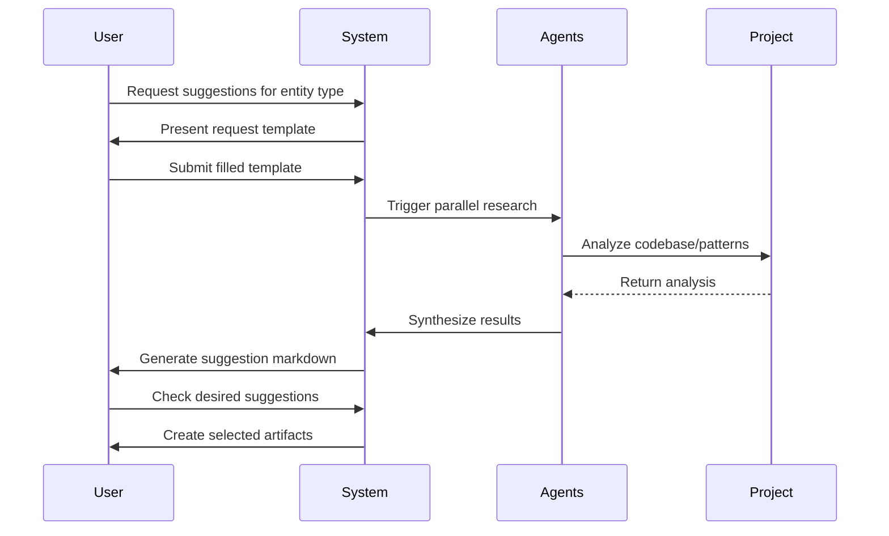
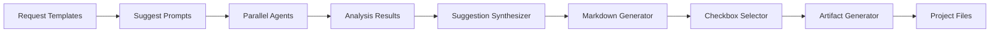

# 🎯 Issue: PLX Suggestion System Feature

A comprehensive suggestion system that provides intelligent recommendations for all PLX framework entity types through structured questionnaires, parallel agent research, and checkbox-based selection interfaces.

---

## 📝 Initial Requirement
*What should the system/user be able to do or be?*

### Requirements
1. **User** should be able to request suggestions for any PLX entity type (workflows, agents, modes, prompts, templates, blocks, context types, instruction types, issues, milestones, roadmaps)
2. **System** should provide easy-to-fill request templates for each entity type with essential information fields
3. **System** should conduct deep project research using multiple agents in parallel based on filled user requests
4. **User** should be able to receive suggestions as markdown files with checkboxes for selection
5. **User** should be able to check off desired suggestions from the generated list
6. **System** should create a unified create-suggestions.md prompt that follows the create.md workflow pattern
7. **System** should generate suggest-* prompts for all 25+ entity types in the PLX framework

### Entity Types to Support
- **Orchestration**: workflows, agents, modes
- **Quick Actions**: prompts
- **Structural**: templates, blocks, output-formats
- **Context Types**: actors, collections, components, concepts, docs, features, models, platforms, roles, teams
- **Instruction Types**: conventions, best-practices, patterns, rules
- **Work Management**: issues, milestones, roadmaps

---

## 🌊 Actor Flow
*How does this look in terms of sequential events?*

### Event Sequence
1. **User** → initiates → suggestion request for specific entity type
   - Data: entity type selection, initial context/requirements
2. **System** → presents → entity-specific request template
   - Data: essential fields for that entity type, guidance text
3. **User** → completes → request template with specific needs
   - Data: filled template fields, context information, constraints
4. **System** → triggers → parallel agent research
   - Data: user requirements, project context, entity patterns
5. **Agents** → analyze → project codebase and existing patterns
   - Data: existing entities, conventions, patterns, dependencies
6. **System** → synthesizes → research results into suggestions
   - Data: analyzed patterns, recommendations, rationale
7. **System** → generates → markdown file with checkbox suggestions
   - Data: structured suggestions, descriptions, selection interface
8. **User** → reviews → suggestions and checks desired items
   - Data: selected suggestions, feedback, modifications
9. **System** → processes → selected suggestions
   - Data: checked items, generation parameters
10. **System** → creates → artifacts for selected suggestions
    - Data: generated entity files, integration points

### Flow Diagram


---

## 📦 Deliverables
*Tangible components to create/update/delete per event*

### Event 1: User initiates suggestion request
- **Create**: suggest-{entity-type}.md prompt file for each of 25+ entity types
- **Create**: Request context object in memory

### Event 2: System presents request template
- **Read**: Entity-specific template structure
- **Create**: Interactive form/template instance

### Event 3: User completes request template
- **Update**: Request context with user inputs
- **Create**: Validated requirement specification

### Event 4: System triggers parallel agent research
- **Create**: Parallel agent task queue
- **Create**: Research coordination context
- **Read**: Project codebase patterns

### Event 5: Agents analyze project
- **Read**: Existing entity files of requested type
- **Read**: Project conventions and patterns
- **Create**: Analysis results per agent

### Event 6: System synthesizes research
- **Create**: Unified suggestion model
- **Create**: Rationale documentation
- **Read**: Quality standards and conventions

### Event 7: System generates suggestion markdown
- **Create**: suggestions-{entity-type}-{timestamp}.md file
- **Create**: Checkbox selection interface
- **Create**: Metadata for each suggestion

### Event 8: User reviews and selects
- **Update**: Suggestion selection state
- **Create**: User preference record

### Event 9: System processes selections
- **Read**: Selected suggestions
- **Create**: Generation task queue

### Event 10: System creates artifacts
- **Create**: Entity files for each selected suggestion
- **Update**: Project structure with new entities
- **Create**: Integration documentation

### Component Connection Diagram


---

## ✅ Acceptance Criteria

### What should always go right?
- [ ] All 25+ entity types have corresponding suggest-* prompts
- [ ] Request templates capture essential information for quality suggestions
- [ ] Parallel agent research completes within reasonable time (<30 seconds)
- [ ] Suggestion markdown files render correctly with functional checkboxes
- [ ] Selected suggestions generate valid entity files
- [ ] Generated entities follow all PLX conventions
- [ ] Create-suggestions.md prompt integrates with create.md workflow
- [ ] WikiLink references resolve correctly in generated artifacts

### What should never go wrong?
- [ ] System never generates duplicate suggestions for same context
- [ ] Parallel agents never create race conditions or conflicts
- [ ] Generated suggestions never violate project conventions
- [ ] Checkbox selection never loses user choices
- [ ] File generation never overwrites existing entities without confirmation
- [ ] Request templates never accept invalid or incomplete data
- [ ] Research never times out without graceful fallback

### What should always be?
- [ ] Request templates available for every entity type
- [ ] Suggestions include clear descriptions and rationale
- [ ] Generated markdown files are human-readable and well-formatted
- [ ] All suggestions are actionable and specific
- [ ] Entity naming follows established conventions
- [ ] Research covers relevant project areas comprehensively
- [ ] User can always modify or reject suggestions

### What should never be?
- [ ] Vague or generic suggestions without context
- [ ] Broken markdown syntax in suggestion files
- [ ] Missing essential fields in request templates
- [ ] Suggestions that duplicate existing entities
- [ ] Invalid wikilinks or references
- [ ] Unhandled errors during parallel agent execution
- [ ] Lost user input or selections
- [ ] Generated entities with placeholder content

### Technical Implementation Notes

**Request Template Structure Example:**
```markdown
# Request Template for {{entity-type}}

## Core Information
- Purpose: [What problem does this solve?]
- Context: [Where/how will this be used?]
- Dependencies: [What existing entities does this relate to?]

## Specific to {{entity-type}}
[Fields specific to each entity type]
```

**Suggestion Markdown Output Example:**
```markdown
# 📋 Suggested {{entity-type}}s

Based on your requirements, here are recommended {{entity-type}}s:

## Suggestions

### 1. {{suggestion-name}}
**Description**: {{why this is suggested}}
**Rationale**: {{how it fits your needs}}
- [ ] Select this suggestion

### 2. {{another-suggestion}}
**Description**: {{description}}
**Rationale**: {{rationale}}
- [ ] Select this suggestion

[Additional suggestions...]
```

**Parallel Agent Strategy:**
- Discovery agents for context gathering
- Meta agents for pattern analysis
- Review agents for quality validation
- Plan agents for dependency mapping
