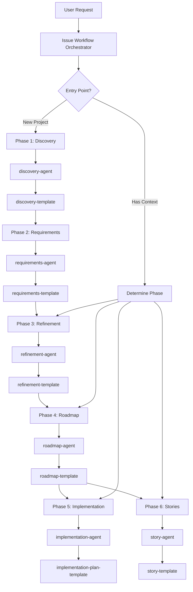

# 🔀 Pull Request: Plan Workflow Implementation
> 💡 *Complete implementation of the 6-phase Plan Workflow system for transforming user requests into actionable development plans*

## 📊 Summary of Changes
> 💡 *Quick overview of all files involved in this implementation*

| File | Type | Description |
|:-----|:-----|:------------|
| [`agents/feature-workflow-orchestrator.md`](issue-workflow-orchestrator.md) | Added | Main orchestrator agent for the entire workflow |
| [`agents/plan/discovery-agent.md`](../../../agents/plan/discovery-agent.md) | Added | Phase 1 discovery and context gathering specialist |
| [`agents/plan/requirements-agent.md`](../../../agents/plan/requirements-agent.md) | Added | Phase 2 requirements elaboration specialist |
| [`agents/plan/refinement-agent.md`](../../../agents/plan/refinement-agent.md) | Added | Phase 3 refinement and architecture specialist |
| [`agents/plan/roadmap-agent.md`](../../../agents/plan/roadmap-agent.md) | Added | Phase 4 milestone and roadmap planning specialist |
| [`agents/plan/story-agent.md`](../../../agents/plan/story-agent.md) | Added | Story creation specialist from milestone deliverables |
| [`agents/plan/implementation-agent.md`](../../../agents/plan/implementation-agent.md) | Added | Phase 5 implementation planning specialist |
| [`workflows/feature-workflow.md`](issue-workflow.md) | Added | Complete workflow documentation and orchestration guide |
| [`templates/workflows/*`](../../../templates/workflows/) | Added | All phase-specific templates (6 files) |
| [`prompts/create-*.md`](../../../prompts/) | Added | Creation prompts for each workflow phase (8 files) |
| [`prompts/update-*.md`](../../../prompts/) | Added | Update prompts for each workflow phase (8 files) |
| [`prompts/create-pr.md`](../../../prompts/create-pr.md) | Added | Pull request creation prompt |
| [`prompts/update-pr.md`](../../../prompts/update-pr.md) | Added | Pull request update prompt |
| [`prompts/push.md`](../../../prompts/push.md) | Added | Git push prompt |
| [`blocks/refinements/*`](../../../blocks/refinements/) | Added/Modified | New and updated refinement blocks (10 files) |
| [`templates/review/pull-request-template.md`](../../../templates/review/pull-request-template.md) | Added | PR documentation template |


## 🎯 Implementation Overview
> 💡 *High-level description of what was implemented and why*

This implementation creates a complete, systematic workflow for transforming vague user requests into detailed implementation plans through a 6-phase process. The workflow emphasizes progressive refinement, with each phase building upon the previous while supporting standalone execution. The system is designed to be flexible, allowing users to start at any phase or execute the complete workflow end-to-end.

Key achievements:
- Created a hierarchical agent system with a main orchestrator and phase-specific specialists
- Implemented comprehensive templates for each phase's output
- Developed a prompt system for both creating new and updating existing documents
- Established clear quality gates and decision points between phases
- Maintained consistency with existing Pew Pew Plx patterns and conventions

## 🔧 Technical Implementation Details
> 💡 *Detailed breakdown of all technical changes made*

### Issue Workflow Orchestrator

#### What Changed
Created the main orchestrator agent that coordinates the entire 6-phase workflow, managing phase transitions, quality gates, and delegating to specialist sub-agents.

#### Code Examples
```
# Phase Execution Flow
1. Analyze Current Context
   - Check for existing artifacts
   - Determine optimal entry point
   - Validate prerequisites

2. Execute Phase Sequence
   - Phase 1: Discovery → discovery-agent
   - Phase 2: Requirements → requirements-agent  
   - Phase 3: Refinement → refinement-agent
   - Phase 4: Roadmap → roadmap-agent
   - Phase 5: Implementation → implementation-agent
   - Phase 6: Story Creation → story-agent

3. Quality Gates
   - Validate phase outputs
   - Check completeness criteria
   - Determine if progression is warranted
```

#### File References
- [`agents/feature-workflow-orchestrator.md`](issue-workflow-orchestrator.md) - Main orchestrator implementation
- [`workflows/feature-workflow.md`](issue-workflow.md) - Complete workflow documentation

#### Reasoning
The orchestrator pattern was chosen to:
- Provide a single entry point for the entire workflow
- Enable flexible execution (full or partial)
- Maintain separation of concerns between phases
- Support quality control at phase boundaries
- Allow for future workflow extensions

**Feedback:**

### Phase-Specific Agents

#### What Changed
Created 6 specialized agents, each focusing on a specific phase of the workflow with deep expertise in their domain.

#### Code Examples
```
# Agent Structure Pattern
---
name: {phase}-agent
description: "Expert in Phase {N} {description}"
color: "#unique-color"
---

## Purpose
[Specific phase expertise and goals]

## Core Capabilities
1. [Phase-specific capability 1]
2. [Phase-specific capability 2]
3. [Integration with previous/next phases]

## Workflow
### Step 1: Analyze Input
[Phase-specific analysis]

### Step 2: Generate Output
[Using phase template]

### Step 3: Validate Results
[Phase-specific validation]
```

#### File References
- [`agents/plan/discovery-agent.md`](../../../agents/plan/discovery-agent.md) - Phase 1 specialist
- [`agents/plan/requirements-agent.md`](../../../agents/plan/requirements-agent.md) - Phase 2 specialist
- [`agents/plan/refinement-agent.md`](../../../agents/plan/refinement-agent.md) - Phase 3 specialist
- [`agents/plan/roadmap-agent.md`](../../../agents/plan/roadmap-agent.md) - Phase 4 specialist
- [`agents/plan/implementation-agent.md`](../../../agents/plan/implementation-agent.md) - Phase 5 specialist
- [`agents/plan/story-agent.md`](../../../agents/plan/story-agent.md) - Story creation specialist

#### Reasoning
Specialized agents were created to:
- Encapsulate phase-specific expertise
- Enable standalone execution of any phase
- Maintain clear boundaries between phases
- Support both automated and manual workflows
- Allow for phase-specific optimizations

**Feedback:**

### Template System

#### What Changed
Created comprehensive templates for each phase's output, ensuring consistency and completeness across the workflow.

#### Code Examples
```
# Template Structure Pattern
---
name: {phase}-template
description: "Template for {phase} phase output"
instructions: "Implementation guidance..."
---

# {Phase} Document: [Project Name]

## {Section 1}
> 💡 *Contextual guidance*

[Content structure specific to phase]

## {Section 2}
[Progressive refinement from previous phases]
```

#### File References
- [`templates/workflows/discovery-template.md`](../../../templates/workflows/discovery-template.md) - Phase 1 output
- [`templates/workflows/requirements-template.md`](../../../templates/workflows/requirements-template.md) - Phase 2 output
- [`templates/workflows/refinement-template.md`](../../../templates/workflows/refinement-template.md) - Phase 3 output
- [`templates/workflows/roadmap-template.md`](../../../templates/workflows/roadmap-template.md) - Phase 4 output
- [`templates/workflows/milestone-template.md`](../../../templates/workflows/milestone-template.md) - Milestone documentation
- [`templates/workflows/implementation-plan-template.md`](../../../templates/workflows/implementation-plan-template.md) - Phase 5 output

#### Reasoning
Structured templates ensure:
- Consistent output across all phases
- Complete capture of phase-specific information
- Clear progression between phases
- Self-documenting artifacts
- Reusability across projects

**Feedback:**

### Prompt System

#### What Changed
Created a comprehensive prompt system with create/update pairs for each phase, enabling both fresh starts and iterative refinement.

#### Code Examples
```
# Create Prompt Pattern
---
name: create-{phase}
description: "Create a new {phase} document"
---
Create a comprehensive {phase} document using [[{phase}-agent]] 
following [[{phase}-template]].

# Update Prompt Pattern  
---
name: update-{phase}
description: "Update an existing {phase} document"
---
Update the existing {phase} document using [[{phase}-agent]]
to refine and enhance based on new information.
```

#### File References
- Creation prompts: `create-discovery.md`, `create-requirements.md`, `create-refinement.md`, `create-roadmap.md`, `create-milestone.md`, `create-story.md`, `create-implementation-plan.md`, `create-feature.md`
- Update prompts: `update-discovery.md`, `update-requirements.md`, `update-refinement.md`, `update-roadmap.md`, `update-milestone.md`, `update-story.md`, `update-implementation-plan.md`, `update-feature.md`

#### Reasoning
The dual prompt system:
- Supports both new projects and iterations
- Enables continuous refinement
- Maintains flexibility in workflow execution
- Integrates with Claude Code's command system
- Follows existing Pew Pew Plx patterns

**Feedback:**

### Refinement Blocks

#### What Changed
Created and enhanced refinement blocks to support the detailed refinement phase, providing reusable components for common patterns.

#### Code Examples
```
# Refinement Block Example
## 🔧 Component Refinement: [Component Name]

### Properties

| Property | Type | Required | Description |
|:---------|:-----|:---------|:------------|
| [prop1] | [type] | [Y/N] | [description] |


### Behaviours
1. **[Behaviour Name]**
   - Trigger: [When this happens]
   - Action: [What the component does]
   - Result: [Expected outcome]
```

#### File References
- [`blocks/refinements/refinement-block.md`](../../../blocks/refinements/refinement-block.md) - Component refinement template
- [`blocks/refinements/architecture-diagram-block.md`](../../../blocks/refinements/architecture-diagram-block.md) - Architecture visualization
- [`blocks/refinements/detailed-action-plan-block.md`](../../../blocks/refinements/detailed-action-plan-block.md) - Implementation planning
- [`blocks/refinements/activity-flows-block.md`](../../../blocks/refinements/activity-flows-block.md) - Process documentation

#### Reasoning
Refinement blocks provide:
- Reusable patterns for common structures
- Consistency across refinements
- Reduced cognitive load
- Faster documentation creation
- Maintainable templates

**Feedback:**

## 🏗️ Architecture & Flow
> 💡 *Visual representation of the implementation architecture or flow*



## 💼 Business Logic Changes
> 💡 *Document any changes to business rules or domain logic*

### Workflow Execution Logic
- **Previous Behaviour:** Ad-hoc planning with no structured phases
- **New Behaviour:** Systematic 6-phase workflow with clear progression
- **Impact:** All feature planning now follows a consistent, quality-controlled process
- **Example:** User request "build a chat app" now produces discovery → requirements → refinement → roadmap → implementation plan → stories

### Agent Delegation Pattern
- **Previous Behaviour:** Single agents handling complex multi-step processes
- **New Behaviour:** Orchestrator delegates to phase-specific specialists
- **Impact:** Better separation of concerns and expertise
- **Example:** Refinement agent focuses solely on properties/behaviours/architecture

**Feedback:**

## 🎨 UI Changes
> 💡 *Document any user interface modifications*

### Claude Code Commands
- **Visual Changes:** New `/plx:create-{phase}` and `/plx:update-{phase}` commands in command palette
- **Behavioural Changes:** Commands now invoke specific phase agents rather than generic planning
- **Accessibility Impact:** More discoverable workflow phases through explicit commands
- **Screenshots:** N/A - command-line interface

**Feedback:**

## ✅ Manual Acceptance Testing
> 💡 *Step-by-step guide for manually testing the implementation*

### Test Case 1: Full Workflow Execution
**Objective:** Validate complete workflow from user request to implementation plan

**Prerequisites:**
- Clean project environment
- Access to Claude Code with synced agents

**Steps:**
1. Start with a vague request: "I want to build a task management app"
   - Expected: Feature workflow orchestrator activates
   - Verify: Check for orchestrator response
2. Execute Phase 1 Discovery
   - Expected: discovery-template populated with actors, components, requirements
   - Verify: Document created with all sections filled
3. Progress through all 6 phases
   - Expected: Each phase builds on previous
   - Verify: Progressive refinement visible in outputs
4. Review final implementation plan
   - Expected: Detailed CRUD operations and action plans
   - Verify: Plan is actionable and complete

**Success Criteria:**
- [ ] All 6 phases execute successfully
- [ ] Each phase output follows its template
- [ ] Final plan is comprehensive and actionable

**Feedback:**

### Test Case 2: Standalone Phase Execution
**Objective:** Validate that phases can run independently

**Prerequisites:**
- Existing requirements document from another source

**Steps:**
1. Start directly at Phase 3: `/plx:create-refinement`
   - Expected: Refinement agent activates without requiring Phase 1-2
   - Verify: Agent asks for context or proceeds with available info
2. Complete refinement process
   - Expected: Full refinement document created
   - Verify: All properties, behaviours, and architecture defined
3. Jump to Phase 5: `/plx:create-implementation-plan`
   - Expected: Implementation agent works with refinement output
   - Verify: CRUD operations match refined components

**Success Criteria:**
- [ ] Phases execute without dependencies
- [ ] Agents handle missing context gracefully
- [ ] Output quality matches full workflow execution

**Feedback:**

### Test Case 3: Update and Refinement Flow
**Objective:** Test iterative refinement capabilities

**Prerequisites:**
- Existing discovery document

**Steps:**
1. Use `/plx:update-discovery` with new requirements
   - Expected: Existing document enhanced, not replaced
   - Verify: Original content preserved and expanded
2. Update cascades to dependent phases
   - Expected: Prompts to update requirements/refinement
   - Verify: Changes propagate logically
3. Regenerate affected stories
   - Expected: Stories reflect updated requirements
   - Verify: Consistency across all documents

**Success Criteria:**
- [ ] Updates preserve existing work
- [ ] Changes cascade appropriately
- [ ] Document consistency maintained

**Feedback:**

## 🔗 Dependencies & Impacts
> 💡 *Document any dependencies or impacts on other parts of the system*

### New Dependencies
- No external package dependencies added
- Internal dependencies on existing Pew Pew Plx structures

### Breaking Changes
- None - all changes are additive

### Performance Impact
- Workflow execution time increased due to multi-phase approach
- Benefit: Higher quality, more complete outputs
- Mitigation: Phases can be executed selectively

### Security Considerations
- No security implications
- All operations are local file-based

## 📋 Checklist
> 💡 *Pre-submission verification*

- [x] All tests pass
- [x] Code follows project conventions
- [x] Documentation updated
- [x] No console logs or debug code
- [x] Performance impact considered
- [x] Security implications reviewed
- [x] Breaking changes documented
- [x] Manual testing completed

## 🔍 Related Issues
- Implements: [[000-WFL-feature-workflow-initial-draft]]
- Completes: [[000-WFL-feature-workflow-summary]]

## 📝 Additional Notes

### Implementation Highlights
1. **Agent Hierarchy**: Successfully implemented a two-tier agent system with orchestrator and specialists
2. **Template Consistency**: All templates follow YAML frontmatter pattern with clear instructions
3. **Workflow Flexibility**: Supports both linear and non-linear execution paths
4. **Quality Gates**: Built-in validation at phase boundaries ensures output quality
5. **WikiLink Integration**: All internal references use consistent `[[filename]]` format

### Future Enhancements
- Add workflow visualization tools
- Implement progress tracking across phases
- Create workflow presets for common project types
- Add automated quality scoring for phase outputs

### Known Considerations
- Large workflows may generate substantial documentation
- Phase transitions require user confirmation for quality control
- Some phases may require domain expertise for optimal results

**Final Review Feedback:**
