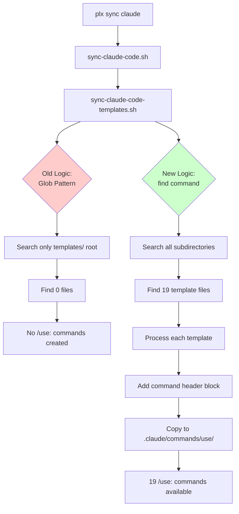

# PR: Fix Template Sync for Subdirectory Structure

## Summary

This PR fixes a critical issue where templates were not being synced to Claude Code's `.claude/commands/use/` directory due to the sync script not searching subdirectories after a recent reorganization of the template file structure.

### Files Changed

- [`scripts/claude-code/sync-claude-code-templates.sh`](../scripts/claude-code/sync-claude-code-templates.sh) - Modified template discovery logic

### Related Issue

- [`issues/backlog/templates-not-syncing-to-claude-commands.md`](../issues/backlog/templates-not-syncing-to-claude-commands.md)

## Problem Statement

The `plx sync claude` command was failing to sync any templates, resulting in all `/use:{template-name}` commands being unavailable in Claude Code. The sync process would complete but report "0 template commands" created.

## Root Cause Analysis

### Template Directory Structure Change

Templates were recently reorganized from a flat structure to a hierarchical structure:

**Before (all in root):**
```
templates/
├── story-template.md
├── epic-template.md
├── milestone-template.md
└── ... (16 more files)
```

**After (organized in subdirectories):**
```
templates/
├── plan/
│   ├── story-template.md
│   ├── epic-template.md
│   ├── milestone-template.md
│   └── ... (10 files total)
├── context/
│   ├── role-template.md
│   ├── team-template.md
│   └── ... (4 files total)
├── act/
│   └── workflow-template.md
├── discovery/
│   └── research-report-template.md
├── meta/
│   ├── agent-template.md
│   └── block-template.md
└── review/
    └── work-log-template.md
```

### Why The Script Failed

The sync script was using a bash glob pattern that only matches files in the root directory:

```bash
for template_file in "$TEMPLATES_DIR"/*-template.md; do
```

Bash glob patterns do not recurse into subdirectories by default, so none of the 19 template files in subdirectories were found.

**Reasoning:** This is a common oversight when refactoring file structures - associated scripts that depend on file locations are not always updated.

**Feedback:**

## Technical Implementation

### Code Change

The fix updates the template discovery mechanism to use `find` command for recursive search:

**Before:**
```bash
# Process each template file
template_count=0
for template_file in "$TEMPLATES_DIR"/*-template.md; do
    if [ -f "$template_file" ]; then
        # ... processing logic
    fi
done
```

**After:**
```bash
# Process each template file
template_count=0
for template_file in $(find "$TEMPLATES_DIR" -name "*-template.md" -type f); do
    if [ -f "$template_file" ]; then
        # ... processing logic
    fi
done
```

### Why This Solution

1. **Consistency with Other Scripts**: The agents sync script ([`sync-claude-code-agents.sh`](../scripts/claude-code/sync-claude-code-agents.sh)) already uses `find` for recursive search:
   ```bash
   find "$AGENTS_DIR" -name "*.md" -type f ! -name "README*" ! -name "readme*" -exec cp {} "$CLAUDE_AGENTS_DIR/" \;
   ```

2. **Minimal Change**: Only one line needs to be modified, reducing the risk of introducing new bugs.

3. **Maintains Flat Output Structure**: Templates from all subdirectories are still flattened into `.claude/commands/use/`, preserving the expected `/use:{template-name}` command structure.

**Reasoning:** Using `find` is the standard approach for recursive file operations in bash scripts and aligns with the project's existing patterns.

**Feedback:**

## Flow Diagram



**Reasoning:** The diagram illustrates the critical difference between the old non-recursive search and the new recursive search approach.

**Feedback:**

## Impact Analysis

### What This Fixes

1. **All 19 templates** now sync correctly to `.claude/commands/use/`
2. **Template commands** like `/use:story-template`, `/use:epic-template` are now available
3. **Sync output** correctly reports "Successfully created 19 template commands"

### What Remains Unchanged

1. **Command naming**: Templates still use their base filename (e.g., `story-template.md` → `/use:story-template`)
2. **Directory flattening**: Subdirectory structure is not preserved in commands (intentional design choice)
3. **Processing logic**: Each template still gets the same command header block inserted

**Reasoning:** The fix maintains backward compatibility while restoring the broken functionality.

**Feedback:**

## Edge Cases Considered

### Potential Name Conflicts

Since templates from different subdirectories are flattened into one directory, there's a theoretical risk of name conflicts. However:

1. All current templates follow the `*-template.md` naming convention
2. A verification shows no duplicate names exist:
   ```bash
   find templates -name "*-template.md" -type f | xargs -n1 basename | sort | uniq -d
   # No output = no duplicates
   ```

**Reasoning:** The consistent naming convention prevents conflicts, and the project's template naming guidelines should prevent future conflicts.

**Feedback:**

### Special Characters in Filenames

The `find` command output is used directly in a for loop, which could break with filenames containing spaces. However:

1. All template files use kebab-case naming (e.g., `story-template.md`)
2. The project conventions enforce no spaces in filenames

**Reasoning:** While the code could be more robust with `while read` pattern, the current approach works given the project's naming constraints.

**Feedback:**

## Acceptance Test

### Prerequisites

1. Ensure you have the latest code with this fix
2. Clear any existing Claude Code sync: `rm -rf .claude/commands/use`

### Test Steps

1. **Run the sync command:**
   ```bash
   plx sync claude
   # OR
   make sync claude
   ```

2. **Verify sync output shows 19 templates:**
   ```
   📋 Syncing templates...
   📋 Creating Claude use commands directory...
   📋 Processing templates from /path/to/templates to /tmp/claude-sync-XXX/.claude/commands/use...
   ✅ Successfully created 19 template commands
   ```

3. **Verify template files exist:**
   ```bash
   ls -la .claude/commands/use/ | grep -c "template.md"
   # Should output: 19
   ```

4. **Verify specific templates are available:**
   ```bash
   ls .claude/commands/use/
   ```
   Should include:
    - `story-template.md`
    - `epic-template.md`
    - `milestone-template.md`
    - `role-template.md`
    - `workflow-template.md`
    - etc. (19 total)

5. **Test in Claude Code:**
    - Open Claude Code
    - Type `/use:story-template`
    - Verify the command is recognized and loads the template

### Expected Results

- All 19 templates should be available as `/use:` commands
- Each template should load with the proper command header block
- No errors during sync process

**Reasoning:** These test steps verify both the technical fix (files are found and copied) and the user-facing functionality (commands work in Claude Code).

**Feedback:**

## Risk Assessment

### Low Risk
- Single line change in a non-critical path
- Follows established patterns from other sync scripts
- Maintains backward compatibility

### Mitigated Risks
- **Performance**: `find` command is efficient for the small number of files (19 templates)
- **Security**: No new file operations or permissions required
- **Compatibility**: Works with existing bash versions on macOS/Linux

**Reasoning:** This is a low-risk fix that restores broken functionality without introducing new complexity.

**Feedback:**

## Conclusion

This fix restores the template sync functionality by updating a single line to use recursive directory search. The change aligns with existing project patterns and has been verified to sync all 19 templates correctly.

The root cause was a mismatch between the template file organization (hierarchical) and the sync script's expectations (flat). This fix bridges that gap while maintaining the simple `/use:{template-name}` command structure users expect.
