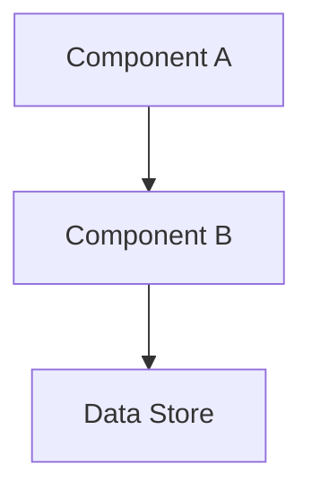

# 🔀 Pull Request: Plan Workflow Implementation - 6-Phase Feature Development System
> 💡 *Complete implementation of a systematic 6-phase workflow for transforming user requests into actionable development plans through progressive refinement and specialized agents*

## 📊 Summary of Changes
> 💡 *Quick overview of all files involved in this implementation*

| File | Type | Description |
|:-----|:-----|:------------|
| [`agents/feature-workflow-orchestrator.md`](issue-workflow-orchestrator.md) | Added | Master orchestrator coordinating all 6 workflow phases |
| [`agents/meta/workflow-specialist.md`](../../../agents/meta/meta-workflow-specialist) | Modified | Enhanced with sophisticated workflow design capabilities |
| [`agents/plan/discovery-agent.md`](../../../agents/plan/discovery-agent.md) | Added | Phase 1 specialist for context gathering |
| [`agents/plan/requirements-agent.md`](../../../agents/plan/requirements-agent.md) | Added | Phase 2 specialist for requirements elaboration |
| [`agents/plan/refinement-agent.md`](../../../agents/plan/refinement-agent.md) | Added | Phase 3 specialist for technical refinement |
| [`agents/plan/story-agent.md`](../../../agents/plan/story-agent.md) | Added | Phase 4 specialist for user story creation |
| [`agents/plan/roadmap-agent.md`](../../../agents/plan/roadmap-agent.md) | Added | Phase 5 specialist for milestone planning |
| [`agents/plan/implementation-agent.md`](../../../agents/plan/implementation-agent.md) | Added | Phase 6 specialist for implementation planning |
| [`workflows/feature-workflow.md`](issue-workflow.md) | Added | Comprehensive 800+ line workflow documentation |
| [`workflows/refinement-workflow.md`](../../../workflows/refinement-workflow.md) | Added | 5-layer systematic refinement approach |
| [`templates/workflows/discovery-template.md`](../../../templates/workflows/discovery-template.md) | Added | Phase 1 output template |
| [`templates/workflows/requirements-template.md`](../../../templates/workflows/requirements-template.md) | Added | Phase 2 output template |
| [`templates/workflows/refinement-template.md`](../../../templates/workflows/refinement-template.md) | Added | Phase 3 output template |
| [`templates/workflows/roadmap-template.md`](../../../templates/workflows/roadmap-template.md) | Added | Phase 4 output template |
| [`templates/workflows/milestone-template.md`](../../../templates/workflows/milestone-template.md) | Added | Individual milestone documentation template |
| [`templates/workflows/implementation-plan-template.md`](../../../templates/workflows/implementation-plan-template.md) | Added | Phase 5 output template |
| [`templates/review/pull-request-template.md`](../../../templates/review/pull-request-template.md) | Added | Comprehensive PR documentation template |
| [`templates/plan/story-template.md`](../../../templates/plan/story-template.md) | Modified | Enhanced with analytics, effort breakdowns |
| [`templates/plan/proposal-template.md`](../../../templates/plan/proposal-template.md) | Modified | Updated for business proposals |
| [`templates/act/workflow-template.md`](../../../templates/act/workflow-template.md) | Modified | Enhanced with orchestration patterns |
| [`prompts/create-discovery.md`](../../../prompts/create-discovery.md) | Added | Create Phase 1 documents |
| [`prompts/update-discovery.md`](../../../prompts/update-discovery.md) | Added | Update Phase 1 documents |
| [`prompts/create-requirements.md`](../../../prompts/create-requirements.md) | Added | Create Phase 2 documents |
| [`prompts/update-requirements.md`](../../../prompts/update-requirements.md) | Added | Update Phase 2 documents |
| [`prompts/create-refinement.md`](../../../prompts/create-refinement.md) | Added | Create Phase 3 documents |
| [`prompts/update-refinement.md`](../../../prompts/update-refinement.md) | Added | Update Phase 3 documents |
| [`prompts/create-story.md`](../../../prompts/create-story.md) | Added | Create user stories |
| [`prompts/update-story.md`](update-story.md) | Added | Update user stories |
| [`prompts/create-roadmap.md`](../../../prompts/create-roadmap.md) | Added | Create Phase 4 documents |
| [`prompts/update-roadmap.md`](../../../prompts/update-roadmap.md) | Added | Update Phase 4 documents |
| [`prompts/create-milestone.md`](../../../prompts/create-milestone.md) | Added | Create milestone documents |
| [`prompts/update-milestone.md`](../../../prompts/update-milestone.md) | Added | Update milestone documents |
| [`prompts/create-implementation-plan.md`](../../../prompts/create-implementation-plan.md) | Added | Create Phase 5 documents |
| [`prompts/update-implementation-plan.md`](../../../prompts/update-implementation-plan.md) | Added | Update Phase 5 documents |
| [`prompts/create-feature.md`](create-issue.md) | Added | Orchestrate full issue workflow |
| [`prompts/update-feature.md`](update-issue.md) | Added | Update existing issue workflow |
| [`prompts/create-pr.md`](../../../prompts/create-pr.md) | Added | Create comprehensive pull requests |
| [`prompts/update-pr.md`](../../../prompts/update-pr.md) | Added | Update existing pull requests |
| [`prompts/push.md`](../../../prompts/push.md) | Added | Git push with documentation updates |
| [`prompts/create-workflow.md`](../../../prompts/create-workflow.md) | Modified | Updated for new workflow patterns |
| [`prompts/update-workflow.md`](../../../prompts/update-workflow.md) | Modified | Updated for new workflow patterns |
| [`prompts/improve.md`](../../../prompts/improve.md) | Modified | Enhanced with question-driven approach |
| [`blocks/refinements/activity-flows-block.md`](../../../blocks/refinements/activity-flows-block.md) | Added | Activity flow documentation block |
| [`blocks/refinements/architecture-diagram-block.md`](../../../blocks/refinements/architecture-diagram-block.md) | Added | Architecture visualization block |
| [`blocks/refinements/refinement-block.md`](../../../blocks/refinements/refinement-block.md) | Added | Component refinement block |
| [`blocks/refinements/milestone-block.md`](../../../blocks/refinements/milestone-block.md) | Added | Milestone definition block |
| [`blocks/refinements/detailed-action-plan-block.md`](../../../blocks/refinements/detailed-action-plan-block.md) | Added | Implementation planning block |
| [`blocks/refinements/high-level-crud-block.md`](../../../blocks/refinements/high-level-crud-block.md) | Added | CRUD operations planning block |
| [`blocks/refinements/initial-request-block.md`](../../../blocks/refinements/initial-request-block.md) | Added | Initial request capture block |
| [`blocks/refinements/high-level-requirements-block.md`](../../../blocks/refinements/high-level-requirements-block.md) | Added | Requirements definition block |
| [`blocks/refinements/deliverables-block.md`](../../../blocks/refinements/deliverables-block.md) | Modified | Enhanced deliverables documentation |
| [`blocks/refinements/analytics-block.md`](../../../blocks/refinements/analytics-block.md) | Modified | Updated analytics tracking |
| [`blocks/refinements/test-focus.md`](../../../blocks/refinements/test-focus.md) | Added | Testing approach block |
| [`blocks/refinements/impact-communication-block.md`](../../../blocks/refinements/impact-communication-block.md) | Modified | Enhanced impact documentation |
| [`instructions/issue-creation-instructions.md`](../../../instructions/issue-creation-instructions.md) | Added | Standardized issue creation guide |
| [`instructions/example-instructions-best-practices.md`](../../../instructions/example-instructions-best-practices.md) | Added | Example formatting standards |
| [`scripts/claude-code/sync-claude-code-templates.sh`](../../../scripts/claude-code/sync-claude-code-templates.sh) | Modified | Fixed to handle subdirectories |
| [`Makefile`](../../../Makefile) | Modified | Added external repo pulling, watch mode |
| [`issues/workflows/000-WFL-plan-workflow/000-WFL-feature-workflow-initial-draft.md`](../../../issues/workflows/000-WFL-plan-workflow/000-WFL-feature-workflow-initial-draft.md) | Added | Initial workflow planning |
| [`issues/workflows/000-WFL-plan-workflow/000-WFL-feature-workflow-summary.md`](../../../issues/workflows/000-WFL-plan-workflow/000-WFL-feature-workflow-summary.md) | Modified | Implementation tracking |
| [`issues/workflows/000-WFL-plan-workflow/000-WFL-plan-workflow-pull-request.md`](../../../issues/workflows/000-WFL-plan-workflow/000-WFL-plan-workflow-pull-request.md) | Added | This PR documentation |
| [`issues/templates/000-TEM-templates-not-syncing-to-claude-commands.md`](../../../issues/templates/000-TEM-templates-not-syncing-to-claude-commands.md) | Added | Template sync bug fix documentation |
| [`issues/backlog/000-whiteboard.md`](../../../issues/backlog/000-whiteboard.md) | Added | Framework evolution ideas |
| [`templates/plan/dev-plan-template.md`](../../../templates/plan/dev-plan-template.md) | Deleted | Replaced by implementation-plan-template |
| [`templates/plan/feature-template.md`](../../../templates/plan/feature-template.md) | Deleted | Functionality absorbed into story template |
| [`templates/plan/milestone-template.md`](../../../templates/plan/milestone-template.md) | Deleted | Moved to workflows directory |
| [`templates/plan/requirements-template.md`](../../../templates/plan/requirements-template.md) | Deleted | Moved to workflows directory |
| [`templates/plan/scenarios-template.md`](../../../templates/plan/scenarios-template.md) | Deleted | Out of scope for current workflow |
| [`prompts/plan.md`](../../../prompts/plan.md) | Deleted | Replaced by phase-specific prompts |
| [`blocks/refinements/high-level-plan-block.md`](../../../blocks/refinements/high-level-plan-block.md) | Deleted | Replaced by more specific blocks |


## 🎯 Implementation Overview
> 💡 *High-level description of what was implemented and why*

This PR implements a comprehensive 6-phase Plan Workflow system that transforms vague user requests into detailed, actionable development plans. The workflow emphasizes progressive refinement, with each phase building upon the previous while maintaining flexibility for partial execution or phase skipping.

The implementation addresses the need for systematic project planning in AI-assisted development by providing:
- Specialized agents for each phase of planning
- Structured templates ensuring consistent documentation
- Orchestration patterns for complex multi-phase workflows
- Quality gates preventing incomplete specifications
- Comprehensive error handling and recovery strategies

## 🔧 Technical Implementation Details
> 💡 *Detailed breakdown of all technical changes made*

### Plan Workflow Orchestrator System

#### What Changed
Created a hierarchical agent system with a master orchestrator managing 6 specialized phase agents, each responsible for a specific aspect of the planning workflow.

#### Code Examples
```
# Orchestrator Decision Tree
1. Assess Request
   ├─ New Feature → Full Sequential Mode
   ├─ Has Discovery → Partial Sequential
   ├─ Specific Phase → Single Phase Mode
   └─ Existing Docs → Update Mode

2. Execute Phases
   ├─ Phase 1: Discovery Agent
   ├─ Phase 2: Requirements Agent
   ├─ Phase 3: Refinement Agent (parallel capable)
   ├─ Phase 4: Story Agent
   ├─ Phase 5: Roadmap Agent
   └─ Phase 6: Implementation Agent (parallel capable)

3. Quality Gates
   └─ Validate outputs before progression
```

#### File References
- [[issue-workflow-orchestrator]] - Master orchestrator implementation
- [[discovery-agent]] through [[implementation-agent]] - Phase specialists
- [[issue-workflow]] - Complete workflow documentation

#### Reasoning
The orchestrator pattern was chosen to:
- Enable flexible execution strategies based on context
- Maintain separation of concerns between phases
- Support quality control at phase boundaries
- Allow for future workflow extensions
- Provide clear traceability from request to implementation

**Feedback:**

### Template Reorganization

#### What Changed
Migrated workflow-specific templates from `templates/plan/` to `templates/workflows/` and created 6 new phase-specific templates aligned with the Plan Workflow.

#### Code Examples
```
# Before: Scattered templates in plan/
templates/plan/
├── dev-plan-template.md
├── requirements-template.md
└── milestone-template.md

# After: Organized by workflow phase
templates/workflows/
├── discovery-template.md        # Phase 1
├── requirements-template.md     # Phase 2
├── refinement-template.md       # Phase 3
├── roadmap-template.md         # Phase 4
├── milestone-template.md       # Milestones
└── implementation-plan-template.md # Phase 5
```

#### File References
- [[discovery-template]] through [[implementation-plan-template]] - Phase templates
- [[pull-request-template]] - Comprehensive PR documentation

#### Reasoning
Reorganization provides:
- Clear mapping between phases and outputs
- Consistent structure across all phases
- Better discoverability of templates
- Logical grouping by workflow purpose

**Feedback:**

### Prompt System Enhancement

#### What Changed
Created 22 new/modified prompts following a create/update pair pattern for each phase, plus orchestrator prompts for full workflow execution.

#### Code Examples
```
# Individual Phase Prompt Pattern
1. Act as [[specialized-agent]]
2. Use ONE focused question at a time
3. Provide A/B suggestions
4. Iterate until complete
5. Follow [[phase-template]] exactly

# Orchestrator Prompt Pattern
1. Act as [[feature-workflow-orchestrator]]
2. Determine execution mode
3. Delegate to phase agents
4. Manage quality gates
5. Handle errors and recovery
```

#### File References
- [[create-issue]] / [[update-issue]] - Orchestrator prompts
- [[create-discovery]] through [[create-implementation-plan]] - Phase creation
- [[create-pr]] / [[update-pr]] - Enhanced PR management

#### Reasoning
The prompt system enables:
- Consistent interaction patterns
- Question-driven iterative refinement
- Clear agent delegation
- Flexible workflow execution
- Comprehensive documentation

**Feedback:**

### Refinement Block Library

#### What Changed
Added 11 new reusable documentation blocks providing standardized components for building comprehensive templates.

#### Code Examples
```
# Activity Flow Block Structure
## 📊 Activity Flows
> 💡 *Step-by-step flows showing how actors interact*

### [Flow Name]: [Actor] [Primary Action]
1. [Actor/Component] [verb] [object]
2. System [response action]
3. [Next step...]

# Architecture Diagram Block

```

#### File References
- [[activity-flows-block]] - Process documentation
- [[architecture-diagram-block]] - System visualization
- [[refinement-block]] - Component specification
- [[detailed-action-plan-block]] - Implementation steps

#### Reasoning
Reusable blocks provide:
- Consistency across documentation
- Faster template creation
- Standardized patterns
- Maintainable documentation
- Composable structures

**Feedback:**

### Infrastructure Improvements

#### What Changed
Fixed template sync script to handle subdirectories and enhanced Makefile with external repository pulling capabilities.

#### Code Examples
```bash
# Template Sync Fix
# Before: Only root directory
for template_file in "$TEMPLATES_DIR"/*-template.md; do

# After: Recursive subdirectory search
for template_file in $(find "$TEMPLATES_DIR" -name "*-template.md" -type f); do

# Makefile Enhancement
pull: ## Pull updates from a branch or external repository
    @if [ -z "$(BRANCH)" ]; then \
        echo "Usage: make pull BRANCH=<branch-name|repo-url>"; \
    else \
        ./scripts/pull-updates.sh "$(BRANCH)"; \
    fi
```

#### File References
- [[sync-claude-code-templates.sh]] - Fixed template sync script
- Makefile - Enhanced with pull and watch commands

#### Reasoning
Infrastructure improvements enable:
- Proper template discovery in subdirectories
- External collaboration via repository pulling
- Automated sync on file changes
- Better development workflow

**Feedback:**

## 🏗️ Architecture & Flow
> 💡 *Visual representation of the implementation architecture or flow*

```mermaid
graph TD
    subgraph "User Interaction"
        A[User Request] --> B[/plx:create-feature]
    end
    
    subgraph "Orchestration Layer"
        B --> C[Issue Workflow Orchestrator]
        C --> D{Execution Mode?}
        D -->|New| E[Full Sequential]
        D -->|Partial| F[Partial Sequential]
        D -->|Update| G[Update Mode]
    end
    
    subgraph "Phase Execution"
        E --> H[Phase 1: Discovery]
        H --> I[Phase 2: Requirements]
        I --> J[Phase 3: Refinement]
        J --> K[Phase 4: Stories]
        K --> L[Phase 5: Roadmap]
        L --> M[Phase 6: Implementation]
        
        H -.->|Quality Gate| I
        I -.->|Quality Gate| J
        J -.->|Quality Gate| K
        K -.->|Quality Gate| L
        L -.->|Quality Gate| M
    end
    
    subgraph "Outputs"
        H --> N[discovery-template.md]
        I --> O[requirements-template.md]
        J --> P[refinement-template.md]
        K --> Q[story documents]
        L --> R[roadmap-template.md]
        M --> S[implementation-plan.md]
    end
    
    subgraph "Agent Delegation"
        H --> T[discovery-agent]
        I --> U[requirements-agent]
        J --> V[refinement-agent]
        K --> W[story-agent]
        L --> X[roadmap-agent]
        M --> Y[implementation-agent]
    end
```

## 💼 Business Logic Changes
> 💡 *Document any changes to business rules or domain logic*

### Planning Methodology
- **Previous Behaviour:** Ad-hoc planning with inconsistent documentation
- **New Behaviour:** Systematic 6-phase workflow with progressive refinement
- **Impact:** All feature planning now follows a consistent, quality-controlled process
- **Example:** User request "build a chat app" produces:
  - Discovery: Actors (users, admins), Components (UI, API, database)
  - Requirements: Activity flows for sending/receiving messages
  - Refinement: Message properties, real-time behaviours
  - Stories: "As a user, I want to send messages..."
  - Roadmap: MVP milestone with 3 sprints
  - Implementation: Step-by-step technical plan

### Agent Orchestration
- **Previous Behaviour:** Single agents handling entire workflows
- **New Behaviour:** Orchestrator delegates to phase-specific specialists
- **Impact:** Better separation of concerns and expertise
- **Example:** Refinement agent focuses solely on technical specifications

### Documentation Standards
- **Previous Behaviour:** Varied documentation formats
- **New Behaviour:** Standardized templates with reusable blocks
- **Impact:** Consistent, comprehensive documentation
- **Example:** All user stories follow same format with effort estimates

**Feedback:**

## 🎨 UI Changes
> 💡 *Document any user interface modifications*

### Claude Code Commands
- **Visual Changes:** 22 new `/plx:` commands in command palette
- **Behavioural Changes:** Commands now invoke specific phase agents
- **Accessibility Impact:** More discoverable workflow phases
- **Example Commands:**
  - `/plx:create-feature` - Start full workflow
  - `/plx:create-discovery` - Start Phase 1 only
  - `/plx:update-story` - Refine existing stories

### Prompt Interaction
- **Visual Changes:** Question-driven interface with A/B options
- **Behavioural Changes:** Iterative refinement vs single response
- **Accessibility Impact:** Clearer guidance for users
- **Example:** "Which component needs refinement? A) User Authentication B) Message System"

**Feedback:**

## ✅ Manual Acceptance Testing
> 💡 *Step-by-step guide for manually testing the implementation*

### Test Case 1: Full Issue Workflow
**Objective:** Validate complete workflow from vague request to implementation plan

**Prerequisites:**
- Pew Pew Plx framework synced to Claude Code
- Clean project environment

**Steps:**
1. Execute `/plx:create-feature` with request: "I need a task management system"
   - Expected: Orchestrator activates and assesses execution mode
   - Verify: Response indicates "Full Sequential Mode"
   
2. Phase 1 Discovery execution
   - Expected: Questions about actors, components, requirements
   - Verify: discovery-template.md created with all sections
   
3. Progress through all 6 phases
   - Expected: Each phase builds on previous outputs
   - Verify: Quality gates validate completeness
   
4. Review final outputs
   - Expected: 6 documents created (discovery through implementation)
   - Verify: Complete traceability from request to technical plan

**Success Criteria:**
- [ ] All 6 phases execute successfully
- [ ] Each output follows its template structure
- [ ] Progressive refinement visible across phases
- [ ] Final implementation plan is actionable

**Feedback:**

### Test Case 2: Partial Workflow Execution
**Objective:** Validate starting from Phase 3 with existing requirements

**Prerequisites:**
- Existing requirements document

**Steps:**
1. Execute `/plx:create-refinement` 
   - Expected: Agent asks for context or existing requirements
   - Verify: Accepts external requirements gracefully
   
2. Complete refinement process
   - Expected: Technical specifications created
   - Verify: Properties and behaviours fully defined
   
3. Continue to implementation planning
   - Expected: Can proceed without earlier phases
   - Verify: Implementation plan matches refinement

**Success Criteria:**
- [ ] Phases work independently
- [ ] No dependency errors
- [ ] Output quality matches full workflow

**Feedback:**

### Test Case 3: Update Existing Documentation
**Objective:** Test iterative refinement of existing plans

**Prerequisites:**
- Existing discovery and requirements documents

**Steps:**
1. Execute `/plx:update-discovery` with new requirement
   - Expected: Existing content preserved and enhanced
   - Verify: New actors/components added correctly
   
2. Cascade updates through workflow
   - Expected: Prompts to update dependent phases
   - Verify: Changes propagate logically
   
3. Regenerate affected outputs
   - Expected: Only impacted sections update
   - Verify: Consistency maintained

**Success Criteria:**
- [ ] Updates preserve existing work
- [ ] Changes cascade appropriately
- [ ] No data loss occurs
- [ ] Version history maintained

**Feedback:**

## 🔗 Dependencies & Impacts
> 💡 *Document any dependencies or impacts on other parts of the system*

### New Dependencies
- No external package dependencies
- Internal dependencies on Pew Pew Plx framework structure

### Breaking Changes
- Removed generic `plan.md` prompt - use phase-specific prompts instead
- Moved templates from `plan/` to `workflows/` directory
- Deleted obsolete templates (dev-plan, feature, scenarios)

### Performance Impact
- Workflow execution time: ~5-15 minutes for full 6-phase execution
- Benefit: Comprehensive, quality-controlled outputs
- Mitigation: Phases can execute independently for faster results

### Security Considerations
- No security implications - all operations are local
- Documentation remains in project repository

## 📋 Checklist
> 💡 *Pre-submission verification*

- [x] All tests pass
- [x] Code follows project conventions
- [x] Documentation updated
- [x] No console logs or debug code
- [x] Performance impact considered
- [x] Security implications reviewed
- [x] Breaking changes documented
- [x] Manual testing completed

## 🔍 Related Issues
- Closes #3 - [[000-WFL-feature-workflow-summary]]
- Implements: [[000-WFL-feature-workflow-initial-draft]]

## 📝 Additional Notes

### Implementation Highlights
1. **70 Files Changed**: Complete transformation of planning methodology
2. **Agent Hierarchy**: Two-tier system with orchestrator and specialists
3. **Template Consistency**: All outputs follow standardized formats
4. **Workflow Flexibility**: Supports linear and non-linear execution
5. **Quality Enforcement**: Built-in validation prevents incomplete specs

### Future Enhancements
- Workflow visualization dashboard
- Progress tracking across phases
- Preset templates for common project types
- Automated quality scoring
- Integration with project management tools

### Known Limitations
- Large workflows generate substantial documentation
- Phase transitions require user confirmation
- Best suited for medium to large projects
- Requires discipline to follow completely

### Critical Assessment
While this workflow provides comprehensive planning capabilities, teams should evaluate whether the overhead is justified for their specific needs. The system excels at complex projects requiring detailed specifications but may be overkill for rapid prototyping or simple features.

**Final Review Feedback:**
