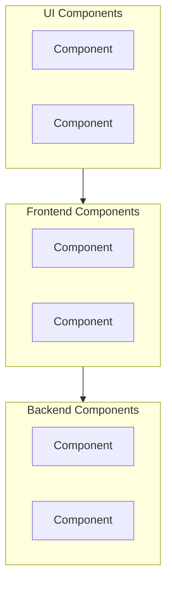

## 🧩 Component Diagram
> 💡 *Identification of UI, frontend, and backend components needed*

[Create a Mermaid diagram showing the components required]

```mermaid
graph TB
    subgraph UI[UI Components]
        U1[Component]
        U2[Component]
    end
    
    subgraph FE[Frontend Components]
        F1[Component]
        F2[Component]
    end
    
    subgraph BE[Backend Components]
        B1[Component]
        B2[Component]
    end
    
    UI --> FE
    FE --> BE
```