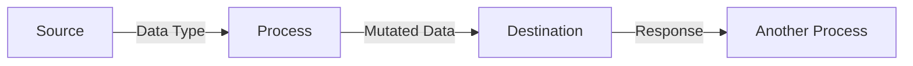

## 📊 Data Flow Diagram
> 💡 *Visualization of data movement and transformations*

[Create a Mermaid flowchart showing which data goes from where to where and how it's mutated]

```mermaid
flowchart LR
    A[Source] -->|Data Type| B[Process]
    B -->|Mutated Data| C[Destination]
    C -->|Response| D[Another Process]
```