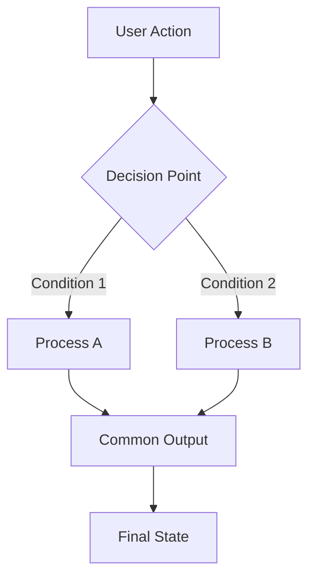

# 🔀 Pull Request: [Feature/Fix Name]
> 💡 *[One-line description of what this PR accomplishes and its impact]*

## 📊 Summary of Changes
> 💡 *Quick overview of all files involved in this implementation*

| File | Type | Description |
|:-----|:-----|:------------|
| [`path/to/file.ext`](path/to/file.ext) | [Modified/Added/Deleted] | [Brief description of changes] |
| [`another/file.ts`](another/file.ts#L123) | [Modified] | [Link to specific line if relevant] |
| [Add all modified files with clickable links] | | |


## 🎯 Implementation Overview
> 💡 *High-level description of what was implemented and why*

[Provide a comprehensive overview of the implementation, including the problem being solved, the approach taken, and the overall impact on the system]

## 🔧 Technical Implementation Details
> 💡 *Detailed breakdown of all technical changes made*

### [Component/Feature/Module Name]

#### What Changed
[Describe exactly what was modified, added, or removed in this component]

#### Code Examples
```[language]
// Before (if modifying existing code)
[Show the original code if relevant]

// After
[Show the new/modified code with enough context to understand the change]
```

#### File References
- [`path/to/main/file.ts:45-67`](path/to/main/file.ts#L45) - [Description of the main implementation]
- [`path/to/helper/file.ts:123`](path/to/helper/file.ts#L123) - [Description of supporting changes]
- [`path/to/test/file.spec.ts`](path/to/test/file.spec.ts) - [Description of test coverage]

#### Reasoning
[Provide detailed explanation of why this approach was chosen over alternatives. Include:]
- Technical constraints considered
- Alternative approaches evaluated
- Performance implications
- Maintainability considerations
- Alignment with existing patterns

**Feedback:**

### [Additional Component/Feature]
[Repeat the above structure for each major component or feature modified]

## 🏗️ Architecture & Flow
> 💡 *Visual representation of the implementation architecture or flow*



[Or use ASCII diagrams if mermaid isn't suitable]
```
┌─────────────┐     ┌─────────────┐
│   Client    │────▶│   Service   │
└─────────────┘     └─────────────┘
       │                    │
       └────────┬───────────┘
                ▼
         ┌─────────────┐
         │  Database   │
         └─────────────┘
```

## 💼 Business Logic Changes
> 💡 *Document any changes to business rules or domain logic*

### [Business Rule/Logic Area]
- **Previous Behaviour:** [How it worked before]
- **New Behaviour:** [How it works now]
- **Impact:** [Who/what is affected by this change]
- **Example:** [Concrete example showing the difference]

**Feedback:**

## 🎨 UI Changes
> 💡 *Document any user interface modifications*

### [Screen/Component Name]
- **Visual Changes:** [Description of what looks different]
- **Behavioural Changes:** [Description of interaction changes]
- **Accessibility Impact:** [Any a11y considerations]
- **Screenshots:** [If applicable, though not always possible in text]

**Feedback:**

## ✅ Manual Acceptance Testing
> 💡 *Step-by-step guide for manually testing the implementation*

### Test Case 1: [Primary Happy Path]
**Objective:** [What this test validates]

**Prerequisites:**
- [Any setup required]
- [Test data needed]

**Steps:**
1. [Specific action with expected result]
   - Expected: [What should happen]
   - Verify: [What to check]
2. [Next action]
   - Expected: [Result]
   - Verify: [Validation]
3. [Continue for all steps]

**Success Criteria:**
- [ ] [Specific measurable outcome]
- [ ] [Another verification point]

**Feedback:**

### Test Case 2: [Error Handling/Edge Case]
[Repeat structure for additional test cases covering edge cases, error scenarios, etc.]

## 🔗 Dependencies & Impacts
> 💡 *Document any dependencies or impacts on other parts of the system*

### New Dependencies
- [Package/Library Name] - [Version] - [Reason for addition]
- [Any additional dependencies]

### Breaking Changes
- [Description of any breaking changes]
- [Migration steps if applicable]

### Performance Impact
- [Any performance implications]
- [Benchmarks or metrics if available]

### Security Considerations
- [Any security implications]
- [Measures taken to address them]

## 📋 Checklist
> 💡 *Pre-submission verification*

- [ ] All tests pass
- [ ] Code follows project conventions
- [ ] Documentation updated
- [ ] No console logs or debug code
- [ ] Performance impact considered
- [ ] Security implications reviewed
- [ ] Breaking changes documented
- [ ] Manual testing completed

## 🔍 Related Issues
- Closes #[issue-number] - [[local-issue-reference]]
- Related to #[other-issue] - [Description of relationship]

## 📝 Additional Notes
[Any additional context, known issues, future improvements, or other relevant information]

**Final Review Feedback:**
