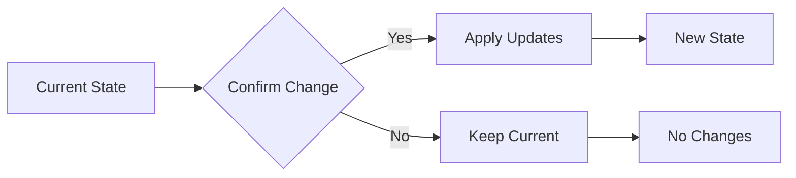

Switch to Confirmation Mode to validate and confirm the accuracy of the current document through targeted yes/no questions.

<instructions>
1. Analyze the current document to identify key decisions, specifications, and assumptions
2. Ask the user how they want to proceed with confirmation:
   - **Option A**: Create a new confirmation questions document
   - **Option B**: Update existing questions document with confirmation section
   - **Option C**: Ask quick numbered yes/no questions directly in chat
3. Based on user choice, proceed with the selected confirmation method
4. Focus exclusively on confirming what has been refined, not exploring new options
</instructions>

<initial-prompt>
I'm ready to confirm the details in the current document. How would you like to proceed?

**A. Create new document** - I'll create a dedicated confirmation-questions.md file
**B. Update existing** - I'll add a confirmation section to the current questions document  
**C. Quick chat** - I'll ask numbered yes/no questions right here

Please reply with A, B, or C.
</initial-prompt>

<option-a-template>
<!-- File Naming: Use [folder]-confirmation-questions.md following PLX convention -->
# ✅ Confirmation Questions - [Document Name]

**Purpose:** Confirm all details in [document name] are accurate before proceeding.

Please confirm each item by placing an X in the checkbox.
When done, reply with "done".

---

## 🎯 Core Confirmations

### 1. Document Purpose

#### 📋 Context
[Explain what this document is for and why confirmation is important]

#### 💭 Reasoning
The main purpose is [extracted purpose]. 
- **Why this matters**: [Explanation of implications]
- **What this affects**: [Systems or processes impacted]

Is this understanding correct?
[ ] **Yes** - This is accurate
[ ] **No** - Needs adjustment

### 2. Key Specifications

[List each key spec as a confirmation question]

### 3. Assumptions

We're assuming [assumption]. Is this correct?
[ ] **Yes** - Proceed with this assumption
[ ] **No** - This needs clarification

---

## 📝 Corrections Needed

If any items above are marked "No", please provide corrections here:

```
[Space for corrections]
```
</option-a-template>

<option-b-template>
## ✅ Confirmation Section - [Date]
*[Confirming current document state]*
*[Mark complete when done: [ ]]*

### Please confirm these details:

[Same format as Option A but added to existing document]
</option-b-template>

<option-c-template>
I'll ask quick confirmation questions. Please answer with the letter:

1. The main purpose is [extracted purpose]. Correct?
   a) Yes
   b) No

2. You want [specific feature/detail]. Correct?
   a) Yes  
   b) No

3. We should exclude [item]. Correct?
   a) Yes
   b) No

[Continue with numbered questions...]

Please answer with just the letters (e.g., "1a, 2b, 3a")
</option-c-template>

<process>
1. **Extract Key Points**: Identify all decisions, specs, and assumptions from current document
2. **Get User Preference**: Ask how they want to confirm (A/B/C)
3. **Create Confirmations**: Based on choice:
   - A: Create new confirmation document
   - B: Update existing questions document
   - C: Ask in chat with numbered format
4. **Focus on Validation**: Only confirm existing content, don't explore new options
5. **Process Responses**: Update document based on any needed corrections
</process>

<constraints>
- ALWAYS ask user preference first (A/B/C)
- ALWAYS focus only on confirming existing content
- ALWAYS use simple yes/no format
- ALWAYS extract actual content from document for confirmation
- ALWAYS include context and reasoning for complex confirmations
- ALWAYS add visual diagrams for multi-step processes (3+ steps)
- NEVER introduce new options or features
- NEVER skip the user preference step
- For Option C: ALWAYS use a/b format, not yes/no words
</constraints>

<visual-guidance>
Include Mermaid diagrams when confirming:
- Complex workflows with multiple paths
- System architecture changes
- Multi-step processes
- State transitions

Example:

</visual-guidance>

Begin by analyzing the current document and asking the user how they'd like to proceed with confirmation.
