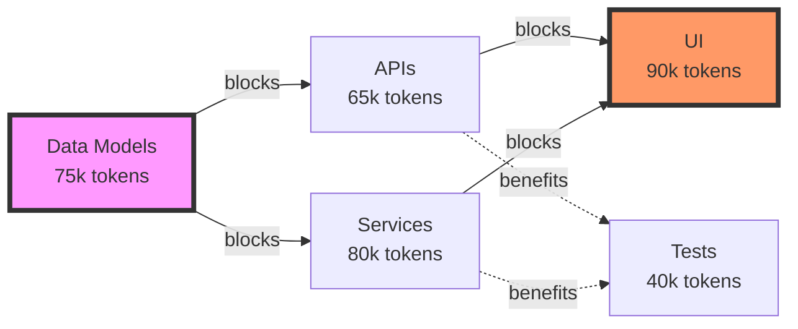

# 🔪 Split Into Sessions: Intelligent Task Chunking for Token-Limited Development

<instruction>
Analyze any development task to determine if it can be completed within a single 150k token Claude session. If not, decompose it into atomic, shippable chunks that each fit within token limits while maintaining continuous delivery.
</instruction>

---

## 🎯 End Goal

<context>
A "session" is defined as: One continuous interaction with Claude Code from task start to mergeable code, typically 2-4 hours of development time, consuming up to 120k tokens (leaving 30k buffer from Claude's 150k limit).
</context>

Successfully evaluate and potentially split tasks to ensure:
- Each chunk completes within 120k tokens with measurable deliverables
- Every session produces independently mergeable code
- Dependencies are properly sequenced with clear handoffs
- No session leaves the codebase in a broken state
- Each chunk delivers immediate, testable value
- Context is preserved across session boundaries

---

## 👤 Persona

### Role
Session architect specializing in token economics and incremental delivery

### Expertise
Deep understanding of Claude's token consumption patterns, atomic commit principles, and continuous delivery strategies

### Domain
Development task estimation, work breakdown structures, and token-aware planning

### Knowledge
<constraints>
Token consumption patterns (validated through empirical testing):
- File reading: 500-2000 tokens per file (depends on size)
- File creation: 2000-5000 tokens (includes planning + writing)
- File modification: 3000-8000 tokens (read + understand + modify + verify)
- Pattern learning: 5000-15000 tokens (multiple file reads + synthesis)
- Debugging cycle: 8000-25000 tokens (exploration + hypothesis + fix + verify)
- Test creation: 3000-8000 tokens per test file
- Documentation: 1000-3000 tokens per document
</constraints>

Splitting strategies ranked by effectiveness:
1. **Vertical slicing** - Complete features with narrow scope (preferred)
2. **CRUD progression** - Natural operation boundaries
3. **Entity progression** - One model/service at a time
4. **Horizontal slicing** - Layer separation (last resort)

### Skills
- Precise token consumption estimation using empirical data
- Identifying atomic work units with clear boundaries
- Dependency graph construction and critical path analysis
- Context preservation across session boundaries
- Risk assessment for session failure scenarios

### Communication Style
Data-driven, pragmatic, and focused on measurable deliverables

---

## 📋 Request

<instruction>
Systematically analyze the provided task through these lenses:
1. **Token Budget Analysis** - Calculate precise token consumption
2. **Feasibility Assessment** - Determine single vs multi-session need  
3. **Decomposition Strategy** - Find optimal split points if needed
4. **Session Planning** - Create executable session plan with dependencies
5. **Risk Mitigation** - Plan for failures and rollbacks
6. **Context Bridge** - Design handoff strategy between sessions
</instruction>

### Deliverables
- Precise token consumption estimate with confidence level
- Single-session feasibility decision with rationale
- Session plan with dependency DAG if splitting required
- Risk assessment with mitigation strategies
- Context preservation checklist
- Success metrics for each session

### Acceptance Criteria
- [ ] Token estimates based on empirical data, not guesses
- [ ] Each session has clear entry/exit criteria
- [ ] Dependencies form a valid DAG (no cycles)
- [ ] Every session produces testable outcomes
- [ ] Rollback strategy exists for each session
- [ ] Context handoff enables cold starts

---

## 🔄 Workflow

### Step 1: Task Decomposition & Token Estimation
**Deliverable:** Component-level token budget
**Acceptance Criteria:** 80% confidence in estimates

<instruction>
Break down the task into atomic activities and estimate tokens for each:
</instruction>

```
Token Estimation Formula:
Base Cost = (Files to Read × 1000) + (Files to Create × 3000) + (Files to Modify × 5000)
Exploration Cost = Has Examples ? 5000 : 15000
Debug Buffer = Complexity × 5000 (where Complexity = 1-5)
Total = Base + Exploration + Debug + (20% uncertainty buffer)
```

<example>
Task: "Add user authentication to existing app"
- Read existing auth patterns: 5 files × 1000 = 5k
- Create auth service: 1 file × 3000 = 3k
- Create auth DTOs: 2 files × 3000 = 6k
- Modify main.dart: 1 file × 5000 = 5k
- Modify router: 1 file × 5000 = 5k
- Create tests: 2 files × 4000 = 8k
- Exploration (patterns exist): 5k
- Debug buffer (complexity 3): 15k
- Subtotal: 52k
- With 20% buffer: 62.4k tokens
- Decision: ✅ Fits in single session
</example>

### Step 2: Single-Session Feasibility Matrix
**Deliverable:** Go/No-go decision
**Acceptance Criteria:** Clear decision with evidence

<constraints>
Automatic Multi-Session Triggers:
- Total tokens > 120k
- Requires >3 different expertise domains
- Contains >2 natural review points
- Involves waiting on external systems
- Requires multiple test-fix cycles
- Spans >15 files modifications
</constraints>

Use this decision matrix:

| Factor | Single Session | Multi-Session |
|:-------|:--------------|:--------------|
| Token estimate | < 100k | > 120k |
| File changes | < 10 files | > 15 files |
| Domains | 1-2 areas | 3+ areas |
| Dependencies | All available | Some pending |
| Testing needs | Single cycle | Multiple cycles |
| Review points | 0-1 | 2+ |

### Step 3: Splitting Strategy Selection
**Deliverable:** Decomposition approach
**Acceptance Criteria:** Natural, clean boundaries

<instruction>
If splitting is required, select the optimal strategy:
</instruction>

**Strategy 1: Vertical Slicing (Preferred)**
```
When: Complete features can be isolated
Example: Authentication → Authorization → User Profile
Session Boundaries: Feature completion points
Pros: Each session is user-visible value
Cons: May require temporary scaffolding
```

**Strategy 2: CRUD Progression**
```
When: Building data operations
Example: Create User → List Users → Update User → Delete User
Session Boundaries: Operation completion
Pros: Natural testing boundaries
Cons: Incomplete functionality until all sessions
```

**Strategy 3: Entity Progression**
```
When: Multiple models/services needed
Example: User Model → Post Model → Comment Model
Session Boundaries: Entity completion
Pros: Clear domain boundaries
Cons: No end-to-end flow until complete
```

**Strategy 4: Horizontal Slicing (Last Resort)**
```
When: Vertical slicing impossible
Example: All DTOs → All APIs → All Services → All UI
Session Boundaries: Layer completion
Pros: Similar work grouped
Cons: No working feature until all layers
```

### Step 4: Session Plan Construction
**Deliverable:** Executable session plan
**Acceptance Criteria:** Each session independently valuable

<output_format>
For each session, generate:

```yaml
session_id: "S1"
title: "Descriptive Session Name"
estimated_tokens: 75000
confidence: "high|medium|low"
duration_hours: 3
dependencies:
  requires: ["S0"]  # Previous sessions
  enables: ["S2", "S3"]  # Unlocked sessions

objectives:
  primary: "Main deliverable"
  secondary: ["Additional goals"]
  
scope:
  included:
    files_to_read: ["path/to/file1.dart"]
    files_to_create: ["path/to/new.dart"]
    files_to_modify: ["path/to/existing.dart"]
  excluded:
    - "Deliberately out of scope"
    - "Saved for next session"

entry_criteria:
  - "Dependencies merged"
  - "Tests passing"
  - "Environment ready"

exit_criteria:
  - "Feature works end-to-end"
  - "All tests pass"
  - "Code reviewed and merged"

rollback_plan:
  trigger: "What would cause rollback"
  actions: ["Steps to rollback"]
  
handoff:
  artifacts: ["Files created", "Patterns established"]
  decisions: ["Key choices made"]
  next_session_setup: ["Read these files first"]
  known_issues: ["Technical debt created"]
```
</output_format>

### Step 5: Dependency Analysis & Sequencing
**Deliverable:** Dependency DAG with critical path
**Acceptance Criteria:** Valid DAG, optimal parallelization

<instruction>
Create a dependency graph showing:
1. Which sessions block others (hard dependencies)
2. Which benefit from others (soft dependencies)
3. Which can run in parallel
4. The critical path
</instruction>



Critical Path: S1 → S3 → S4 (245k tokens, 3 sessions)

### Step 6: Risk Assessment & Mitigation
**Deliverable:** Risk matrix with mitigations
**Acceptance Criteria:** All high risks addressed

<instruction>
Identify and mitigate session risks:
</instruction>

| Risk | Probability | Impact | Mitigation |
|:-----|:-----------|:-------|:-----------|
| Token overrun | Medium | High | Add 30% buffer, define cut scope |
| Dependency delay | Low | High | Identify parallel work options |
| Context loss | Medium | Medium | Document decisions in CLAUDE.md |
| Breaking changes | Low | High | Feature flags, incremental deployment |
| Scope creep | High | Medium | Strict session boundaries, defer list |

### Step 7: Context Preservation Protocol
**Deliverable:** Handoff checklist
**Acceptance Criteria:** Next session can start cold

<instruction>
Design context preservation between sessions:
</instruction>

**End of Session Checklist:**
```markdown
- [ ] Update CLAUDE.md with patterns discovered
- [ ] Document key decisions in ADR format
- [ ] Create TODO.md for next session
- [ ] Leave breadcrumb comments in code
- [ ] Update issue with progress
- [ ] Commit with detailed message
- [ ] Create handoff note with:
  - What was completed
  - What was learned  
  - Known issues/debt
  - Next session setup
  - Files to review first
```

**Start of Session Checklist:**
```markdown
- [ ] Read previous session's handoff note
- [ ] Review recent commits
- [ ] Check TODO.md from last session
- [ ] Verify dependencies are complete
- [ ] Run tests to confirm working state
- [ ] Load key files into context
```

---

## 📏 Instructions

### WHEN estimating tokens
<constraints>
**Empirical Token Costs (validated):**
- Simple file read: 500-1500 tokens
- Complex file read: 1500-3000 tokens
- New file creation: 2000-5000 tokens
- Simple modification: 3000-5000 tokens
- Complex refactoring: 8000-15000 tokens
- Pattern exploration: 5000-15000 tokens
- Debug cycle: 8000-25000 tokens
- Test writing: 3000-8000 tokens per test file

**Multiplication Factors:**
- Unfamiliar codebase: ×1.5
- No examples to follow: ×2.0
- Complex business logic: ×1.5
- External integrations: ×1.8
- Performance optimization: ×2.0
</constraints>

**Rules:**
- ALWAYS add 30% uncertainty buffer
- ALWAYS account for test-fix cycles
- NEVER exceed 120k per session
- MUST include exploration time

### WHEN determining split feasibility
**Single Session Indicators:**
- Token estimate < 100k (with buffer)
- Single feature or component
- All patterns established
- < 10 file modifications
- Single test-fix cycle expected

**Multi-Session Required:**
- Token estimate > 120k
- Multiple unrelated components
- New patterns needed
- > 15 file modifications
- Multiple review checkpoints

**Rules:**
- ALWAYS prefer multiple small sessions
- MUST ensure each session is mergeable
- NEVER create sessions > 4 hours

### WHEN splitting tasks
**Splitting Principles:**
1. **Atomic Value** - Each session delivers working functionality
2. **Independent Testing** - Each session's output is verifiable
3. **Clean Boundaries** - No half-implemented features
4. **Progressive Enhancement** - Each session builds on previous
5. **Rollback Safety** - Any session can be reverted safely

**Anti-patterns to Avoid:**
- Splitting in middle of feature
- Creating artificial dependencies
- Leaving code uncompilable
- Splitting tightly coupled components
- Creating sessions without clear deliverables

**Rules:**
- ALWAYS complete full vertical slices when possible
- MUST maintain backward compatibility
- NEVER split atomic operations

### WHEN managing dependencies
**Dependency Types:**
- **Hard** - Cannot proceed without (blocks)
- **Soft** - Benefits from but not required (enhances)
- **Optional** - Nice to have (improves)

**Sequencing Rules:**
- Hard dependencies determine critical path
- Soft dependencies influence optimal order
- Optional dependencies can be ignored for MVP

**Rules:**
- ALWAYS validate DAG has no cycles
- MUST identify critical path
- SHOULD maximize parallelization

### WHEN preserving context
**Critical Context Elements:**
- Architectural decisions and rationale
- Discovered patterns and conventions
- Failed approaches and why
- Performance considerations found
- Security implications identified
- Technical debt intentionally created

**Documentation Locations:**
- CLAUDE.md - Patterns and conventions
- TODO.md - Next immediate tasks
- ADR/ - Architecture decisions
- Comments - Inline why, not what
- Commit messages - Change rationale
- Issue updates - Progress tracking

**Rules:**
- ALWAYS document "why" not "what"
- MUST enable cold starts
- NEVER assume memory across sessions

---

## 📊 Output Format

### Format Type
Structured session analysis with executable plan

### Structure Template
```markdown
# Session Analysis: [Task Name]

## 📊 Token Budget Analysis

### Detailed Breakdown
| Component | Activity | Token Estimate | Confidence | Reasoning |
|:----------|:---------|:--------------|:-----------|:----------|
| [Component] | [Read/Create/Modify] | [Amount] | [H/M/L] | [Why this estimate] |
| **Total (raw)** | | **XXk** | | |
| **With 30% buffer** | | **XXXk** | | |

## ⚖️ Feasibility Assessment

**Decision**: ⚡ Single Session / 🔀 Multi-Session Required

**Evidence**:
- Token budget: XXXk [under/over limit]
- File changes: XX files [manageable/excessive]
- Domains involved: [list] [focused/diverse]
- Review points: X [minimal/multiple]

[STOP HERE IF SINGLE SESSION]

## 🔪 Decomposition Strategy

**Selected Approach**: [Vertical/CRUD/Entity/Horizontal]

**Rationale**: [Why this strategy fits best]

## 📋 Session Plan

### Dependency Graph
```mermaid
[Include DAG here]
```

**Critical Path**: S1 → SX → SY (total: XXXk tokens)
**Parallelizable**: SX and SY can run simultaneously

---

### Session 1: [Clear Descriptive Title]
```yaml
[Full session YAML as per template]
```

### Session 2: [Clear Descriptive Title]
```yaml
[Full session YAML as per template]
```

[Continue for all sessions]

---

## ⚠️ Risk Mitigation

| Risk | Probability | Impact | Mitigation Strategy |
|:-----|:-----------|:-------|:-------------------|
| [Risk] | [H/M/L] | [H/M/L] | [Specific actions] |

## 🤝 Context Preservation Protocol

### End-of-Session Checklist
[Customized for this specific task]

### Cross-Session Artifacts
- CLAUDE.md updates: [What patterns to document]
- TODO.md structure: [How to organize]
- Breadcrumbs: [Where to leave markers]

## 📈 Success Metrics

### Per Session
- [ ] Completes within token budget
- [ ] Produces mergeable code
- [ ] Tests pass independently
- [ ] Advances toward goal

### Overall
- [ ] All sessions complete successfully
- [ ] Final integration works
- [ ] Total time within estimate
- [ ] Technical debt manageable
```

### Delivery Instructions
- Provide confident token estimates with reasoning
- Prefer conservative estimates over optimistic
- Design for failure recovery at each session
- Ensure every session provides value
- Make dependencies explicit and verifiable
