# 🏗️ Architecture: [Project/Initiative Name]

## 📜 Introduction & Purpose
> 💡 *State the purpose of this architecture document. What does it describe? What are its objectives?*

[Describe the purpose of this document, e.g., "This document outlines the proposed architecture for..., detailing its components, interactions, and design decisions to guide implementation." ]

### 🗺️ Scope
> 💡 *Define the boundaries of the architecture. What systems, processes, or features are covered? What is explicitly out of scope?*

- **In Scope:** [List in-scope items]
- **Out of Scope:** [List out-of-scope items]

### 👥 Intended Audience
> 💡 *List the primary audience for this document (e.g., Project Team, Technical Leads, Product Managers, Security Team, Operations Team).*

[List intended audience]

### 🔗 Related Documents
> 💡 *List links to other relevant documents like PRDs, process specifications, design mockups, policies, etc.*

- [[product-requirements-document]]
- [[design-mockups]]
- [Other relevant documents]

## 📄 Document Metadata
> 💡 *Provide administrative details about this document.*

| Field                | Details                                      |
| :------------------- | :------------------------------------------- |
| Document Version     | [e.g., 1.0, 1.1, 2.0]                        |
| Status               | [e.g., Draft, In Review, Approved, Obsolete] |
| Date Created         | [YYYY-MM-DD]                                 |
| Last Updated         | [YYYY-MM-DD]                                 |
| Author(s)            | [Name(s) / Role(s)]                          |
| Reviewer(s)          | [Name(s) / Role(s)]                          |
| Key Stakeholders     | [List key stakeholder names or groups]       |
| Target Project/Release| [e.g., Project X v2.1, Q4 2024]              |

### 🔄 Version History
> 💡 *Maintain a log of significant changes to this document.*

| Version | Date       | Author(s)       | Summary of Changes                                  |
| :------ | :--------- | :-------------- | :-------------------------------------------------- |
| 0.1     | [YYYY-MM-DD] | [Name (Role)]   | Initial Draft                                       |
| 1.0     | [YYYY-MM-DD] | [Name (Role)]   | Incorporated feedback from review; Approved for use |

## 🎯 Goals & Architectural Drivers
> 💡 *Outline the business and technical goals that this architecture must support.*

### 📈 Business Goals
> 💡 *List the key business goals that this architecture must support. How does it enable their achievement?*

- [Business Goal 1, e.g., Reduce time-to-market for new products by X%]
- [Business Goal 2, e.g., Support Y concurrent users during peak load]

### 🛠️ Structural Goals
> 💡 *List specific structural or systemic goals for the architecture (e.g., improve maintainability, adopt a specific pattern, enhance testability).*

- [Structural Goal 1, e.g., Achieve high cohesion and low coupling between modules]
- [Structural Goal 2, e.g., Ensure 99.99% uptime for critical systems]

### 🧭 Architectural Principles
> 💡 *List the guiding principles that shaped this architecture (e.g., Build for resilience, Design for scalability, Security by design, Simplicity).*

- [Principle 1: e.g., Prefer standardized tools over custom-built solutions.]
- [Principle 2: e.g., All inter-component communication should be asynchronous where possible.]

### 🛑 Key Constraints & Assumptions
> 💡 *List any constraints (budget, timeline, existing systems, tools) and critical assumptions made during the design.*

- **Constraints:**
    - [Constraint 1, e.g., Must integrate with legacy System X.]
- **Assumptions:**
    - [Assumption 1, e.g., The anticipated growth rate of X% per year is accurate.]

## 🏛️ Current Architecture (As-Is) - Optional
> 💡 *If this is an evolution of an existing system, briefly describe the current state. Skip if this is a greenfield project.*

[Description and/or diagram of the current architecture.]

### ⚠️ Pain Points / Limitations
> 💡 *Identify key issues or limitations in the current architecture that the new design aims to address.*

- [Pain Point 1, e.g., Scalability issues with the current monolithic database.]
- [Pain Point 2, e.g., Tight coupling makes changes difficult and risky.]

## 🏗️ Proposed Architecture (To-Be)
> 💡 *Describe the proposed architecture for the new system or redesign.*

[High-level description of the architecture and its core concepts.]

### 🧩 Logical View / Conceptual Architecture
> 💡 *Describe the system at a high level, focusing on major functional areas and their relationships. Use simple block diagrams or C4-style diagrams.*

<example>
**System Context Diagram**

```mermaid
graph TD
    User[👤 User] -->|Interacts with| System([🏢 System: Project Name]);
    System -->|Uses| ExternalService([🌐 External Service]);
```

</example>

<example>
**Container/Module Diagram**

```mermaid
graph TD
    subgraph System Boundary
        WebApp[📱 Web Application]
        APIService[⚙️ API Service]
        Database[💾 Database]
    end
    User[👤 User] -->|Uses| WebApp;
    WebApp -->|Calls| APIService;
    APIService -->|Reads/Writes| Database;
```

</example>

### 📦 Component View
> 💡 *Zoom into individual containers/modules, showing the key sub-components and their interactions.*

- **Module: [e.g., API Service]**
    - Component 1: [e.g., Authentication Controller] - Responsibility: [e.g., Handles user login and token generation.]
    - Component 2: [e.g., Order Processor] - Responsibility: [e.g., Manages order creation and fulfillment.]

<example>
**Sequence Diagram**

</example>

### 💾 Information View
> 💡 *Describe the key information entities, their attributes, and relationships.*

- **Entity:** [e.g., User (UserID, Name, Email)]
- **Entity:** [e.g., Order (OrderID, UserID, Status)]
- **Relationship:** [A User can have multiple Orders.]

### 💻 Tools & Technology Stack
> 💡 *List the specific tools, platforms, and technologies chosen for the architecture.*

- **Frontend:** [e.g., React, Vue.js]
- **Backend:** [e.g., Node.js, Python, Go]
- **Database:** [e.g., PostgreSQL, MongoDB]
- **Platform:** [e.g., AWS, Azure, GCP]

## ⭐ Key Architectural Decisions & Rationale
> 💡 *Document significant architectural decisions, the reasons behind them, and any alternatives considered in a simple format or using an Architecture Decision Record (ADR) table.*

| Decision ID | Decision Made                                  | Rationale                                           | Alternatives Considered              |
| :---------- | :--------------------------------------------- | :-------------------------------------------------- | :----------------------------------- |
| ADR-001     | [e.g., Adopt a microservices architecture]     | [e.g., To improve scalability and team autonomy.]   | [e.g., Monolith, Service-Oriented]   |
| ADR-002     | [e.g., Use an event-driven messaging system]   | [e.g., For decoupling services and high throughput.]| [e.g., Direct API calls, Polling]    |

## 🛡️ Quality Attributes (Non-Functional Requirements)
> 💡 *Summarize key quality attributes (NFRs) that influence the architecture and describe how they are addressed.*

- **Performance:** [e.g., Target response times, throughput requirements, and supporting strategies.]
- **Scalability:** [e.g., Horizontal scaling, stateless design.]
- **Reliability/Availability:** [e.g., Redundancy, failover, health checks.]
- **Security:** [e.g., Authentication, encryption, access controls.]
- **Maintainability:** [e.g., Modularity, clear interfaces, documentation standards.]

## ❓ Open Questions
> 💡 *List any unresolved questions or items requiring further investigation.*

- [Question 1: What is the optimal sharding strategy for the database?]
- [Question 2: How will we handle data synchronization for offline clients?]