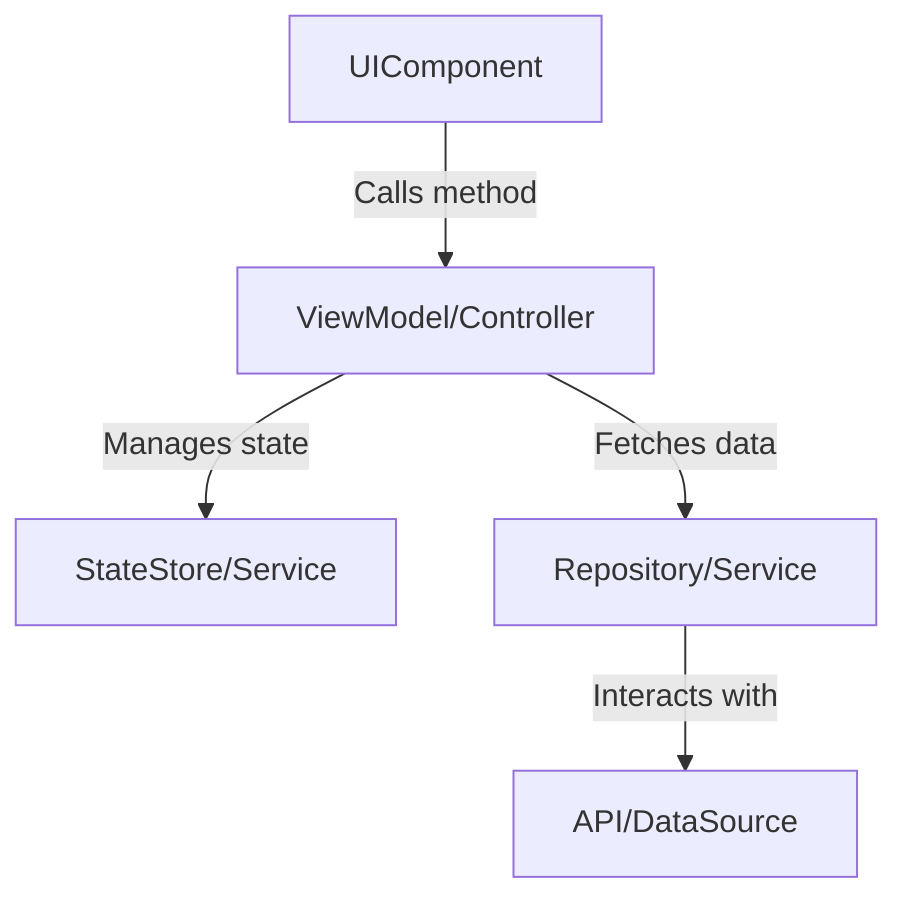

# 📒 Story: Convert [Source Feature] to a new Framework
> 💡 *A user story for porting a feature from a source codebase to a new target. It captures the original implementation details and provides a clear, framework-agnostic guide for the new implementation.*

## 🗣️ User Story
> 💡 *As a [ROLE] I want [BEHAVIOUR] so that [REASON].*

**As a** [User Role e.g., Mobile User]
**I want** [to use the feature, e.g., to edit my profile]
**So that** [I can have a consistent experience on the new platform]

## ✅ Acceptance Criteria
> 💡 *Specific, testable conditions that must be met for the story to be considered complete. The new implementation should match the original feature's behavior.*

<example>
- **Scenario: Feature works as expected**
    - GIVEN I am on the [correct screen/view] in the target application
    - WHEN I [perform an action]
    - THEN the app should [behave in the same way as the source application]
- **Scenario: Edge cases are handled**
    - GIVEN [a specific state]
    - WHEN [an edge case occurs]
    - THEN the app should handle it gracefully, matching the source implementation.
</example>

---

## 🔬 Source Implementation Analysis
> 💡 *A detailed analysis of the original feature, including component hierarchy, state, props, and core logic. This section is typically generated by the feature-analyzer-agent.*

### Feature: [Name of Feature Analyzed]

**Component Hierarchy:**
- `[ParentComponent]`
  - `[ChildComponentA]`
  - `[ChildComponentB]`

---

### Component: `[Component Name]`
- **Location:** `[path/to/source/component]`
- **Purpose:** [Brief description of the component's responsibility]
- **Inputs/Props:**
    - `propName`: `[type]` - [Description]
- **State:**
    - `stateVariable`: `[type]` - [Description]
- **Core Logic Summary:**
    [Explain the key logic, including lifecycle methods, event handlers, and data fetching.]
- **Key Code Snippet:**
    ```[source_language]
    // A relevant snippet of the source component's code
    ```
[Repeat for all relevant components]

---

## 🎯 Framework-Agnostic Implementation Guide
> 💡 *Guidance for the development team on how to build the equivalent feature in a new framework, using generic programming concepts.*

### Proposed Target Structure
- **Main View/Component:** `[ProposedTargetComponentName]`
- **Child Components:**
  - `[ChildComponentA]` (corresponds to source's `[ChildComponentA]`)
  - `[ChildComponentB]` (corresponds to source's `[ChildComponentB]`)

### State Management / Data Flow
- **Approach:** [e.g., Use a centralized store, a view model/controller, or a service-based approach.]
- **State Translation:**
  - Source `stateVariable` -> Target `[State management property, e.g., a property on a ViewModel]`

### Logic Translation Notes
- The source's data fetching logic (e.g., in `useEffect`, `onMounted`) should be translated to an appropriate data-loading pattern in the target framework (e.g., in an `onInit` lifecycle method, a service call, or using a data-fetching component).
- Source event handlers (e.g., `onClick`) should be translated to equivalent event listeners in the target framework (e.g., `onPressed`, `onTap`, `@click`), which should call methods on a ViewModel, Controller, or Service.

### Proposed Architecture


---

## ⏱️ Effort Estimates
> 💡 *A breakdown of the estimated effort required for analysis and implementation.*

| Work Type              | Hours | Reasoning                                       |
| :--------------------- | :---- | :---------------------------------------------- |
| Analysis of Source Code| [X]   | [Time to understand the original feature.]      |
| Target Scaffolding     | [X]   | [Setting up new views, models, etc.]     |
| UI Implementation      | [X]   | [Building the target UI to match source.]       |
| Business Logic         | [X]   | [Implementing the core logic in the target language.]          |
| **Subtotal**           | **[Y]** |                                                 |
| QA & Testing           | [X]   | [~20% of subtotal for testing effort.]       |
| Delay Margin           | [X]   | [~10-15% of total for unforeseen issues.]    |
| **Total**              | **[Z]** |                                                 |

## 👉 Final Remarks
> 💡 *Note anything that is out of scope, any dependencies, or other points of caution.*

- **Dependencies:** [e.g., Backend API endpoints must be available.]
- **Notes:** [e.g., Pay close attention to styling differences between source and target platforms.]