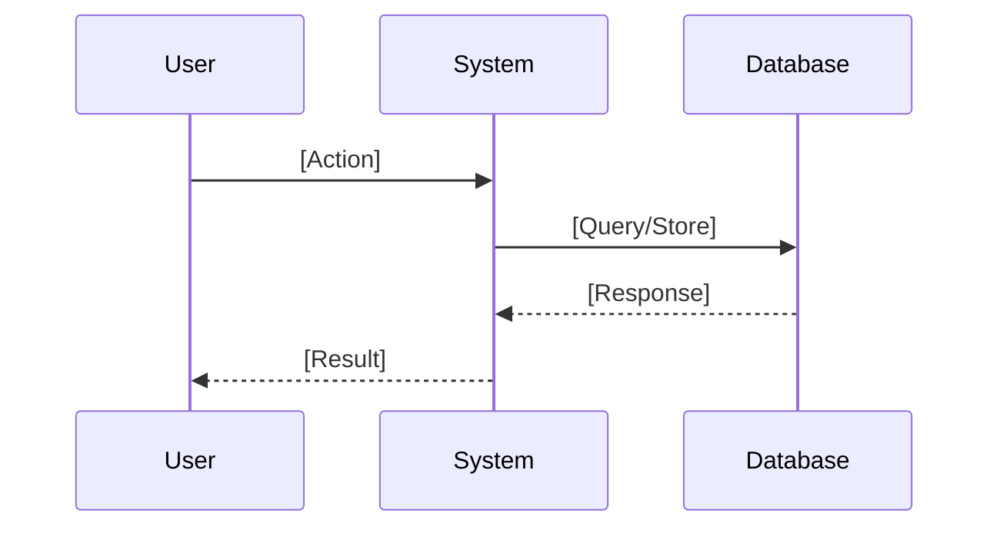
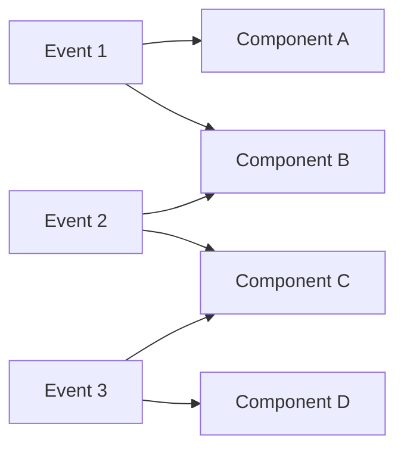

# [Fitting Emoji] Issue: [Feature Name]

[Brief description of the feature or capability]

---

## 📝 Initial Requirement
*What should the system/user be able to do or be?*

### Requirements
[List specific capabilities as simple English sentences. Be as specific as possible, break down if needed]

```
<example>
NOTE: These are example TYPES only - replace with actual requirements relevant to your specific issue
1. **User** should be able to [authentication action, data entry action, navigation action]
2. **System** should [automatic behavior, scheduled task, validation rule]
3. **Admin** should be able to [management action, configuration change, monitoring task]
- [More actor-based requirements as needed for the specific issue context]
- [...]
</example>
```

---

## 🌊 Actor Flow
*How does this look in terms of sequential events?*

### Event Sequence
[Create a single list of events with actors using verb-subject pattern]

```
<example>
NOTE: These are example TYPES only - replace with actual events relevant to your specific issue
1. **User** → initiates → [login process, registration flow, data submission]
   - Data: [user credentials, form inputs, file uploads]
2. **System** → validates → [input data, user permissions, business rules]
   - Data: [validation results, error messages, processed data]
3. **System** → stores → [user data, transaction records, audit logs]
   - Data: [database records, file storage, cache entries]
4. **User** → receives → [confirmation message, result display, next steps]
   - Data: [success indicators, processed results, navigation options]
- [More sequential events as needed for the specific flow]
- [...]
</example>
```

### Flow Diagram


---

## 📦 Deliverables
*Tangible components to create/update/delete per event*

[List what needs to be created, updated, or deleted for each event]

```
<example>
NOTE: These are example TYPES only - replace with actual deliverables relevant to your specific issue
### Event 1: [User authentication event, data submission event, navigation event]
- **Create**: [new session object, user record, authentication token]
- **Update**: [user status, last login timestamp, activity log]
- **Delete**: [expired sessions, temporary data, old tokens]

### Event 2: [System processing event, validation event, calculation event]
- **Create**: [processing result, validation report, calculated values]
- **Update**: [system state, processing queue, metrics]

### Event 3: [Data storage event, notification event, completion event]
- **Create**: [database record, notification entry, completion flag]

[More events and their deliverables as needed for the specific issue]
[...]
</example>
```

### Component Connection Diagram


---

## ✅ Acceptance Criteria

### What should always go right?
[List specific conditions that must always work correctly]

```
<example>
NOTE: These are example TYPES only - replace with actual success conditions relevant to your specific issue
- [ ] [User authentication success conditions, data validation passes, system responses]
- [ ] [Data persistence guarantees, transaction completions, state consistency]
- [ ] [Performance requirements, response times, availability metrics]
- [ ] [More success conditions as needed based on the specific issue context]
- [ ] [...]
</example>
```

### What should never go wrong?
[List failures that must be prevented]

```
<example>
NOTE: These are example TYPES only - replace with actual failure conditions relevant to your specific issue
- [ ] [Security breaches, unauthorized access, data leaks]
- [ ] [Data corruption, loss of information, inconsistent states]
- [ ] [System crashes, infinite loops, resource exhaustion]
- [ ] [More failure conditions as needed based on the specific issue context]
- [ ] [...]
</example>
```

### What should always be?
[List conditions that must always be true]

```
<example>
NOTE: These are example TYPES only - replace with actual invariant conditions relevant to your specific issue
- [ ] [System availability states, data integrity conditions, security postures]
- [ ] [Performance baselines, compliance standards, quality metrics]
- [ ] [User access controls, audit trails, backup states]
- [ ] [More invariant conditions as needed based on the specific issue context]
- [ ] [...]
</example>
```

### What should never be?
[List conditions that must always be false]

```
<example>
NOTE: These are example TYPES only - replace with actual prohibited conditions relevant to your specific issue
- [ ] [Invalid states, unauthorized conditions, data inconsistencies]
- [ ] [Security vulnerabilities, performance degradations, compliance violations]
- [ ] [Orphaned resources, dangling references, circular dependencies]
- [ ] [More prohibited conditions as needed based on the specific issue context]
- [ ] [...]
</example>
```
