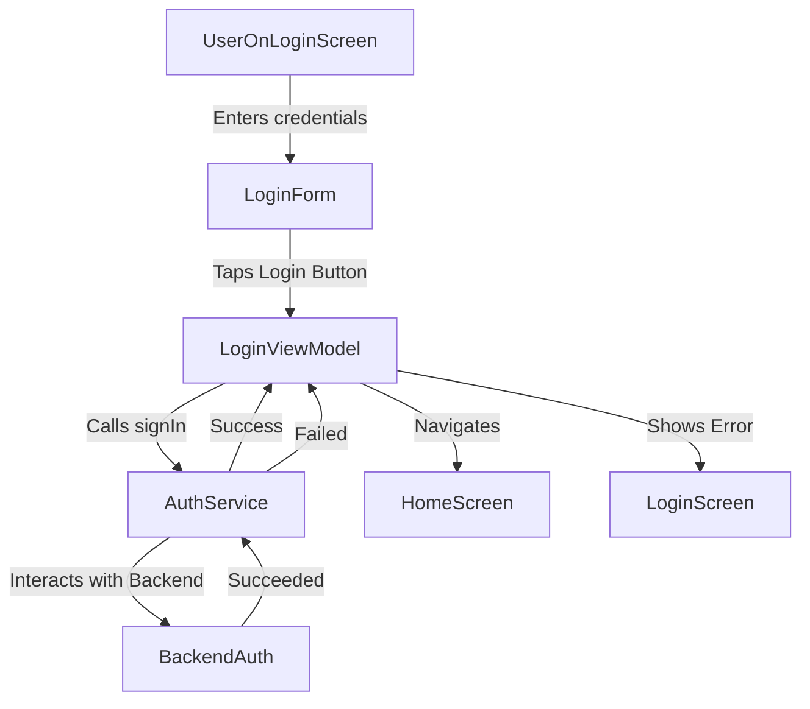

# 📒 Story: [Title]
> 💡 *A user story for a feature or capability, addressing a specific user's need to accomplish a goal. It structures requirements from the user's perspective with clear acceptance criteria and technical details.*

# 🔖 Description
> 💡 *A short and descriptive introduction of the problem we are going to solve.*

[Introduction to the problem]

# 🗣 User Story
> 💡 ***As a*** *ROLE* ***I want*** *BEHAVIOUR* ***so that*** *REASON.*

**As a** [User Role e.g., Registered User]
**I want** [Action/Behaviour e.g., to log in with my email and password]
**So that** [Benefit/Reason e.g., I can access my personalized dashboard]

# 🤖 AI Agent Context
> 💡 *Essential information for the AI agent to understand and execute this ticket effectively. Review all linked resources thoroughly before proceeding.*

## 📚 Relevant Project Files & Code
> 💡 *List all project files, code snippets, or directories that the AI agent **must read and understand** to effectively complete the tasks. Include paths relative to the project root and a brief note on their relevance. Use the [[filename]] format.*
*   [[feature-description]] – (Relevance: High-level overview of the feature)
*   [[path/to/existing/module_if_related]] – (Relevance: Code for related existing functionality)
*   [[data_models]] – (Relevance: Definitions of existing data structures)

## 🌐 Relevant Documentation & Links
> 💡 *List any external web pages, API documentation, design specifications (e.g., Figma links), or other online resources the AI agent should consult. Include a brief note on their relevance.*
*   [[epic-name]] – (Relevance: User-centric view of the requirements)
*   [Link to UI Mockups/Prototypes (Figma, etc.)] – (Relevance: Visual and interaction design)
*   [Link to WCAG 2.1 specs] – (Relevance: Accessibility guidelines if applicable)

## 💡 Other Key Information
> 💡 *Include any other critical context, specific instructions, or points the AI agent needs to be aware of. This could include previous decisions, specific constraints, key architectural considerations, or even links to previous related tickets/discussions.*
*   [Context point 1: e.g., These requirements are for the MVP (Minimum Viable Product) release.]
*   [Context point 2: e.g., The system must integrate with the existing authentication service.]
*   [Example: Performance is a key consideration; avoid solutions known to be resource-intensive.]

# 🧩 Actors & Components (Who or what)
> 💡 *Someone or something that can perform actions or be interacted with (examples include User, Button, Screen, Input Field, Message, System, API, Database, and they can be a person, service, visual or non-visual).*

*   [Actor/Component 1]
*   [Actor/Component 2]
    *   [Child Actor/Component 2.1]
*   ...

# 🎬 Activities (Who or what does what?)
> 💡 *Actions that an Actor or Component performs (examples include Create List, Delete Item, Sync Data, and they must always contain a verb + action).*

*   [Actor/Component Name]
    *   [Activity 1 for this Actor/Component]
    *   [Activity 2 for this Actor/Component]
*   ...

## 🌊 Activity Flows & Scenarios (What in which order?)
> 💡 *Sequences of Atomic Actions (like "Tap button") that map out the steps to complete an Activity.*

*   [Activity Name]
    *   **Happy Flow:**
        *   GIVEN [precondition]
        *   WHEN [action]
        *   THEN [expected outcome]
    *   **Error Flow (e.g., Invalid Input):**
        *   GIVEN [precondition]
        *   WHEN [action with invalid input]
        *   THEN [error message is shown]
    *   **(Optional) Mermaid Diagram:**
        ```mermaid
        graph TD
            Start --> Step1;
        ```
*   ...

# 📝 Properties (Which values?)
> 💡 *Describes a value or configuration that belongs to an object (examples include width, color, id, name).*

*   [Actor/Component/Activity Name]
    *   [property_name : data_type (e.g., user_id : string, is_enabled : boolean)]
    *   [another_property : data_type]
*   ...

# 🛠️ Behaviours (How does it act when.. in terms of.. ?)
> 💡 *Defines how something looks, works and performs. Examples include ui/ux, rules & limits, data & analytics, security, performance and scalability.*

*   [Actor/Component/Activity/Property Name]
    *   [Behaviour 1: e.g., Button should display a loading spinner when tapped and an API call is in progress.]
    *   [Behaviour 2: e.g., Input field for 'email' must validate format against standard email regex.]
*   ...

# ✅ Acceptance Criteria
> 💡 *Specific conditions that must be met for the story to be considered complete. Each criterion should be testable and unambiguous.*

* [ ] Criterion 1: [Description of what must be true for this criterion to pass]
* [ ] Criterion 2: [Description of what must be true for this criterion to pass]
* [ ] Criterion 3: [Description of what must be true for this criterion to pass]

# 💾 Data Model
> 💡 *Old and new data models that will be created and/or altered when this feature is added.*

[Describe data model changes, or "No changes to data model" if applicable.]

# 🔒 Security Rules / Row Level Security
> 💡 *Old and new security rules with roles and access that should be created and/or altered. Include create, read, update and delete.*

[Describe security rule changes, or "No changes to security rules" if applicable.]

# 🐒 API
> 💡 *Old and new API calls that should be created and/or altered.*

[Describe API changes, or "No API changes" if applicable.]

# 📊 Analytics
> 💡 *Old and new analytics that should be created and/or altered when this feature is added. Include a name, when it's fired and optional properties.*

[Describe analytics changes, or "No new analytics events" if applicable.]

# ☎️ Impact Communication
> 💡 *Who / which teams should we inform about the impact of releasing this ticket? Sales, marketing, data, CS, other?*

[List teams/individuals to inform, or "No specific impact communication needed" if applicable.]

# 🧪 Tests
> 💡 *Components/flows/code that would benefit from tests and which scenario's should be tested.*

*   **Unit Tests:** [e.g., ViewModel logic for login, Input validation functions]
*   **Widget Tests:** [e.g., Login form rendering and interaction]
*   **Integration Tests:** [e.g., Login flow with mock AuthService]

# 🤝 Acceptance Test
> 💡 *Which scenario's should we test in the acceptance test? So that we can make sure that this ticket does what it is supposed to do without any unexpected errors.*

1.  **Scenario 1: Successful Login**
    *   Given: User is on the login screen.
    *   When: User enters valid credentials and taps "Login".
    *   Then: User is redirected to the dashboard.
2.  **Scenario 2: Invalid Credentials**
    *   Given: User is on the login screen.
    *   When: User enters invalid credentials and taps "Login".
    *   Then: An appropriate error message is displayed.

# 🎨 UI/UX Behaviour
> 💡 *Anything to take note of regarding the behaviour of UI/UX elements (if applicable). Think of position, behaviour when elements do not fit the screen, feedback on elements and properties of animations.*

*   [UI/UX note 1: e.g., Login button should show a loading indicator while processing.]
*   [UI/UX note 2: e.g., Error messages should appear below the respective input field.]

# ⏱️ Effort Breakdown & Estimates
> 💡 *Detailed breakdown of estimated effort required for each aspect of the user story implementation.*

*   **Design:** [X] hours
    *   *Reasoning: [Explain why this amount of design effort is needed, or 0 if none]*
*   **Refinement:** [X] hours
    *   *Reasoning: [Explain the effort needed for planning, detailing requirements, and refining the approach for this user story]*
*   **Front-end:** [X] hours
    *   *Reasoning: [Explain the front-end development tasks involved (UI implementation, state management, etc.)]*
*   **Backend:** [X] hours
    *   *Reasoning: [Explain the backend development tasks involved (API endpoints, database changes, logic, etc.)]*
*   **General Work:** [X] hours
    *   *Reasoning: [Explain any other tasks not covered above (e.g., documentation, specific integrations)]*

# 🧪 QA, Testing & Delay Margin
> 💡 *Estimates for quality assurance, testing efforts, and buffer time for potential delays.*

*   **QA:** [X] hours ([Y]%)
    *   *Reasoning: [Based on complexity, explain the QA effort needed (manual testing, exploratory testing)]*
*   **Testing:** [X] hours ([Y]%)
    *   *Reasoning: [Based on complexity, explain the testing effort needed (unit tests, integration tests, e2e tests)]*
*   **Delay Margin:** [X] hours ([Y]%)
    *   *Reasoning: [Based on complexity and potential risks/unknowns, explain the buffer needed]*

# 📝 Suggested Approach
> 💡 *With knowledge of the current codebase, try to define a best suggested approach. Think of current components used, flow of data and UI elements. Include mermaid diagrams to illustrate flows and connections.*

[Describe suggested approach. Example below.]



# 🎯 Roles & Todo's
> *Backend Dev · Front-end Dev · Ui/Ux Designer · DevOps Engineer*

* 📌 **Project Manager**:
    - [ ] [Task for PM]
* 🔧 **Backend Developer**:
    - [ ] [Task for Backend Dev, e.g., Ensure login API endpoint is stable]
* 🖥️ **Front-end Developer**:
    - [ ] [Task for Frontend Dev, e.g., Implement LoginScreen UI]
* 🎨 **UI/UX Designer**:
    - [ ] [Task for Designer, e.g., Review implemented UI against Figma]
* 🚀 **DevOps Engineer**:
    - [ ] [Task for DevOps, if applicable]
* 📊 **Data Engineer**:
    - [ ] [Task for Data Engineer, if applicable]
* 📣 **Marketeer**:
    - [ ] [Task for Marketeer, if applicable]

# 👉️ Final Remarks
> 💡 *Anything to take note off that is not properly defined yet. Think of out of scope notes, dependencies, anything to be extra cautious about and/or information about related issues.*

*   **Related Issues:** [Link to related issues]
*   **Dependencies:** [e.g., Backend API for login must be deployed]
*   **Notes:** [Other comments]