# 🏗️ Architecture Document: [Project/Initiative Name]

## 1. 📜 Introduction & Purpose

### 1.1. Document Purpose
> 💡 *Clearly state the purpose of this architecture document. What does it describe? What are its objectives? E.g., "This document outlines the proposed architecture for the [Project/Initiative Name], detailing its components, interactions, tools, and design decisions to guide implementation and ensure alignment with project goals."*
---
[Describe the purpose of this document]

### 1.2. Scope
> 💡 *Define the boundaries of the architecture described. What systems, processes, or features are covered? What is explicitly out of scope from an architectural perspective?*
---
*   **In Scope:** [e.g., Core processes for Initiative X, Client interaction patterns, Information storage for user profiles]
*   **Out of Scope:** [e.g., Detailed graphic design, Third-party vendor's internal processes, Specific script/formula implementation details]

### 1.3. Intended Audience
> 💡 *List the primary audience for this document (e.g., Project Team, Technical Leads, Process Owners, Product Managers, Security Team, Operations Team, other Architects).*
---
[List intended audience]

### 1.4. Related Documents
> 💡 *List links to other relevant documents like PRDs, process specifications, design mockups, policies, etc.*
---
*   Product Requirements Document (PRD): [[refinement-prd-template]]
*   Design Mockups / Blueprints: [Link to Designs]
*   Process Specifications: [Link to Process Docs]
*   [Other relevant documents]

# 🤖 AI Agent Context
> 💡 *Essential information for the AI agent to understand and execute this ticket effectively. Review all linked resources thoroughly before proceeding.*
---

## 📚 Relevant Project Files & Documents
> 💡 *List all project files, documents, or directories that the AI agent **must read and understand** to effectively complete the tasks. Include paths and a brief note on their relevance. Use wikilinks format.*
---
*   [[current-architecture-overview]] - (Relevance: If evolving an existing system)
*   [[key-process-interface]] - (Relevance: Example of existing interface to adhere to)
*   [[requirements-template]] - (Relevance: Source requirements for this architecture)

## 🌐 Relevant Documentation & Links
> 💡 *List any external web pages, standards documentation, design specifications (e.g., Figma links), or other online resources the AI agent should consult. Include a brief note on their relevance.*
---
*   [[refinement-prd-template]] - (Relevance: Business goals and Quality Attributes)
*   [Link to Organizational Best Practices/Approved Tools] - (Relevance: Constraints on tool choices)
*   [Link to Industry Standard Documentation (e.g., ISO 9001)] - (Relevance: Best practices)
*   *Example: https://en.wikipedia.org/wiki/Systems_architecture - (Relevance: For foundational concepts)*

## 💡 Other Key Information
> 💡 *Include any other critical context, specific instructions, or points the AI agent needs to be aware of. This could include previous decisions, specific constraints, key architectural considerations, or even links to previous related tickets/discussions.*
---
*   [Context point 1: e.g., The primary driver for this architectural change is to improve process scalability.]
*   [Context point 2: e.g., A key constraint is to minimize disruption to existing operations during rollout.]
*   *Example: All new processes must be documented using BPMN.*
---

## 2. 📄 Document Metadata

| Field                | Details                                      |
| :------------------- | :------------------------------------------- |
| Document Version     | `[e.g., 1.0, 1.1, 2.0]`                      |
| Status               | `[e.g., Draft, In Review, Approved, Obsolete]` |
| Date Created         | `[YYYY-MM-DD]`                               |
| Last Updated         | `[YYYY-MM-DD]`                               |
| Author(s)            | `[Name(s) / @username(s) & Role(s)]`         |
| Reviewer(s)          | `[Name(s) / @username(s) & Role(s)]`         |
| Key Stakeholders     | `[List key stakeholder names or groups]`     |
| Target Project/Release| `[e.g., Project X v2.1, Q4 2024]`            |

### 2.1. Version History
> 💡 *Maintain a log of significant changes to this document.*
---
| Version | Date       | Author(s)             | Summary of Changes                                     |
| :------ | :--------- | :-------------------- | :----------------------------------------------------- |
| `0.1`   | `YYYY-MM-DD` | `[Name (Role)]`       | Initial Draft                                          |
| `1.0`   | `YYYY-MM-DD` | `[Name (Role)]`       | Incorporated feedback from review; Approved for use    |
| `...`   | `...`      | `...`                 | `...`                                                  |

## 3. 🎯 Goals & Architectural Drivers

### 3.1. Business Goals
> 💡 *List the key business goals that this architecture must support. How does the architecture enable the achievement of these goals? Reference PRD goals if applicable.*
---
*   [Business Goal 1, e.g., Reduce time-to-market for new products by X%]
*   [Business Goal 2, e.g., Support Y concurrent users/operations during peak load]
*   [Business Goal 3, e.g., Decrease operational costs by Z%]

### 3.2. Structural Goals
> 💡 *List specific structural or systemic goals for the architecture (e.g., improve maintainability, adopt a specific methodology, enhance testability).*
---
*   [Structural Goal 1, e.g., Achieve high cohesion and low coupling between process modules]
*   [Structural Goal 2, e.g., Implement a fully automated quality assurance workflow]
*   [Structural Goal 3, e.g., Ensure 99.99% uptime for critical systems]

### 3.3. Architectural Principles
> 💡 *List the guiding principles that shaped this architecture (e.g., Build for resilience, Design for scalability, Security by design, Simplicity, Use open standards where possible).*
---
*   [Principle 1: e.g., Prefer standardized tools over custom-built solutions to reduce maintenance overhead.]
*   [Principle 2: e.g., All inter-department communication should be asynchronous where possible.]
*   [Principle 3: e.g., Information privacy is paramount; apply least privilege access.]

### 3.4. Key Constraints & Assumptions
> 💡 *List any constraints (budget, timeline, existing systems, mandated tools, regulatory requirements) and critical assumptions made during the architectural design.*
---
*   **Constraints:**
    *   [Constraint 1, e.g., Must integrate with legacy System X via its existing interface.]
    *   [Constraint 2, e.g., Project budget for Phase 1 is $Y.]
    *   [Constraint 3, e.g., Must use the organization's approved cloud provider.]
*   **Assumptions:**
    *   [Assumption 1, e.g., The anticipated growth rate of X% per year is accurate.]
    *   [Assumption 2, e.g., Third-party Partner Z will maintain its current Service Level Agreement.]

## 4. 🏛️ Current Architecture (As-Is) - Optional
> 💡 *If this architecture is an evolution of an existing system, describe the current state briefly. Focus on aspects relevant to the proposed changes. Skip if this is a greenfield project.*
---
### 4.1. Overview
> 💡 *Provide a high-level diagram and description of the current system or process architecture.*
---
[Description and/or diagram of the current architecture]

### 4.2. Pain Points / Limitations
> 💡 *Identify key issues, bottlenecks, or limitations in the current architecture that the new architecture aims to address.*
---
*   [Pain Point 1, e.g., Scalability issues with the current monolithic information database.]
*   [Pain Point 2, e.g., Tight coupling between departments makes process changes difficult and risky.]

## 5. 🏗️ Proposed Architecture (To-Be)
> 💡 *This section should describe the proposed architecture for a new system/process or a significant redesign.*
---
### 5.1. Overview & Guiding Principles
> 💡 *Provide a high-level narrative of the architecture. Reiterate any specific principles that guide this particular design.*
---
[High-level description of the architecture and its core concepts.]

### 5.2. Logical View / Conceptual Architecture
> 💡 *Describe the system at a high level of abstraction, focusing on major functional areas and their relationships. Use diagrams like C4 (adapted for general systems) or simple block diagrams.*
---
#### 5.2.1. System Context Diagram
> 💡 *Shows the system in its environment, interacting with users and external entities.*
---

```mermaid
graph TD
    User[👤 User/Customer] -->|Interacts with| System([🏢 System: Initiative Name]);
    System -->|Uses| ExternalService([🌐 External Service A]);
    System -->|Sends data to| PartnerSystem([⚙️ Partner System B]);
```

[Brief explanation of the context diagram.]

#### 5.2.2. Container/Module Diagram
> 💡 *Zooms into the system boundary, showing high-level components (e.g., applications, departments, major processes, data stores) and their responsibilities.*
---

```mermaid
graph TD
    subgraph System Boundary
        UserPortal[📱 User-Facing Portal]
        ProcessEngine[⚙️ Core Process Engine]
        DataStore[💾 Central Datastore]
        AccessControl[🔐 Access Control Service]
    end
    User[👤 User] -->|Uses| UserPortal;
    UserPortal -->|Requests| ProcessEngine;
    ProcessEngine -->|Reads/Writes| DataStore;
    ProcessEngine -->|Authenticates via| AccessControl;
    ProcessEngine -->|Integrates with| ExternalService([🌐 External Service]);
```

[Brief explanation of the container diagram, responsibilities, and interactions.]

### 5.3. Component View
> 💡 *Zooms into individual containers/modules, showing the key sub-components/sub-processes/roles within them and their interactions.*
---
#### 5.3.1. Key Components & Responsibilities
> 💡 *For each major module (e.g., Core Process Engine), list its key internal components and their primary responsibilities.*
---
*   **Module: [e.g., Core Process Engine]**
    *   Component 1: [e.g., Order Intake Controller] - Responsibility: [e.g., Handles new order submissions, validation, and queuing.]
    *   Component 2: [e.g., Fulfillment Service] - Responsibility: [e.g., Manages order picking, packing, and shipping integration.]
    *   `...`

#### 5.3.2. Interactions & Interfaces
> 💡 *Describe how key components interact. Use sequence diagrams for important flows if necessary. Define major interfaces (e.g., document standards, message formats).*
---

[Explanation of key interactions and interface definitions.]

### 5.4. Information View
---
#### 5.4.1. Information Models (High-Level)
> 💡 *Describe the key information entities, their attributes, and relationships. Link to detailed schema/definitions if available.*
---
*   Entity 1: [e.g., Customer (CustomerID, ContactInfo, Name, CreatedAt)]
*   Entity 2: [e.g., Order (OrderID, CustomerID, ItemList, Status, Timestamp)]
*   Relationship: [e.g., A Customer can have multiple Orders.]
*   Link to Detailed Schema: [Link or N/A]

#### 5.4.2. Information Flow & Storage Strategy
> 💡 *Describe how information flows through the system. What information is stored where, and why?*
---
[Description of information flow and storage choices (e.g., relational DB for transactions, object store for documents, cache for session data).]

### 5.5. Tools & Technology Stack
> 💡 *List the specific tools, platforms, and major technologies chosen for each part of the architecture.*
---
*   **Client-Facing Interface (if applicable):** [e.g., Web Portal, Mobile App, Physical Kiosk]
*   **Core Processing:** [e.g., BPMN Engine, Data Processing Scripts, Custom Services]
*   **Datastores:** [e.g., Relational Database, Document Store, Object Storage, Cache]
*   **Integration & Messaging:** [e.g., Message Queue, Event Bus, API Gateway]
*   **Platforms & Services:** [e.g., Cloud Provider X, On-Premise Servers, Container Orchestration]

### 5.6. Implementation & Rollout View
---
#### 5.6.1. Environments/Phases
> 💡 *Describe the different environments for development and rollout (e.g., Development, Pilot, Production).*
---
*   Development: [Description]
*   Pilot: [Description]
*   Production: [Description]

#### 5.6.2. Infrastructure Overview
> 💡 *High-level diagram or description of the production infrastructure. How are components hosted and connected?*
---
[Infrastructure diagram/description, e.g., load balancers, app servers, data stores, network segments.]

#### 5.6.3. Automation & Delivery Process
> 💡 *Outline the process for automated delivery or process rollout (CI/CD, workflow automation).*
---
[Description of automation tools and pipeline stages (e.g., build, test, deploy, monitor).]

### 5.7. Integration View
---
#### 5.7.1. Internal Integrations
> 💡 *How does this architecture integrate with other internal systems?*
---
*   System A: [Integration method, e.g., Message Queue, Shared Service, API] - Purpose: [...]
*   System B: [...]

#### 5.7.2. External Integrations
> 💡 *How does this architecture integrate with external third-party services?*
---
*   Service X: [Integration method, e.g., API calls, SDK, File Exchange] - Purpose: [...]
*   Service Y: [...]

## 6. ⭐ Key Architectural Decisions & Rationale
> 💡 *Document significant architectural decisions, the reasons behind them, and any alternatives considered.*
---
| Decision ID | Decision Made                                       | Rationale                                                                 | Alternatives Considered                     | Status     | Date       |
| :---------- | :-------------------------------------------------- | :------------------------------------------------------------------------ | :------------------------------------------ | :--------- | :--------- |
| `ADR-001`   | [e.g., Adopt a modular process architecture]      | [e.g., To improve scalability, team autonomy, and tool diversity.]      | [e.g., Monolithic process, Centralized workflow] | `Approved` | `YYYY-MM-DD` |
| `ADR-002`   | [e.g., Use an event-driven messaging layer]       | [e.g., For decoupling processes and handling high throughput.]          | [e.g., Polling, Direct API calls]         | `Approved` | `YYYY-MM-DD` |
| `...`       | `...`                                               | `...`                                                                     | `...`                                       | `...`      | `...`      |

*   Link to ADR Repository (if separate): [[adr-repo]]

## 7. 🛡️ Quality Attributes (Non-Functional Requirements)
> 💡 *Summarize key quality attributes (NFRs) that influence the architecture and describe how they are addressed.*
---
*   **Performance:** [e.g., Target response times, throughput requirements and supporting strategies.]
*   **Scalability:** [e.g., Horizontal scaling, sharding, stateless design.]
*   **Reliability/Availability:** [e.g., Redundancy, failover, health checks.]
*   **Security:** [e.g., Authentication, encryption, access controls; see Section 8.]
*   **Maintainability:** [e.g., Modularity, clear interfaces, documentation standards.]
*   **Extensibility:** [e.g., Plugin points, loosely coupled modules.]
*   **Testability:** [e.g., Mockable interfaces, automated test coverage.]
*   **Cost-Effectiveness:** [e.g., Resource optimization, use of managed services.]

## 8. 🔐 Security & Access Control

### 8.1. Authentication & Authorization
> 💡 *Describe mechanisms for identity verification and access control.*
---
*   Authentication: [e.g., SSO, OAuth 2.0, Username/Password with MFA]
*   Authorization: [e.g., Role-Based Access Control (RBAC), Attribute-Based Access Control (ABAC), API Keys]

### 8.2. Information Security
> 💡 *How is information protected at rest and in transit?*
---
*   Data at Rest: [e.g., Encryption at application or storage level]
*   Data in Transit: [e.g., TLS/SSL, mTLS for internal communication]

### 8.3. Network Security
> 💡 *Describe network segmentation, firewalls, intrusion detection/prevention, etc.*
---
[e.g., Use of VPNs, subnets, security groups, Web Application Firewall (WAF).]

### 8.4. Threat Model (High-Level)
> 💡 *Identify key threats and mitigation strategies (e.g., STRIDE).*
---
*   Threat 1: [e.g., Unauthorized data access] – Mitigation: [e.g., Strong encryption, RBAC]
*   Threat 2: [e.g., Denial of Service] – Mitigation: [e.g., Rate limiting, auto-scaling, WAF]

### 8.5. Compliance Considerations
> 💡 *List compliance standards (e.g., GDPR, HIPAA) and how the architecture supports them.*
---
[Compliance details]

## 9. 📈 Scalability, Performance & Reliability

### 9.1. Scalability Strategy
> 💡 *How will the architecture scale to meet increasing demand?*
---
[e.g., Auto-scaling groups, sharding, caching strategies.]

### 9.2. Performance Targets & Bottlenecks
> 💡 *Reiterate performance goals, identify bottlenecks, and mitigation strategies.*
---
[Targets and mitigation approaches (e.g., load testing, optimized queries).]

### 9.3. Reliability & Availability Strategy
> 💡 *Describe strategies to maintain operations and recover from failures.*
---
[e.g., Multi-region deployment, failover, health probes.]

## 10. 🛠️ Operational Considerations

### 10.1. Monitoring & Alerting
> 💡 *What metrics are monitored, what tools are used, and how are alerts handled?*
---
[e.g., CPU, memory, error rates, dashboards, alerting channels.]

### 10.2. Logging Strategy
> 💡 *Describe logging format, storage, and analysis approach.*
---
[e.g., Structured logs, correlation IDs, centralized log management.]

### 10.3. Backup & Recovery
> 💡 *Outline backup frequency, retention, RPO/RTO targets, and recovery procedures.*
---
[e.g., Daily backups, point-in-time recovery, DR plan.]

### 10.4. Maintenance & Upgrades
> 💡 *How will components be upgraded or patched with minimal disruption?*
---
[e.g., Blue/green deployments, canary releases, phased rollouts.]

## 11. ⚠️ Risks & Mitigation Strategies
> 💡 *Identify key risks and proposed mitigation strategies.*
---
| Risk ID | Description                                       | Likelihood (H/M/L) | Impact (H/M/L) | Mitigation Strategy                                       | Owner         |
| :------ | :------------------------------------------------ | :----------------- | :------------- | :-------------------------------------------------------- | :------------ |
| `AR-001`| [e.g., Vendor lock-in risk]                      | `M`                | `H`            | [e.g., Standards-based interfaces, portability design]   | `[Lead]`      |
| `AR-002`| [e.g., Performance under peak load]             | `M`                | `M`            | [e.g., Load testing, auto-scaling plan]                 | `[Ops Team]`  |
| `...`   | `...`                                             | `...`              | `...`          | `...`                                                     | `...`         |

## 12. 🔄 Alternatives Considered
> 💡 *Describe significant alternatives evaluated and why they were not chosen.*
---
*   **Alternative 1:** [e.g., Monolithic vs. Modular Process]
    *   Pros: [... ]
    *   Cons: [... ]
    *   Reason Not Chosen: [... ]
*   **Alternative 2:** [e.g., Tool Y vs. Tool X]
    *   Pros: [... ]
    *   Cons: [... ]
    *   Reason Not Chosen: [... ]

## 13. 📖 Glossary
> 💡 *Define key architectural terms and acronyms used in this document.*
---
*   **ADR:** Architecture Decision Record
*   **RBAC:** Role-Based Access Control
*   **ABAC:** Attribute-Based Access Control
*   **NFR:** Non-Functional Requirement
*   **BPMN:** Business Process Model and Notation
*   [Add other relevant terms]

## 14. ❓ Open Questions

### 14.1. Open Questions
> 💡 *List any unresolved questions or items requiring further investigation.*
---
| Question ID | Question                                                               | Assigned To     | Due Date     | Status     |
|:------------|:-----------------------------------------------------------------------|:----------------|:-------------|:-----------|
| `AQ-001`    | [e.g., What is the optimal partitioning strategy for data stores?]   | `[Data Team]`   | `YYYY-MM-DD` | `Open`     |
| `AQ-002`    | [e.g., How to synchronize offline processes?]                        | `[Operations]`  | `YYYY-MM-DD` | `Research` |