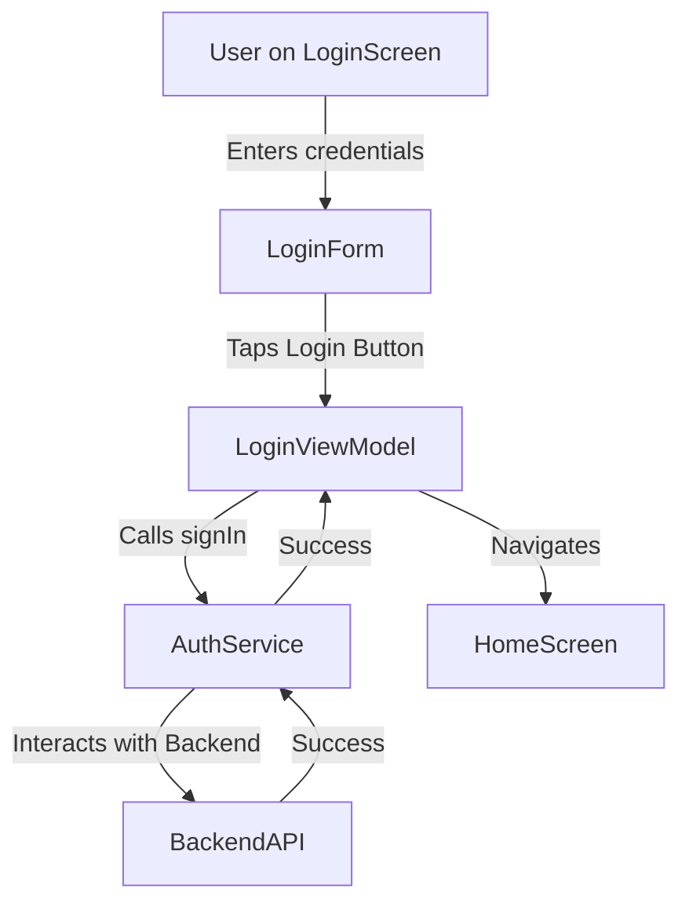

# 📒 Story: [Title]
> 💡 *A user story for a feature or capability, addressing a specific user's need to accomplish a goal. It structures requirements from the user's perspective with clear acceptance criteria and technical details.*

## 🗣️ User Story
> 💡 *As a [ROLE] I want [BEHAVIOUR] so that [REASON].*

**As a** [User Role e.g., Registered User]
**I want** [Action/Behaviour e.g., to log in with my email and password]
**So that** [Benefit/Reason e.g., I can access my personalized dashboard]

## ✅ Acceptance Criteria
> 💡 *Specific, testable conditions that must be met for the story to be considered complete. Often written in Gherkin (Given-When-Then) format.*

<example>
- **Scenario: Successful Login**
    - GIVEN I am on the [[Login Screen]]
    - WHEN I enter my valid credentials
    - AND I tap the "Login" button
    - THEN I should be navigated to the [[Dashboard Screen]]
- **Scenario: Invalid Credentials**
    - GIVEN I am on the [[Login Screen]]
    - WHEN I enter invalid credentials
    - AND I tap the "Login" button
    - THEN I should see an "Invalid credentials" error message
</example>

## ⚙️ Technical Details & Approach
> 💡 *A brief overview of the proposed technical implementation. This can include diagrams, notes on components to change, and other key technical considerations.*

[Describe the suggested technical approach. What existing components can be reused? What new components are needed? How does data flow?]

<example>

</example>

## 📦 Components & Requirements
> 💡 *A breakdown of the actors, components, activities, and other requirements needed to fulfill this story. This can be a simplified version of the main requirements document.*

### 🧩 Actors & Components
- [[User Actor]]
- [[Login Screen Component]]
- [[Email Input Component]]
- [[Password Input Component]]
- [[Login Button Component]]

### 🎬 Activities
- [[User Actor]]
    - [Enter email]
    - [Enter password]
    - [Tap login button]
- [[Login Screen Component]]
    - [Display error message]
    - [Navigate to dashboard]

## ⏱️ Effort Estimates
> 💡 *A breakdown of the estimated effort required for each aspect of the user story implementation.*

| Work Type     | Hours | Reasoning                                    |
| :------------ | :---- | :------------------------------------------- |
| Refinement    | [X]   | [Effort for planning and detailing.]         |
| Design        | [X]   | [Effort for UI/UX design work.]              |
| Front-end     | [X]   | [Effort for UI and client-side logic.]       |
| Back-end      | [X]   | [Effort for API and server-side logic.]      |
| **Subtotal**  | **[Y]** |                                              |
| QA & Testing  | [X]   | [~20% of subtotal for testing effort.]       |
| Delay Margin  | [X]   | [~10-15% of total for unforeseen issues.]    |
| **Total**     | **[Z]** |                                              |

## 👉 Final Remarks
> 💡 *Note anything that is out of scope, any dependencies, or other points of caution.*

- **Related Issues:** [Link to related issues or epics]
- **Dependencies:** [e.g., Backend API for login must be deployed]
- **Notes:** [Other comments]