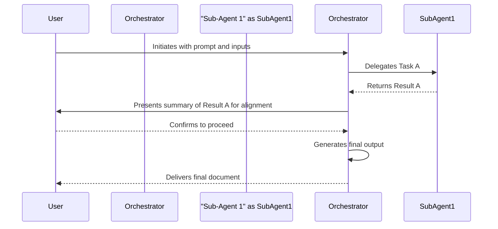

# 🌊 Workflow: [Workflow Name]
> 💡 *A step-by-step description of a process or sequence of tasks, showing how actors and systems interact to achieve a specific goal.*

[Short description of the workflow's purpose and scope.]

## 🎯 Purpose
> 💡 *The primary goal this workflow achieves and the problem it solves.*

[Describe the main objective of this workflow.]

## 🚀 Workflow Components
> 💡 *The core components that drive this automated workflow.*

### 🏁 Initiating Prompt
> 💡 *The user-facing prompt that kicks off the entire workflow. This is typically a command in `.claude/commands/plx/`.*

- **Prompt:** [[prompt-filename]]
- **Purpose:** [Briefly describe what the prompt asks the user and what it triggers.]
- **Inputs:**
    - `{variable_1}`: [Description of input variable]
    - `{variable_2}`: [Description of input variable]

### 🤖 Orchestrator Agent
> 💡 *The primary agent responsible for managing the workflow from start to finish. It interacts with the user and delegates tasks to specialist agents.*

- **Agent:** [[orchestrator-agent-filename]]
- **Responsibilities:**
    - [Validates user input.]
    - [Delegates tasks to specialist sub-agents.]
    - [Presents intermediate results to the user for alignment.]
    - [Assembles the final output.]

### 🛠️ Specialist Sub-Agents & Actors
> 💡 *The specialist agents that perform specific tasks, and any human actors involved.*

- [[sub-agent-1]]: [Specialized role, e.g., "Analyzes source code."]
- [[sub-agent-2]]: [Specialized role, e.g., "Generates documentation."]
- **User**: [The human who initiates the workflow and provides input.]

## 🔄 Workflow Steps
> 💡 *The sequential breakdown of the workflow from start to finish. Use diagrams to visualize the flow.*

1.  **Step 1: [Step Name]**
    - **Actor/Agent:** [[actor-or-agent-name]]
    - **Action:** [Description of the action taken.]
    - **Input:** [Input required for this step.]
    - **Output:** [Output produced by this step.]
2.  **Step 2: [Step Name]**
    - **Actor/Agent:** [[actor-or-agent-name]]
    - **Action:** [Description of the action taken.]
    - **Input:** [Input required for this step.]
    - **Output:** [Output produced by this step.]

## 📥 Inputs
> 💡 *What is required to initiate this workflow? These correspond to the variables in the Initiating Prompt.*

- `{variable_1}`: [Description of what the user needs to provide.]
- `{variable_2}`: [Description of what the user needs to provide.]

## 📤 Outputs
> 💡 *What are the final deliverables or outcomes of this workflow?*

- [Output 1]: [[document-name]] - [Description of the final artifact.]
- [Output 2]: [State change or other outcome]