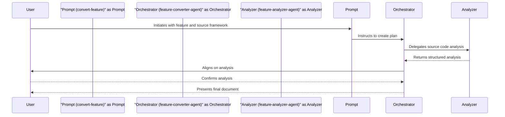

# 🌊 Workflow: Feature Conversion
> 💡 *This workflow describes the end-to-end process for analyzing a feature in an existing application and generating a detailed, framework-agnostic implementation plan for porting it to a new technology stack.*

## 🎯 Purpose
The primary goal of this workflow is to automate and standardize the process of porting features from a source codebase to a new target. It ensures that all necessary analysis is performed and documented, providing the development team with a clear, actionable, and comprehensive guide that is independent of any specific target framework.

## 👥 Actors & Agents
> 💡 *The people, roles, or automated agents involved in executing this workflow.*

- **User**: The person initiating the conversion request (e.g., a Project Manager or Developer).
- [[convert-feature]]: The entry point prompt that orchestrates the entire workflow.
- [[feature-analyzer-agent]]: The specialist agent responsible for analyzing the source code.
- [[feature-converter-agent]]: The specialist agent responsible for creating the final implementation plan document.

## 🔄 Workflow Steps
> 💡 *The sequential breakdown of the workflow from start to finish.*

1.  **Step 1: Initiation**
    - **Actor:** User
    - **Action:** Invokes the [[convert-feature]] prompt, providing a description of the feature and its source framework.
    - **Input:** A feature description (e.g., "The user profile editing page") and the source framework (e.g., "React").
    - **Output:** The workflow is initiated.

2.  **Step 2: Orchestration & Delegation**
    - **Actor:** [[feature-converter-agent]]
    - **Action:** Receives the request and orchestrates the sub-tasks. It first delegates the analysis task to the specialist analyzer agent.
    - **Input:** The feature description and source framework from the User.
    - **Output:** A task assigned to the [[feature-analyzer-agent]].

3.  **Step 3: Source Code Analysis**
    - **Actor:** [[feature-analyzer-agent]]
    - **Action:** Reads the source codebase, identifies the relevant components for the specified feature, and analyzes their inputs, state, and logic.
    - **Input:** Feature description and source framework.
    - **Output:** A structured markdown report detailing the analysis of the source implementation.

4.  **Step 4: User Alignment**
    - **Actor:** [[feature-converter-agent]]
    - **Action:** Presents a summary of the analysis to the user and asks for confirmation to proceed.
    - **Input:** The analysis report.
    - **Output:** User confirmation or feedback.

5.  **Step 5: Plan Generation**
    - **Actor:** [[feature-converter-agent]]
    - **Action:** Takes the approved analysis report, fetches the [[feature-conversion-story-template]], and populates it. It translates the source concepts into a framework-agnostic implementation guide, writes the user story and acceptance criteria, and estimates the effort.
    - **Input:** The analysis report and the [[feature-conversion-story-template]].
    - **Output:** A complete, fully-populated implementation plan document.

6.  **Step 6: Delivery**
    - **Actor:** [[feature-converter-agent]]
    - **Action:** Presents the final implementation plan to the User.
    - **Input:** The completed document.
    - **Output:** The final deliverable is provided to the user.

## 📥 Inputs
- **Feature Description:** A clear description of the feature to be converted.
- **Source Framework:** The name of the language/framework of the original implementation (e.g., "React", "Angular", "Vue", "iOS Swift").
- **Access to Source Codebase:** The [[feature-analyzer-agent]] needs read access to the source project files.

## 📤 Outputs
- **Implementation Plan Document:** A complete markdown file based on the [[feature-conversion-story-template]], containing the full analysis and a framework-agnostic implementation guide. The file is typically saved in the `issues/` directory.