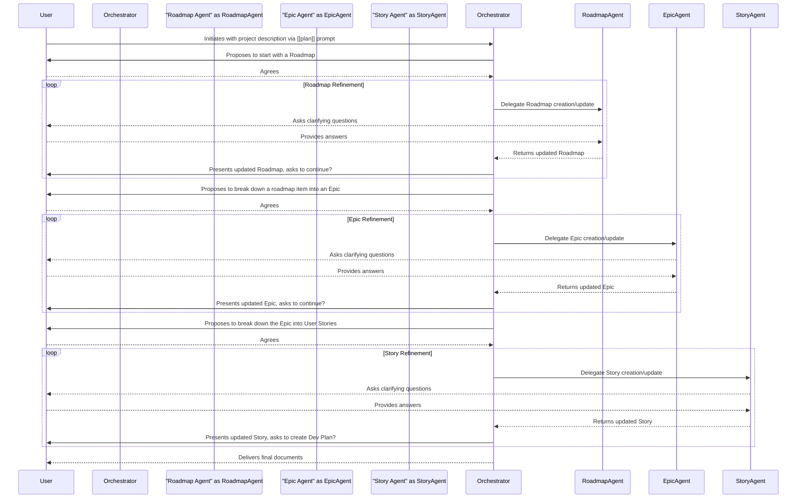

# 🌊 Workflow: Project Planning
> 💡 *A step-by-step description of the process for breaking down a project concept into a hierarchy of actionable plans, from a high-level roadmap to granular tasks, orchestrated by a lead agent and executed by specialists.*

## 🎯 Purpose
The primary goal of this workflow is to provide a structured, collaborative process for transforming a high-level project idea into a set of detailed, actionable documents. It ensures a logical cascade from strategic vision to implementation-ready tasks.

## 🚀 Workflow Components
> 💡 *The core components that drive this automated workflow.*

### 🏁 Initiating Prompt
> 💡 *The user-facing prompt that kicks off the entire workflow.*

- **Prompt:** [[plan]]
- **Purpose:** To trigger the project planning process, asking the user for an initial project description.
- **Inputs:**
    - `{project_description}`: A description of the project, feature, or idea to be planned.

### 🤖 Orchestrator Agent
> 💡 *The primary agent responsible for managing the workflow from start to finish.*

- **Agent:** [[plan-agent]]
- **Responsibilities:**
    - Guides the user through the planning hierarchy (Roadmap -> Epic -> Story -> Plan -> Task).
    - Delegates tasks to specialist sub-agents.
    - Consolidates outputs from specialists into final documents.
    - Proposes next logical steps to the user.

### 🛠️ Specialist Sub-Agents & Actors
> 💡 *The specialist agents that perform specific tasks, and any human actors involved.*

- **User**: The human who initiates the workflow and provides input, feedback, and decisions.
- **Specialist Team**:
    - [[roadmap-agent]]: Helps create the high-level strategic Roadmap.
    - [[epic-agent]]: Helps create Epics to group related features.
    - [[story-agent]]: Helps create User Stories to define specific requirements.
    - [[dev-plan-agent]]: Helps create detailed, technical Development Plans.
    - [[task-agent]]: Helps create granular, actionable Tasks.
    - [[proposal-agent]]: Can be called to generate a client proposal from the planning documents.

## 🔄 Workflow Steps
> 💡 *The sequential breakdown of the workflow from start to finish. This process is iterative and hierarchical.*

1.  **Step 1: Initiation**
    - **Actor/Agent:** User
    - **Action:** Invokes the [[plan]] prompt with a description of the project idea.
    - **Output:** The [[plan-agent]] is invoked.

2.  **Step 2: High-Level Planning (Roadmap/Epic)**
    - **Actor/Agent:** [[plan-agent]] orchestrating [[roadmap-agent]] or [[epic-agent]]
    - **Action:** Guides the user to create a high-level [[roadmap-template]] or [[epic-template]] to define the strategic vision and scope.

3.  **Step 3: Feature Definition (Story)**
    - **Actor/Agent:** [[plan-agent]] orchestrating [[story-agent]]
    - **Action:** Breaks down epics into detailed user stories using the [[story-template]].

4.  **Step 4: Implementation Planning (Dev Plan/Task)**
    - **Actor/Agent:** [[plan-agent]] orchestrating [[dev-plan-agent]] or [[task-agent]]
    - **Action:** Translates user stories into actionable [[dev-plan-template]] or granular [[task-template]] documents for the development team.

5.  **Step 5: Finalization**
    - **Actor/Agent:** [[plan-agent]]
    - **Action:** Presents the full hierarchy of planning documents to the user.
    - **Output:** A complete set of planning artifacts.

## 📥 Inputs
- **Project Description:** A high-level description of the project, feature, or idea that needs to be planned.

## 📤 Outputs
- **Roadmap Document:** Based on [[roadmap-template]].
- **Epic Document(s):** Based on [[epic-template]].
- **Story Document(s):** Based on [[story-template]].
- **Development Plan Document(s):** Based on [[dev-plan-template]].
- **Task Document(s):** Based on [[task-template]].
- **(Optional) Project Proposal:** Based on [[proposal-template]].