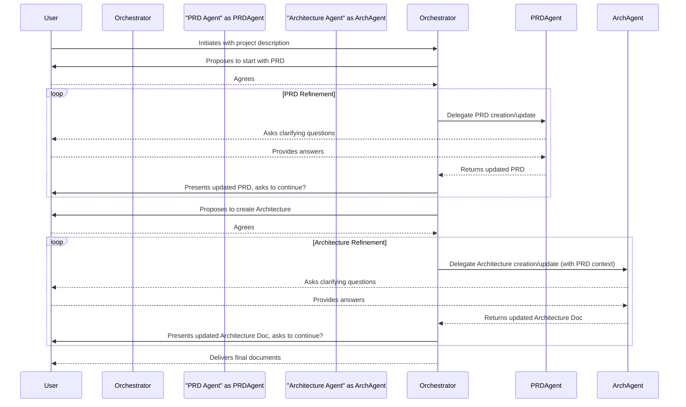

# 🌊 Workflow: Project Refinement
> 💡 *A step-by-step description of the process for refining a project concept into a comprehensive Product Requirements Document (PRD) and a detailed Architecture Document, orchestrated by a lead agent and executed by specialists.*

## 🎯 Purpose
The primary goal of this workflow is to provide a structured, collaborative process for transforming a high-level project idea into a set of detailed, actionable documents. It ensures that both the "what/why" (product requirements) and the "how" (technical architecture) are thoroughly defined before development begins.

## 🚀 Workflow Components
> 💡 *The core components that drive this automated workflow.*

### 🏁 Initiating Prompt
> 💡 *The user-facing prompt that kicks off the entire workflow.*

- **Prompt:** [[refine]]
- **Purpose:** To trigger the project refinement process, asking the user for an initial project description.
- **Inputs:**
    - `{project_description}`: A description of the project, feature, or idea to be refined.

### 🤖 Orchestrator Agent
> 💡 *The primary agent responsible for managing the workflow from start to finish.*

- **Agent:** [[refinement-agent]]
- **Responsibilities:**
    - Guides the user through the refinement process.
    - Delegates tasks to specialist sub-agents for PRD, Architecture, and UI/UX design.
    - Consolidates outputs from specialists into final documents.
    - Proposes next logical steps to the user.

### 🛠️ Specialist Sub-Agents & Actors
> 💡 *The specialist agents that perform specific tasks, and any human actors involved.*

- **User**: The human who initiates the workflow and provides input, feedback, and decisions.
- **Specialist Team**:
    - [[prd-agent]]: Helps create the Product Requirements Document.
    - [[architecture-agent]]: Helps create the Architecture Document.
    - [[ui-ux-design-agent]]: Provides UI/UX design expertise and implementation patterns.
    - [[refinement-proposal-agent]]: Can be called to generate a client proposal from the refined documents.

## 🔄 Workflow Steps
> 💡 *The sequential breakdown of the workflow from start to finish. This process is iterative.*

1.  **Step 1: Initiation**
    - **Actor/Agent:** User
    - **Action:** Invokes the [[refine]] prompt with a description of the project idea.
    - **Output:** The [[refinement-agent]] is invoked.

2.  **Step 2: Process Kick-off**
    - **Actor/Agent:** [[refinement-agent]]
    - **Action:** Acknowledges the request and recommends starting with the Product Requirements Document (PRD) to define the "what" and "why".
    - **Output:** A proposal to engage the [[prd-agent]].

3.  **Step 3: PRD Refinement (Iterative)**
    - **Actor/Agent:** [[prd-agent]] (orchestrated by [[refinement-agent]])
    - **Action:** Collaboratively guides the user to fill out the [[refinement-prd-template]]. This is an iterative process of questions and updates.
    - **Output:** A progressively more complete PRD document.

4.  **Step 4: Architecture Refinement (Iterative)**
    - **Actor/Agent:** [[architecture-agent]] (orchestrated by [[refinement-agent]])
    - **Action:** Once the PRD is sufficiently detailed, the orchestrator engages the architecture agent. This agent uses the PRD as context to guide the user in filling out the [[refinement-architecture-template]].
    - **Output:** A detailed architecture document that aligns with the PRD.

5.  **Step 5: Finalization**
    - **Actor/Agent:** [[refinement-agent]]
    - **Action:** Presents the completed PRD and Architecture documents to the user.
    - **Output:** The final, refined project documentation.

## 📥 Inputs
- **Project Description:** A high-level description of the project, feature, or idea that needs to be refined.

## 📤 Outputs
- **Product Requirements Document:** A complete and detailed PRD based on the [[refinement-prd-template]].
- **Architecture Document:** A comprehensive architecture specification based on the [[refinement-architecture-template]].
- **(Optional) Project Proposal:** A client-facing proposal based on the [[refinement-proposal-template]].