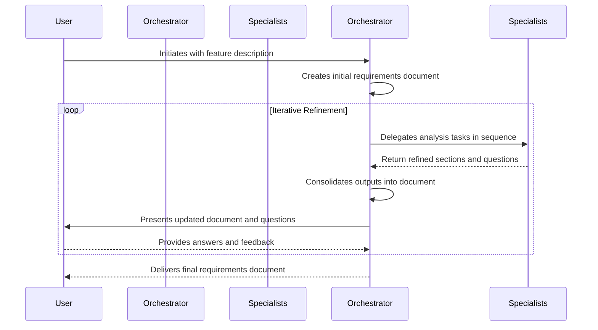

# 🌊 Workflow: Requirements Definition
> 💡 *A step-by-step description of the process for creating a comprehensive requirements specification, showing how a lead agent orchestrates a team of specialists to achieve the goal.*

## 🎯 Purpose
The primary goal of this workflow is to provide a structured, collaborative, and iterative process for deconstructing any feature, idea, or project into a detailed and testable requirements document. It uses a lead orchestrator agent to manage a team of specialist agents, ensuring all aspects of requirements are covered.

## 🚀 Workflow Components
> 💡 *The core components that drive this automated workflow.*

### 🏁 Initiating Prompt
> 💡 *The user-facing prompt that kicks off the entire workflow. This is typically a command in `.claude/commands/plx/`.*

- **Prompt:** A user request to create requirements for a feature (e.g., `/plx:create-requirements "Define requirements for a user login system"`).
- **Purpose:** To trigger the requirements definition process.
- **Inputs:**
    - `{feature_description}`: A description of the feature or project to be defined.

### 🤖 Orchestrator Agent
> 💡 *The primary agent responsible for managing the workflow from start to finish. It interacts with the user and delegates tasks to specialist agents.*

- **Agent:** [[requirements-agent]]
- **Responsibilities:**
    - Manages the entire lifecycle of the requirements document.
    - Simulates a "group chat" by calling specialist agents in a logical sequence.
    - Consolidates agent outputs into the master requirements document.
    - Presents the updated document and clarifying questions to the user.

### 🛠️ Specialist Sub-Agents & Actors
> 💡 *The specialist agents that perform specific tasks, and any human actors involved.*

- **User**: The human who initiates the workflow and provides input and clarifications.
- **Specialist Team**:
    - [[actors-components-agent]]: Identifies the "who" and "what".
    - [[activities-agent]]: Defines "what they do".
    - [[properties-agent]]: Details the "data and attributes".
    - [[scenarios-agent]]: Maps out "how activities are performed".
    - [[behaviours-agent]]: Specifies "rules and constraints".
    - [[proposal-agent]]: Generates a client proposal from the final requirements.
    - [[prompt-engineer-agent]]: Assists in crafting prompts for requirements gathering.

## 🔄 Workflow Steps
> 💡 *The sequential breakdown of the workflow from start to finish. Use diagrams to visualize the flow.*

1.  **Step 1: Initiation**
    - **Actor/Agent:** User
    - **Action:** Provides a description of a feature or project.
    - **Output:** The [[requirements-agent]] is invoked.

2.  **Step 2: Initial Draft**
    - **Actor/Agent:** [[requirements-agent]]
    - **Action:** Immediately creates an initial draft of the requirements document using [[requirements-template]], populating it with information from the user's request.

3.  **Step 3: Specialist Collaboration (Iterative Loop)**
    - **Actor/Agent:** [[requirements-agent]]
    - **Action:** Orchestrates a sequence of specialist agents, feeding the output of one as the input for the next. The typical order is: Actors/Components -> Activities -> Properties -> Scenarios -> Behaviours.
    - **Output:** Each agent provides its contribution to the requirements document and may generate clarifying questions.

4.  **Step 4: Consolidation and User Alignment**
    - **Actor/Agent:** [[requirements-agent]]
    - **Action:** Consolidates all contributions from the specialists into the master requirements document and presents the updated document and a list of questions to the user.

5.  **Step 5: Refinement**
    - **Actor/Agent:** User
    - **Action:** Answers the questions and provides feedback. This input is used by the [[requirements-agent]] to start the next iteration of the specialist collaboration loop. This continues until the document is complete.

## 📥 Inputs
- **Feature Description:** A description of the project, feature, or idea that needs to be defined.

## 📤 Outputs
- **Requirements Document:** A complete and detailed requirements specification based on the [[requirements-template]].
- **(Optional) Project Proposal:** A client-facing proposal document based on the [[proposal-template]], generated by the [[proposal-agent]].